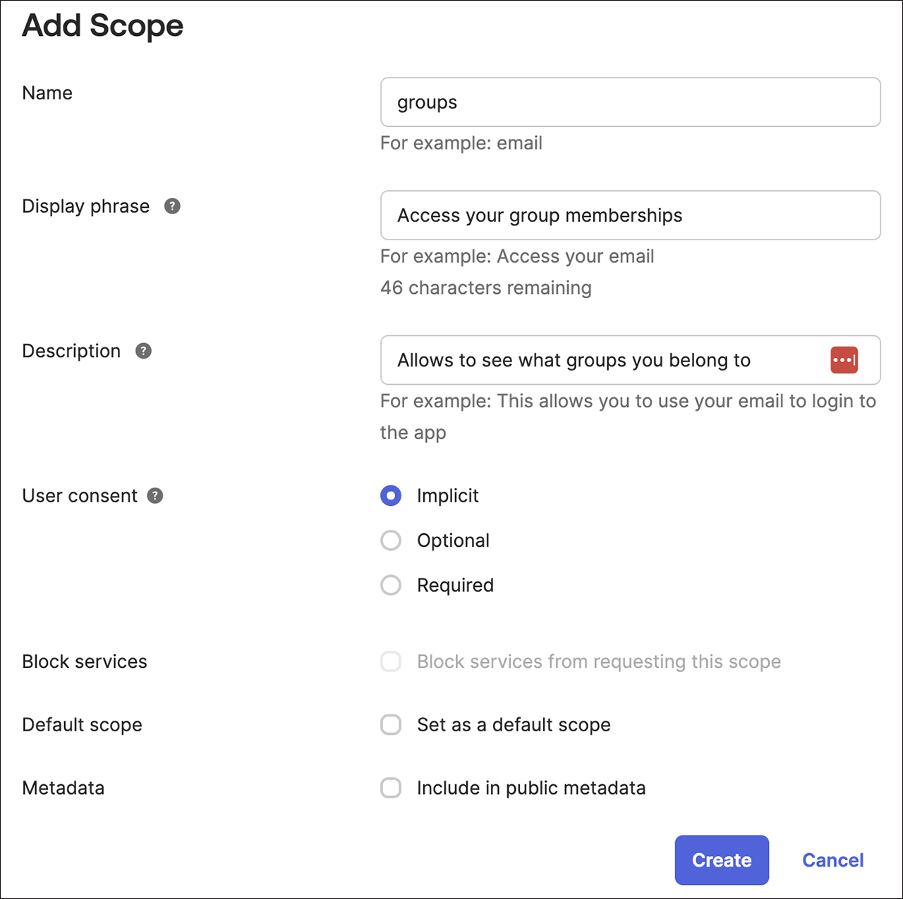
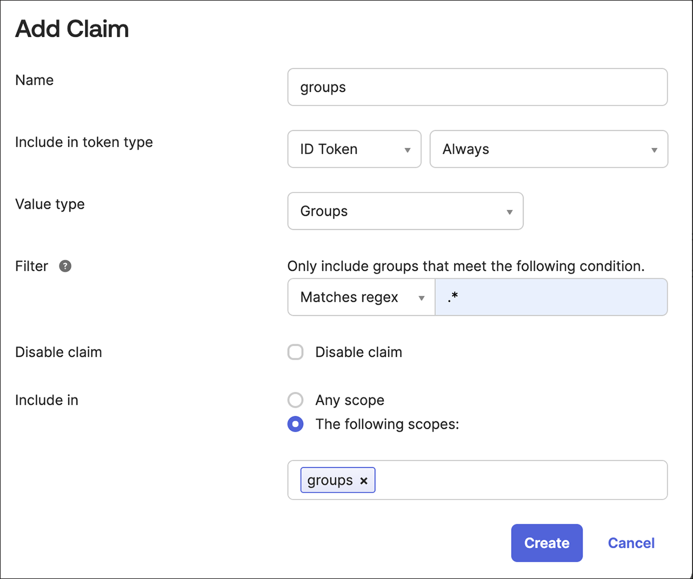
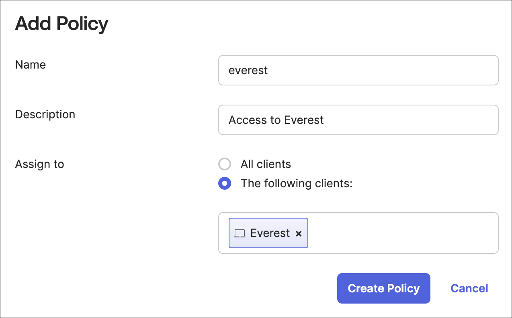
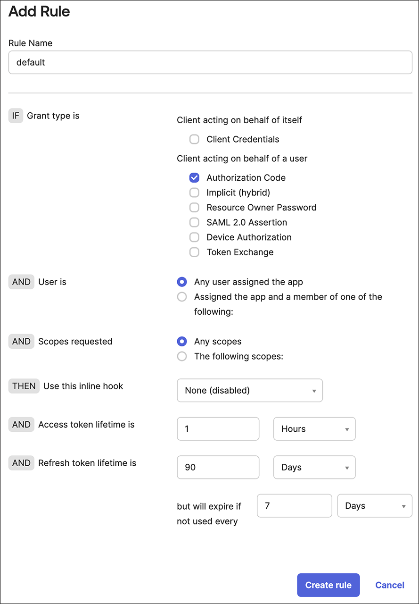

# RBAC: Integration with IdP groups

You can now assign RBAC policies to user groups obtained from the external IDP. This change simplifies permissions management for external users without the need for unique sub IDs.

A user will be authorized to perform an operation if either their subject or any of the groups they belong to has the required permission. To use IdP groups in Percona Everest RBAC, you would need to set up the groups claim in your IdP provider configuration.

## OKTA

Once you successfully establish an Identity Provider (IdP) [integration with Okta](Idp_integration.md#configure-oidc-on-the-provider-side), the `issuerURL` in this configuration identifies your API server, serving as a unique identifier for your server within Okta. Additionally, you will have a client application, referred to as the Application integration, which is represented by the `clientID`. This setup allows for secure communication and authentication between your application and Okta's services.

To use IdP groups in Percona Everest RBAC, set up the groups claim in your IdP provider settings. Here are the steps to configure the groups claim:
{.power-number}

1. Navigate to **Security > API**.

2. In the list, find the API server that you use and click **Edit**.

3. Click **Scopes > Add Scope**. 

    !!! note
        A scope specifies the level and type of access a client application can request from an Identity Provider (IdP) during the authentication process.
      
    Add a scope called **groups** while keeping all other options to their default settings.

    


4. Click **Create**.

5. Click **Claims > Add Claim**. 

    !!! note
        A claim specifies the scope to activate and the information required within that scope.

    1. Add a claim named **groups**.

    2. Set the **Include in token type** to **ID Token** and choose **Always**.

    3. Change the **Value type** to **Groups**.

    4. Select the **Filter** as **Matches regexp** and add a filter to match the desired Okta groups for Everest, for example: .*.

    5. Set **Include in** to **groups**, which is the scope you created earlier.

    

6. Click **Access Policies > Add Policy**. A policy restricts how this authorization server is used.

    1. Add **Name** and **Description**.

    2. Assign the policy to the client (Application Integration) you created earlier. The field should auto-complete as you type. Create the policy.

    3. Create the policy.

    

7. Add a rule to the policy. A Rule defines the details of usage:

    1. Add a name. If you prefer, you can use **default** option.

    2. Fine-tune the settings to align with your organization's security policy. Here are some suggestions:

        - Uncheck all grant types except for the **Authorization Code**.
        -  Adjust the **token lifetime** to determine how long a session can remain active.
        - Restrict the refresh **token lifetime** or consider deactivating it completely.

        

    3. Click **Create Rule**.


## Configure Percona Everest to fetch groups from IdP

During the SSO authentication, if the group's scope is requested but the Identity Provider (IdP), like Okta, lacks the necessary groups claim configuration or does not support it by default, SSO could fail or not function as expected.

To retrieve the OIDC groups, you need to include the scope by specifying the following fields:

    everestctl settings oidc configure --issuer-url https://example.com --client-id 123456 --scopes openid,profile,email,groups

Take a look at the descriptions of the various fields in the table below:

 **Field**|**Description**|
 |--------|---------------|
 |**scopes openid**|Grants access to the user’s identity, necessary for OIDC flows to issue an ID token with the unique identifier (subject sub).|
  |**profile**|Grants access basic profile information.|
  |**email**|Grants access to the user’s email address and its verification status.|
    |**groups**|Grants access to obtain information about the user’s group memberships.|

!!! note
    The default scope is set to `openid profile email`.

??? example "Example"

    Let's consider a scenario where an employee needs to log into the company portal using SSO.
    {.power-number}

    1. The portal redirects to OKTA and requests the following scope:

        ```
        everestctl settings oidc configure --issuer-url https://example.com --client-id 123456 --scopes openid,profile,email,groups
        ```

    2. OKTA authenticates the user and provides an ID token that includes:

        - `openid` - User identifier (sub)
        - `profile` - Users name, picure, and other profile data
        - `email` - Verified email address
        - `groups` - User's group membership (ProjecTeam,Admins)

    The portal retrieves the group's claim from the ID token and grants access to the appropriate dashboard based on the user's membership.

## Configure RBAC to assign permissions to the groups

To configure RBAC, you can assign permissions to the groups that a user belongs to. Just specify the name of the group when creating the policy assignment.

The following commands are similar:

```sh
g, username, role:admin
```
    
!!! note
    The `username` should be a part of the `groupname`.


Similarly, for policies:

```sh
p, username, database-clusters, *, */
```

!!! note
    The `username` should be a part of the `groupname`.       


