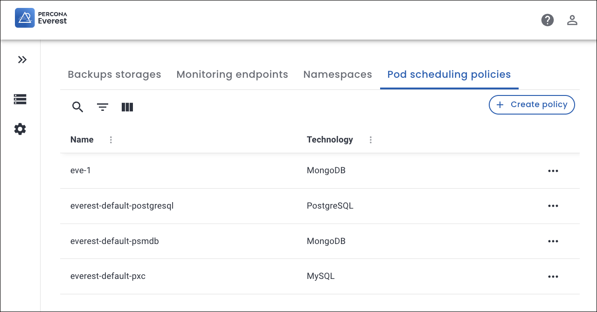
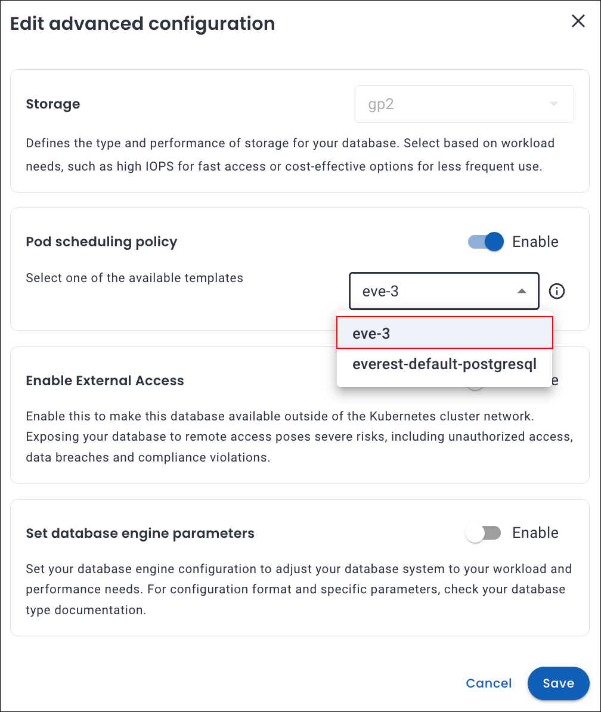
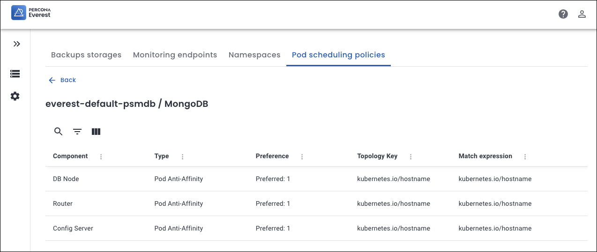
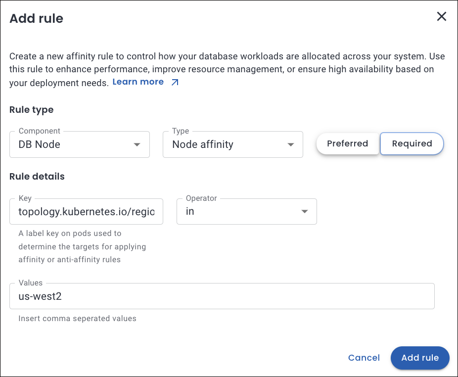
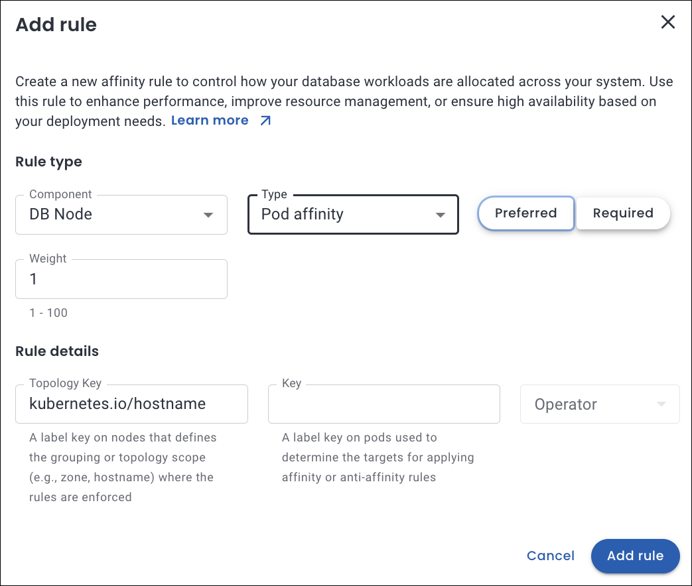

#  Leveraging Pod scheduling policies in Percona Everest

!!! info "Important"
    Percona Everest relies on the Kubernetes scheduler for pod placement and resource management.

## Introduction

Percona Everest supports database workload scheduling on Kubernetes by allowing users to define Pod Scheduling Policies, including Kubernetes Affinity and Anti-Affinity rules. These policies not only optimize performance and enhance system resilience but also ensure that your resources are utilized to their fullest potential.

## Understanding Pod scheduling policies within Percona Everest

Pod Scheduling Policy is a **preset** in Percona Everest that includes a set of Kubernetes affinity rules applied to the relevant DB cluster components.

Kubernetes features three primary types of affinity that play a crucial role in how pods are scheduled and interact within a cluster. 

=== ### "Pod anti-affinity"

    Pod anti-affinity empowers you to take control of pod placement in your Kubernetes environment. With pod anti-affinity you can prevent certain pods from being scheduled on the same node or within the same topology, such as a zone or region.

    Like pod affinity, Pod anti-affinity also uses pod labels to identify and match pods that should not be co-located.

    📚 [Learn more in Kubernetes documentation - Pod anti-affinity](https://kubernetes.io/docs/concepts/scheduling-eviction/assign-pod-node/#inter-pod-affinity-and-anti-affinity).

=== ### "Pod affinity"

    Pod affinity enables you to control the placement of pods based on the location of other pods. By using affinity rules, you can ensure that pods are scheduled together (co-located) on the same node, in the same zone, or within any other topological boundary.

    Kubernetes uses labels, which are key-value pairs, to identify and categorize pods.

    📚 [Learn more in Kubernetes documentation - Pod affinity](https://kubernetes.io/docs/concepts/scheduling-eviction/assign-pod-node/#inter-pod-affinity-and-anti-affinity).

=== ### "Node affinity"

    Node affinity determines which nodes a pod can be scheduled on. Based on the labels assigned to nodes, you can define rules about where a pod should or should not be deployed. 

    Nodes in a Kubernetes cluster have labels that consist of **key-value** pairs.

    📚 [Learn more in Kubernetes documentation - Node affinity](https://kubernetes.io/docs/concepts/scheduling-eviction/assign-pod-node/#node-affinity).

## Create custom Pod scheduling policy for your cluster

Here are the steps to configure pod scheduling rules for the policies for your database clusters:
{.power-number}

1. From the Percona Everest home page navigate to the <i class="uil uil-cog"></i> **Settings > Pod scheduling policies** page. Here, you can view both default and custom policies.

    

2. Click **Create policy**.

3. In the pop-up that appears, enter a **Policy name** and select the **database technology** from the drop-down. Click **Create**.

4. Click **Add rule**.

5. A pop-up will appear where you need to enter the following details for the **Rule type** and **Rule details** section:

    

    Refer to the following table for the detailed attributes descriptions.

    ??? info "📋 Custom Pod scheduling rule attributes"
        The table below describes the key attributes used to define pod scheduling rules in Percona Everest:

        | **Attribute**     | **Description** | **Comments** |
        |------------------|-----------------|-----------|
        | **Components**    | The database cluster components the rule applies to: - **DB Node** - **Proxy / Router / PgBouncer** - **Config Server** | - DB Nodes and Proxies are applicable for **MySQL** and **PostgreSQL**. - Config Servers apply to **MongoDB** sharded clusters. |
        | **Priority**      | Defines the distinct level of rule enforcement: - **Preferred**: Percona Everest will *try* to honor the rule but will schedule the pod even if it's not met. - **Required**: The rule *must* be satisfied for the pod to be scheduled. | Use **Preferred** for flexible placement and **Required** for hard constraints. |
        | **Weight (1–100)**| Determines the priority of a **Preferred** rule. Higher values indicate stronger preference. | Only applicable to **Preferred** rules. |
        | **Topology Key**  | Specifies the domain used to group nodes or pods for affinity. Determines the scope (e.g., zone, hostname) for applying scheduling rules. | Not used for **Node Affinity**. **Examples:** - `kubernetes.io/hostname` - `topology.kubernetes.io/zone` - `topology.kubernetes.io/region` - Custom: `rack` |
        | **Key**           | The pod label key used in **Pod Affinity** or **Anti-Affinity** rules. Helps target specific pods to influence scheduling decisions. | Should match a label present on existing pods in the cluster. **Examples:** - `app` - `security` - `environment` - Custom: `web-store` |
        | **Operator**      | Logical condition used to evaluate the **Key** and **Values**. Determines how Kubernetes interprets the label match. | **Supported Operators:** - `In` – Matches if the label value is in a specified list - `NotIn` – Matches if not in the list - `Exists` – Matches if the label key exists (regardless of value) - `DoesNotExist` – Matches if the label key does not exist |
        | **Values**        | Specific label values that must match for the rule to apply. Required when using `In` or `NotIn` operators. | **Examples:** - `s2` - `database` - `production` - Custom: `finance`, `cache-tier` |

6. Click **Add** to save the rule. The new pod scheduling policy is now available and can be applied to relevant components.

## Assign pod scheduling policy to a new cluster

!!! info "Important"
    If RBAC is enabled, Percona Everest only displays Pod Scheduling Policies applicable to the selected DB Engine type for which the user has read access.

Scheduling policies can be assigned during cluster creation as follows:
{.power-number}

1. From the database creation wizard, navigate to **Advanced Configurations**. In the **Pod scheduling policy**
section, choose a policy from the dropdown.

    

2. Click **Continue** till you reach the end of the wizard.

3. Click **Create Database** to apply the policy.

!!! note
    To see your custom policy in the **Pod scheduling policy** dropdown on the **Advanced Configurations** page, you must first [create the policy](#create-pod-scheduling-policy-for-your-cluster).

## Assign pod scheduling policy to an existing cluster

Scheduling policies can be assigned for an existing cluster as follows:
{.power-number}

1. Go to the **Overview** page of the desired cluster and click **Edit** on the **Advanced configuration** panel. The **Edit advanced configuration** pop-up opens.

2. In the **Pod scheduling policy** section, select the policy from the dropdown.

3. Click **Save**. The chosen pod scheduling policy will now be apple to your cluster.

      

## Default configuration for Pod scheduling policies

In Percona Everest, the default pod scheduling policies are **preset** rules that help ensure optimal placement of database components across a Kubernetes cluster. 

### Common attributes

The following are the common attributes for a default policy for all the three database technologies.

- **Type**: The Affinity Type applied, which is **Pod Anti-Affinity**: This ensures that pods of the same component are not co-located on the same node.

- **Preference**: Preferred 1 means the scheduler will try to satisfy this rule but won't fail if it cannot

- **Topology Key**: This repeats the Topology Key value and suggests that pods matching this label (`kubernetes.io/hostname`) are evaluated when applying the rule.
 
###  Components by technology

The **Components** for a default policy change as per the technology:

- **DB cluster Components**
    - **MySQL**: DB Node and Proxy
    - **PostgreSQL**: DB Node and PG Bouncer
    - **MongoDB** 
        - DB Node, Config Server, and Router (for sharded cluster) 
        - DB Node for non-sharded cluster.

    

## Use cases for affinity

Here are several detailed use cases for affinity that highlight its diverse applications and the numerous benefits it offers across various contexts.

=== "Node affinity"
    ### Regional scheduling

    Let's consider a use case in which workloads are distributed based on performance requirements, fault tolerance, and regional specifications across designated zones or areas.

    You need to run a workload in the `us-west2 region` for latency optimaztion and to meet specific compliance requirements.

    

    ??? info "What happens under the hood"
        - It ensures that the pod is scheduled only on nodes located in the us-west-2 region, as defined by the `topology.kubernetes.io/region` node label.

        - For the rule to be applicable, it is essential that the node possesses a label such as `topology.kubernetes.io/region: us-west-2`. If no nodes correspond to the specified label, the pod will remain in an unscheduled state.

=== "Pod anti-affinity"
    ### Pods scheduled apart

    Let's consider a use case that ensures that the scheduler distributes the different database pods across various Kubernetes nodes, which enhances fault tolerance in the event of node failure.

    

    ??? info "What happens under the hood"
        - The pod will not be scheduled on nodes that contain pods labeled with `app=haproxy`.

        - If no nodes match, the pod will not be scheduled until a suitable node becomes available.

 

