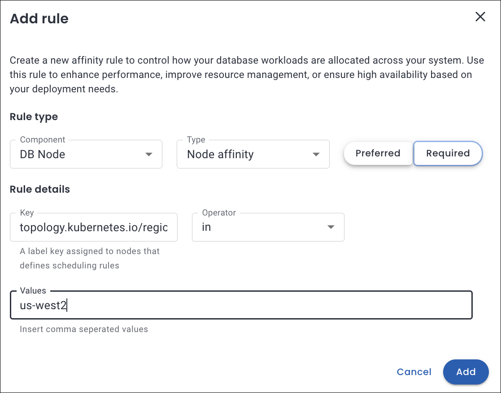

#  Leveraging Pod scheduling policies in Percona Everest

!!! info "Important"
    Percona Everest relies on the Kubernetes scheduler for pod placement and resource management.

## Introduction

Percona Everest supports database workload scheduling on Kubernetes by allowing users to define Pod Scheduling Policies, including Kubernetes Affinity and Anti-Affinity rules. These policies not only optimize performance and enhance system resilience but also ensure that your resources are utilized to their fullest potential.

## Understanding Pod scheduling policies within Percona Everest

Pod Scheduling Policy is a **preset** in Percona Everest that includes a set of Kubernetes affinity rules applied to the relevant DB cluster components.

Kubernetes features three primary types of affinity that play a crucial role in how pods are scheduled and interact within a cluster. 

=== "Pod anti-affinity"

    Pod anti-affinity empowers you to take control of pod placement in your Kubernetes environment. With pod anti-affinity you can prevent certain pods from being scheduled on the same node or within the same topology, such as a zone or region.

    Like pod affinity, Pod anti-affinity also uses pod labels to identify and match pods that should not be co-located.

    📚 [Learn more in Kubernetes documentation - Pod anti-affinity](https://kubernetes.io/docs/concepts/scheduling-eviction/assign-pod-node/#inter-pod-affinity-and-anti-affinity).

=== "Pod affinity"

    Pod affinity enables you to control the placement of pods based on the location of other pods. By using affinity rules, you can ensure that pods are scheduled together (co-located) on the same node, in the same zone, or within any other topological boundary.

    Kubernetes uses labels, which are key-value pairs, to identify and categorize pods.

    📚 [Learn more in Kubernetes documentation - Pod affinity](https://kubernetes.io/docs/concepts/scheduling-eviction/assign-pod-node/#inter-pod-affinity-and-anti-affinity).

=== "Node affinity"

    Node affinity determines which nodes a pod can be scheduled on. Based on the labels assigned to nodes, you can define rules about where a pod should or should not be deployed. 

    Nodes in a Kubernetes cluster have labels that consist of **key-value** pairs.

    📚 [Learn more in Kubernetes documentation - Node affinity](https://kubernetes.io/docs/concepts/scheduling-eviction/assign-pod-node/#node-affinity).

## Use cases for affinity

Here are several detailed use cases for affinity that highlight its diverse applications and the numerous benefits it offers across various contexts.

=== "Node affinity"
    ### Regional scheduling

    Let's consider a use case in which workloads are distributed based on performance requirements, fault tolerance, and regional specifications across designated zones or areas.

    You need to run a workload in the `us-west2 region` for latency optimaztion and to meet specific compliance requirements.

    

    ??? info "What happens under the hood"
        - It ensures that the pod is scheduled only on nodes located in the us-west-2 region, as defined by the `topology.kubernetes.io/region` node label.

        - For the rule to be applicable, it is essential that the node possesses a label such as `topology.kubernetes.io/region: us-west-2`. If no nodes correspond to the specified label, the pod will remain in an unscheduled state.

=== "Pod anti-affinity"
    ### Pods scheduled apart

    Let's consider a use case that ensures that the scheduler distributes the different database pods across various Kubernetes nodes, which enhances fault tolerance in the event of node failure.

    

    ??? info "What happens under the hood"
        - The pod will not be scheduled on nodes that contain pods labeled with `app=haproxy`.

        - If no nodes match, the pod will not be scheduled until a suitable node becomes available.

 

