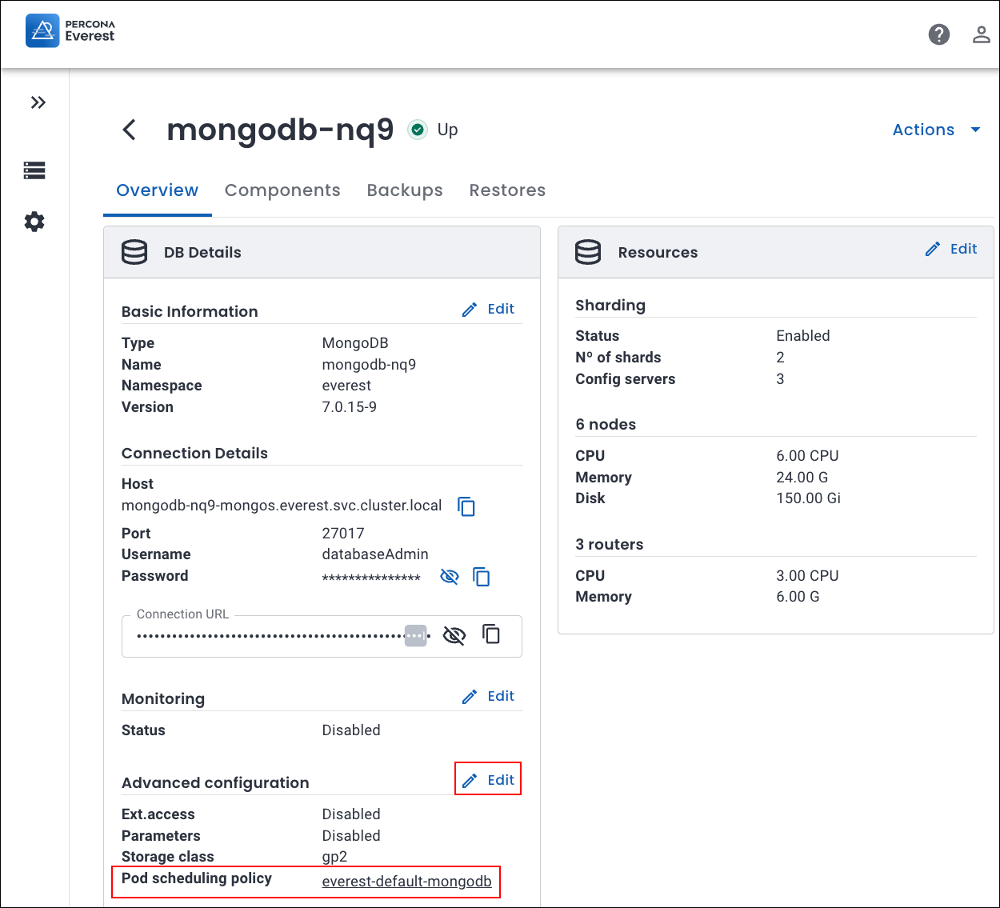
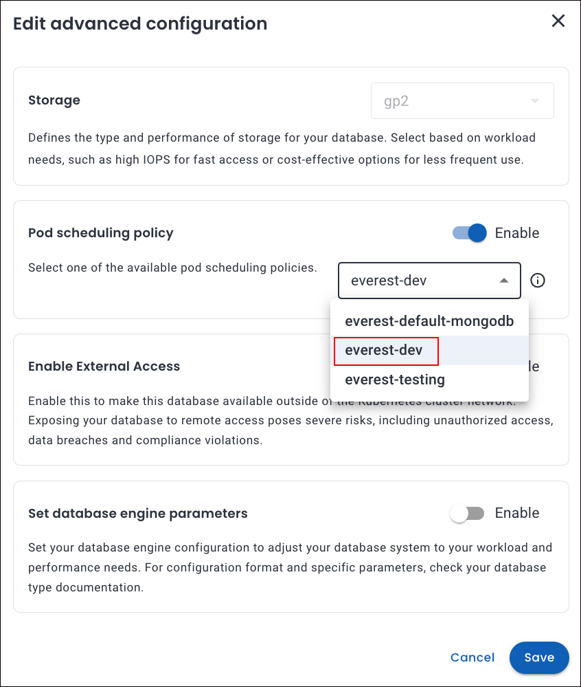
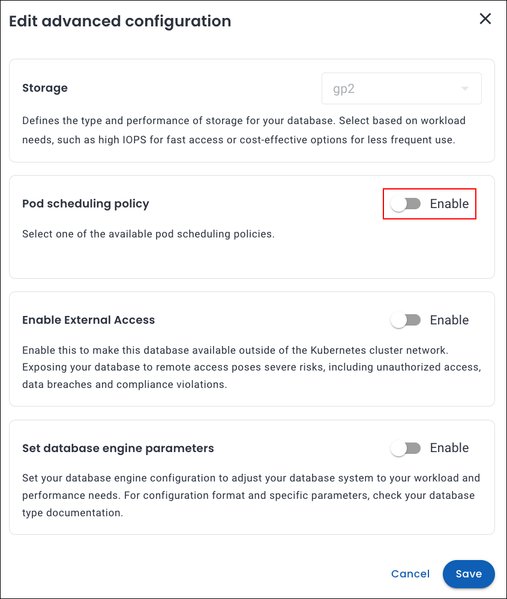

# Apply or change Pod scheduling policies for your DB clusters

## Apply pod scheduling policy to a new DB cluster

!!! info "Important"
    If RBAC is enabled, Percona Everest only displays Pod scheduling policies applicable to the selected DB Engine type for which the user has read access.

You can apply a Pod scheduling policy when creating a cluster by following these steps:
{.power-number}

1. From the database creation wizard, go to **Advanced Configurations** page. In the **Pod scheduling policy**
section, choose a policy from the dropdown.

    

2. Click **Continue** till you reach the end of the wizard.

3. Click **Create Database** to apply the policy.

!!! note
    You must first [create the policy](custom_policies.md#create-pod-scheduling-policy-for-your-db-cluster) to see the custom policy in the **Pod scheduling policy** dropdown on the **Advanced Configurations** page. 

## Apply pod scheduling policy to an existing DB cluster

!!! warning
    When you apply a policy to an existing DB cluster, the database cluster may **restart** to use the new affinity configuration.

You can apply a Pod scheduling policy for an existing DB cluster by following these steps:
{.power-number}

1. Go to the **Overview** page of the desired cluster and click **Edit** on the **Advanced configuration** panel. The **Edit advanced configuration** pop-up opens.

2. In the **Pod scheduling policy** section, select the policy from the dropdown.

3. Click **Save**. The chosen pod scheduling policy will now be added to your cluster.

      

## Change Pod scheduling policy for an existing DB cluster

!!! warning
    When you change the policy from **policy A** to **policy B**, the database cluster might **restart** to apply the new affinity configuration.

You can change a Pod scheduling policy for an existing DB cluster by following these steps:
{.power-number}

1. Go to the **Overview** page of the cluster you want to modify and click **Edit** in the **Advanced configuration** panel. The **Edit advanced configuration** pop-up opens.

    

2. In the **Pod scheduling policy** section, choose the policy you want to apply to the existing cluster.

     

3. Click **Save**. The new policy will be applied to your DB cluster.

## Remove Pod scheduling policy for an existing DB cluster

To remove the policy from the cluster, turn off the **Enable** toggle in the **Pod scheduling policy **section. This will disable the policy assigned to the DB cluster.

    

 

