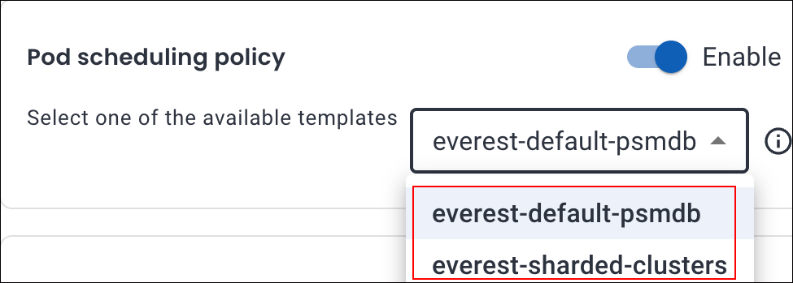

# Custom Pod scheduling policies

Percona Everest allows you to define custom Pod scheduling policies to control how database pods are placed on Kubernetes nodes.

## Create custom Pod scheduling policy for your cluster

Here are the steps to configure pod scheduling rules for the policies for your database clusters:
{.power-number}

1. From the Percona Everest home page navigate to the <i class="uil uil-cog"></i> **Settings > Pod scheduling policies** page. Here, you can view both default and custom policies.

    

2. Click **Create policy**.

3. In the pop-up that appears, enter a **Policy name** and select the **database technology** from the drop-down. Click **Create**.

4. Click **Add rule**.

5. A pop-up will appear where you need to enter the following details for the **Rule type** and **Rule details** section:

    

    Refer to the following table for the detailed attributes descriptions.

    ??? info "📋 Custom Pod scheduling rule attributes"
        The table below describes the key attributes used to define pod scheduling rules in Percona Everest:

        | **Attribute**     | **Description** | **Comments** |
        |------------------|-----------------|-----------|
        | **Components**    | The database cluster components the rule applies to: - **DB Node** - **Proxy / Router / PgBouncer** - **Config Server** | - DB Nodes and Proxies are applicable for **MySQL** and **PostgreSQL**. - Config Servers apply to **MongoDB** sharded clusters. |
        | **Priority**      | Defines the distinct level of rule enforcement: - **Preferred**: Percona Everest will *try* to honor the rule but will schedule the pod even if it's not met. - **Required**: The rule *must* be satisfied for the pod to be scheduled. | Use **Preferred** for flexible placement and **Required** for hard constraints. |
        | **Weight (1–100)**| Determines the priority of a **Preferred** rule. Higher values indicate stronger preference. | Only applicable to **Preferred** rules. |
        | **Topology Key**  | Specifies the domain used to group nodes or pods for affinity. Determines the scope (e.g., zone, hostname) for applying scheduling rules. | Not used for **Node Affinity**. **Examples:** - `kubernetes.io/hostname` - `topology.kubernetes.io/zone` - `topology.kubernetes.io/region` - Custom: `rack` |
        | **Key**           | The pod label key used in **Pod Affinity** or **Anti-Affinity** rules. Helps target specific pods to influence scheduling decisions. | Should match a label present on existing pods in the cluster. **Examples:** - `app` - `security` - `environment` - Custom: `web-store` |
        | **Operator**      | Logical condition used to evaluate the **Key** and **Values**. Determines how Kubernetes interprets the label match. | **Supported Operators:** - `In` – Matches if the label value is in a specified list - `NotIn` – Matches if not in the list - `Exists` – Matches if the label key exists (regardless of value) - `DoesNotExist` – Matches if the label key does not exist |
        | **Values**        | Specific label values that must match for the rule to apply. Required when using `In` or `NotIn` operators. | **Examples:** - `s2` - `database` - `production` - Custom: `finance`, `cache-tier` |

6. Click **Add** to save the rule. The new pod scheduling policy is now available and can be applied to relevant components.

## Assign pod scheduling policy to a new cluster

!!! info "Important"
    If RBAC is enabled, Percona Everest only displays Pod Scheduling Policies applicable to the selected DB Engine type for which the user has read access.

Scheduling policies can be assigned during cluster creation as follows:
{.power-number}

1. From the database creation wizard, navigate to **Advanced Configurations**. In the **Pod scheduling policy**
section, choose a policy from the dropdown.

    

2. Click **Continue** till you reach the end of the wizard.

3. Click **Create Database** to apply the policy.

!!! note
    To see your custom policy in the **Pod scheduling policy** dropdown on the **Advanced Configurations** page, you must first [create the policy](#create-pod-scheduling-policy-for-your-cluster).

## Assign pod scheduling policy to an existing cluster

Scheduling policies can be assigned for an existing cluster as follows:
{.power-number}

1. Go to the **Overview** page of the desired cluster and click **Edit** on the **Advanced configuration** panel. The **Edit advanced configuration** pop-up opens.

2. In the **Pod scheduling policy** section, select the policy from the dropdown.

3. Click **Save**. The chosen pod scheduling policy will now be apple to your cluster.

      

 

