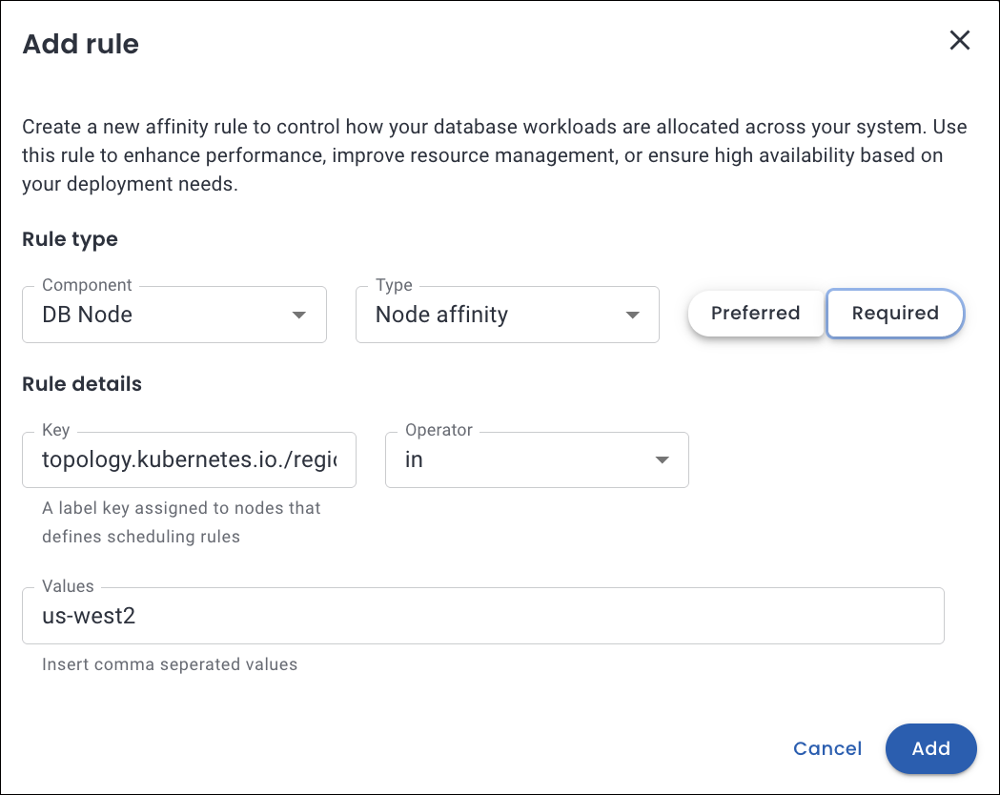

# Custom Pod scheduling policies

Percona Everest allows you to define custom Pod scheduling policies to control how database pods are placed on Kubernetes nodes.

## Manage Pod scheduling policies in Percona Everest

A Percona Everest administrator, or anyone with the necessary RBAC permissions, can edit or delete the Pod Scheduling Policies. It may be necessary to update these policies over time to add new affinity rules, modify existing ones, or remove outdated configurations.

### Create Pod scheduling policy for your DB cluster

Here are the steps to configure pod scheduling rules for the policies for your database clusters:
{.power-number}

1. From the Percona Everest home page, navigate to the <i class="uil uil-cog"></i> **Settings > Pod scheduling policies** page. Here, you can view both default and custom policies.

    

2. Click **Create policy**.

3. In the pop-up that appears, enter a **Policy name** and select the **database technology** from the dropdown. Click **Create**.

4. Click **Add rule**.

5. A pop-up will appear where you need to enter the following details for the **Rule type** and **Rule details** section:

    

    Refer to the following table for the detailed attribute descriptions.

    ??? info "📋 Custom Pod scheduling rule attributes"
        The table below describes the key attributes used to define pod scheduling rules in Percona Everest:

        | **Attribute**     | **Description** | **Comments** |
        |------------------|-----------------|-----------|
        | **Components**    | The database cluster components the rule applies to: - **DB Node** - **Proxy / Router / PgBouncer** - **Config Server** | - DB Nodes and Proxies are applicable for **MySQL** and **PostgreSQL**. - Config Servers apply to **MongoDB** sharded clusters. |
        | **Priority**      | Defines the distinct level of rule enforcement: - **Preferred**: Kubernetes will *try* to honor the rule but will schedule the pod even if it's not met. - **Required**: The rule *must* be satisfied for the pod to be scheduled. | Use **Preferred** for flexible placement and **Required** for hard constraints. |
        | **Weight (1–100)**| Determines the priority of a **Preferred** rule. Higher values indicate stronger preference. | Only applicable to **Preferred** rules. |
        | **Topology Key**  | Specifies the domain used to group nodes or pods for affinity. Determines the scope (e.g., zone, hostname) for applying scheduling rules. |**Examples:**  `kubernetes.io/hostname` `topology.kubernetes.io/zone`  `topology.kubernetes.io/region` Custom: `rack` |
        | **Key**           | The pod label key used in **Pod Affinity** or **Anti-Affinity** rules. Helps target specific pods to influence scheduling decisions. | Should match a label present on existing pods in the cluster. **Examples:** - `app` - `security` - `environment` - Custom: `web-store` |
        | **Operator**      | Logical condition used to evaluate the **Key** and **Values**. Determines how Kubernetes interprets the label match. | **Supported Operators:** - `In`: Matches if the label value is in a specified list - `NotIn`: Matches if not in the list - `Exists`: Matches if the label key exists (regardless of value) - `DoesNotExist`: Matches if the label key does not exist |
        | **Values**        | Specific label values that must match for the rule to apply. Required when using `In` or `NotIn` operators. | **Examples:** - `s2` - `database` - `production` - Custom: `finance`, `cache-tier` |

6. Click **Add** to save the rule. The new pod scheduling policy is now available and can be applied to relevant components.

## Update Pod scheduling rule for a policy

!!! warning
    When you update the policy rules, the database cluster may restart to apply the new affinity configuration.

Here are the steps to update a Pod scheduling policy rule:
{.power-number}

1. From the Percona Everest home page, navigate to the <i class="uil uil-cog"></i> **Settings > Pod scheduling policies** page.

2. Select the policy that you want to update.

3. Click on the **Edit** icon. The **Edit rule** pop-up opens.

    

4. Make the required changes and click **Save**. 

    Percona Everest will update the policy and apply the changes to all the affected database clusters.

## Delete pod scheduling policy

If a specific Pod scheduling policy is no longer needed, the Percona Everest Administrator or anyone with the proper permissions can delete it.

Here are the steps to delete a Pod scheduling policy:
{.power-number}

1. From the Percona Everest home page, navigate to the <i class="uil uil-cog"></i> **Settings > Pod scheduling policies** page.

2. Click on the **ellipsis** (three dots) next to the policy you want to delete.

3. Click on the **Delete** icon. The **Delete Rule** confirmation pop-up opens.

4. Click **Delete**.

    !!! note
        If a policy is assigned to any cluster, you must first [remove the policy](custom_policies.md#unassign-or-change-pod-scheduling-policy-for-an-existing-db-cluster) before you can delete the policy.

 

