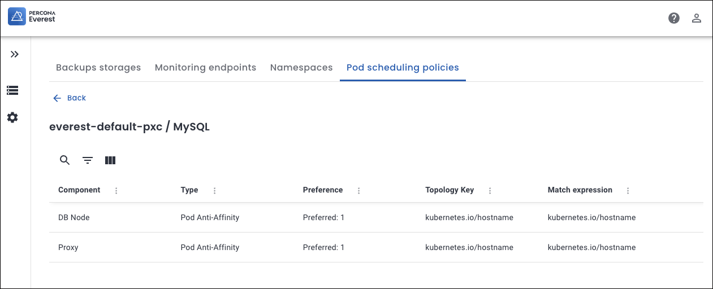
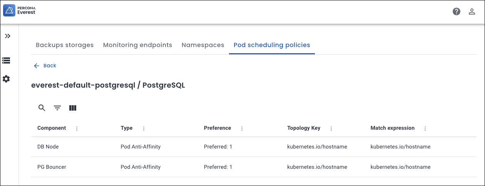

# Default configuration for Pod scheduling policies

In Percona Everest, the default pod scheduling policies are **preset** rules that help ensure optimal placement of database components across a Kubernetes cluster. 

## Importance of default Pod scheduling policies

Percona Everest Administrators create the **default Affinity** rules. Thus, Percona Everest users can use these **predefined** settings without the need to create custom rules for every database cluster they set up. Also, these Pod scheduling policies are defined to align with Percona Everest's infrastructure and internal policies. 

## Common attributes of default Pod scheduling policies

The following are the common attributes of a default policy for all three database technologies.

- **Type**: The Affinity Type applied is **Pod Anti-Affinity**. This ensures that pods of the same component are not co-located on the same node.

- **Preference**: **Preferred** means the scheduler will try to satisfy this rule but will still schedule the pod even if the condition cannot be met.

- **Topology Key**: The topology key `kubernetes.io/hostname` defines the scope of the rule. In this case, it ensures that the anti-affinity is evaluated at the node level, preventing matching pods from being placed on the same node.

These policies use pod labels to identify which pods should not be co-located. The scheduler will try to honor the rule but will not enforce the separation of pods.
 
##  Default policy components by database technology

The **Components** for a default policy change as per the technology:

### Components for MYSQL database

- **DB Node**: The core component that stores and serves data.

- **Proxy**: Acts as a load balancer and router for DB Nodes.

Default anti-affinity prevents multiple DB Nodes or Proxies of the same cluster from being scheduled on the same node.

  

### Components for PostgreSQL database

- **DB Node**: The main PostgreSQL database engine instance.
- **PG Bouncer**: A lightweight connection pooler for PostgreSQL.

The policy ensures separation between DB Nodes and PG Bouncers.

### Components for MongoDB database sharded cluster

- **DB Node:** Stores the actual application data.
- **Config Server:** Stores metadata and configuration for the cluster; required for sharding.
- **Router:** It routes queries to the correct shard(s).

This policy Prevents multiple replica set members or config servers from failing simultaneously if a node goes down.

### Components for MongoDB database non-sharded cluster

- **DB Node:** Replica set members that handle reads and writes for the complete dataset

This policy ensures that DB Nodes (replica set members) are not placed on the same node.

 

