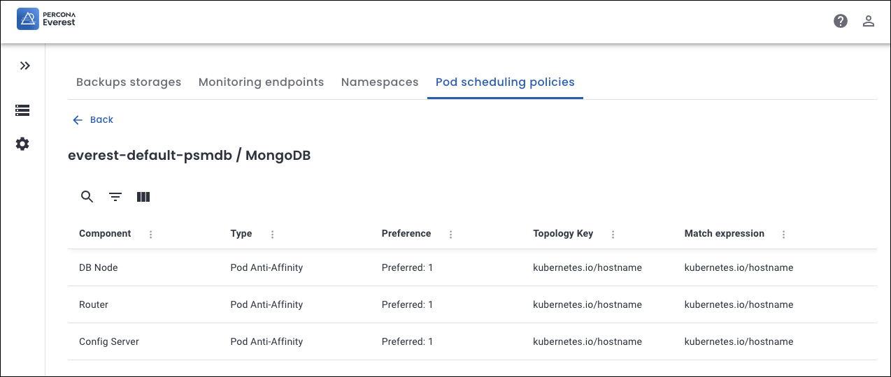

# Default configuration for Pod scheduling policies

In Percona Everest, the default pod scheduling policies are **preset** rules that help ensure optimal placement of database components across a Kubernetes cluster. 

## Importance of default Pod scheduling policies

Percona Everest Administrators create the **default Affinity** rules. Thus, the Percona Everest users can use these **predefined** settings without the need to create custom rules for every database cluster they set up. Also, these Pod scheduling policies are defined to align with Percona Everest's infrastructure and internal policies. 

## Common attributes of default Pod scheduling policies

The following are the common attributes for a default policy for all the three database technologies.

- **Type**: The Affinity Type applied, which is **Pod Anti-Affinity**: This ensures that pods of the same component are not co-located on the same node.

- **Preference**: **Preferred 1** means the scheduler will try to satisfy this rule but will still schedule the pod even if the condition cannot be met.

- **Topology Key**: The topology key `kubernetes.io/hostname` defines the scope of the rule. In this case, it ensures that the anti-affinity is evaluated at the node level, preventing matching pods from being placed on the same node.

These policies use pod labels to identify which pods should not be co-located. The scheduler will try to honor the rule but will not enforce the separation of pods.
 
##  Components by database technology

The **Components** for a default policy change as per the technology:

**MySQL**: DB Node and Proxy

  

**PostgreSQL**: DB Node and PG Bouncer

  

**MongoDB**

- DB Node, Config Server, and Router (for sharded cluster) 
- DB Node for non-sharded cluster.

  

 

