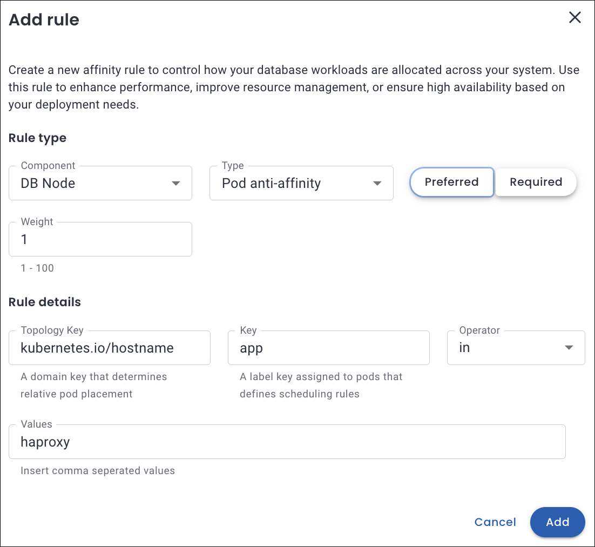

# Default configuration for Pod scheduling policies

In Percona Everest, the default pod scheduling policies are **preset** rules that help ensure optimal placement of database components across a Kubernetes cluster. 

## Common attributes

The following are the common attributes for a default policy for all the three database technologies.

- **Type**: The Affinity Type applied, which is **Pod Anti-Affinity**: This ensures that pods of the same component are not co-located on the same node.

- **Preference**: Preferred 1 means the scheduler will try to satisfy this rule but won't fail if it cannot

- **Topology Key**: This repeats the Topology Key value and suggests that pods matching this label (`kubernetes.io/hostname`) are evaluated when applying the rule.
 
##  Components by technology

The **Components** for a default policy change as per the technology:

- **DB cluster Components**
    - **MySQL**: DB Node and Proxy
    - **PostgreSQL**: DB Node and PG Bouncer
    - **MongoDB** 
        - DB Node, Config Server, and Router (for sharded cluster) 
        - DB Node for non-sharded cluster.

    

## Use cases for affinity

Here are several detailed use cases for affinity that highlight its diverse applications and the numerous benefits it offers across various contexts.

=== "Node affinity"
    ### Regional scheduling

    Let's consider a use case in which workloads are distributed based on performance requirements, fault tolerance, and regional specifications across designated zones or areas.

    You need to run a workload in the `us-west2 region` for latency optimaztion and to meet specific compliance requirements.

    

    ??? info "What happens under the hood"
        - It ensures that the pod is scheduled only on nodes located in the us-west-2 region, as defined by the `topology.kubernetes.io/region` node label.

        - For the rule to be applicable, it is essential that the node possesses a label such as `topology.kubernetes.io/region: us-west-2`. If no nodes correspond to the specified label, the pod will remain in an unscheduled state.

=== "Pod anti-affinity"
    ### Pods scheduled apart

    Let's consider a use case that ensures that the scheduler distributes the different database pods across various Kubernetes nodes, which enhances fault tolerance in the event of node failure.

    

    ??? info "What happens under the hood"
        - The pod will not be scheduled on nodes that contain pods labeled with `app=haproxy`.

        - If no nodes match, the pod will not be scheduled until a suitable node becomes available.

 

