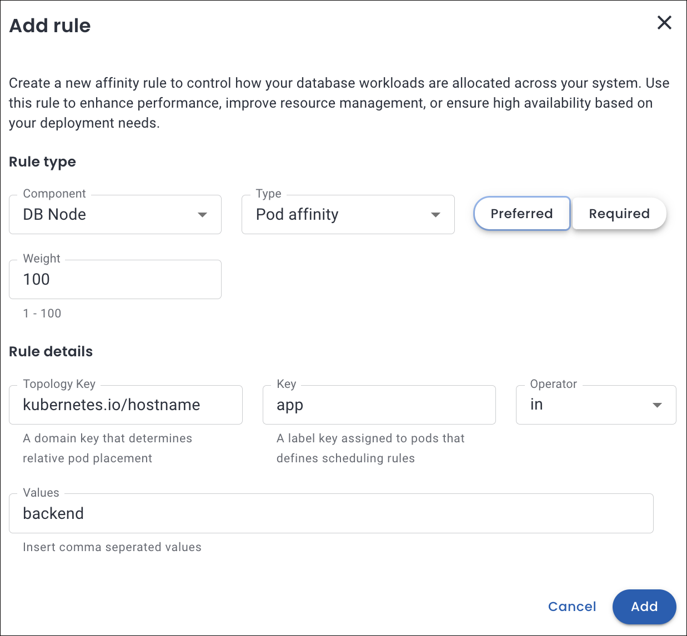

# Use cases for Pod scheduling policies

Here are several detailed use cases for affinity that highlight its diverse applications and the numerous benefits it offers across various contexts.

## Node affinity: Regional scheduling

Let's consider a use case in which workloads are distributed based on performance requirements, fault tolerance, and regional specifications across designated zones or areas.

You need to run a workload in the `us-west2 region` for latency optimaztion and to meet specific compliance requirements.

  

??? info "What happens under the hood"
    - It ensures that the pod is scheduled only on nodes located in the us-west-2 region, as defined by the `topology.kubernetes.io/region` node label.
    - For the rule to be applicable, it is essential that the node possesses a label such as `topology.kubernetes.io/region: us-west-2`. If no nodes correspond to the specified label, the pod will remain in an unscheduled state.

## Pod anti-affinity: Pods scheduled apart

Let's consider a use case that ensures that the scheduler distributes the different database pods across various Kubernetes nodes, which enhances fault tolerance in the event of node failure.

??? info "What happens under the hood"
    - The pod will not be scheduled on nodes that contain pods labeled with `app=haproxy`.
    - If no nodes match, the pod will not be scheduled until a suitable node becomes available.

## Pod affinity: Pods scheduled on the same node

Let's consider a use case that ensures that the scheduler distributes the different database pods on the same Kubernetes node.

  

??? info "What happens under the hood"
    It will prefer to place this pod on a node where other pods with `app=backend` are already running.

 

