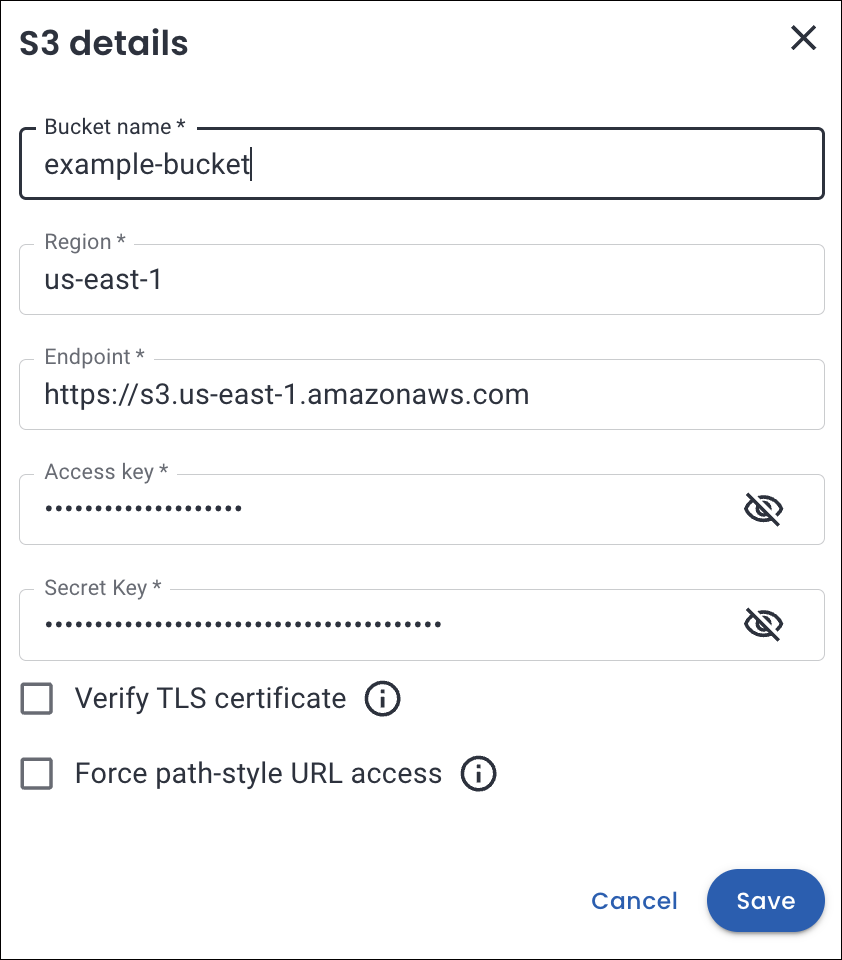
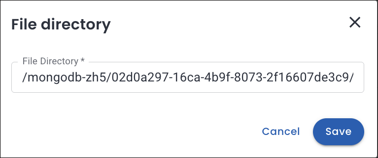
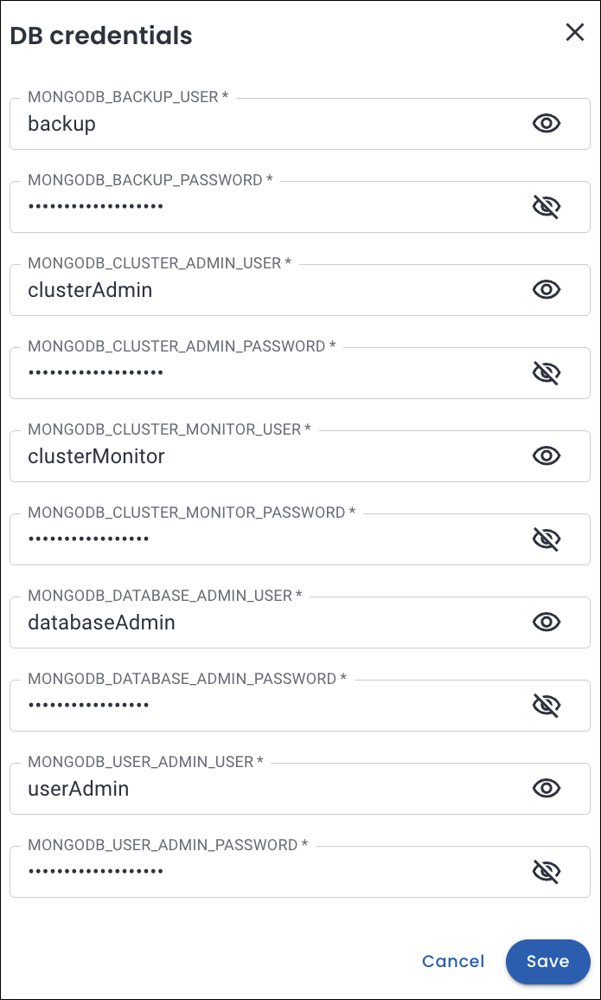
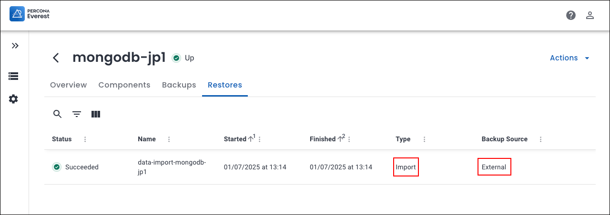
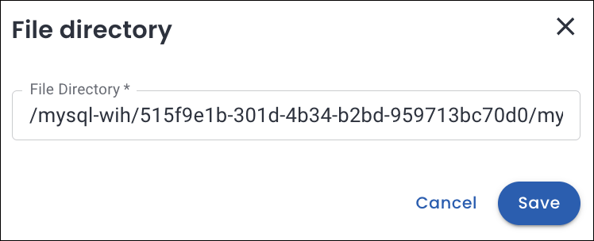
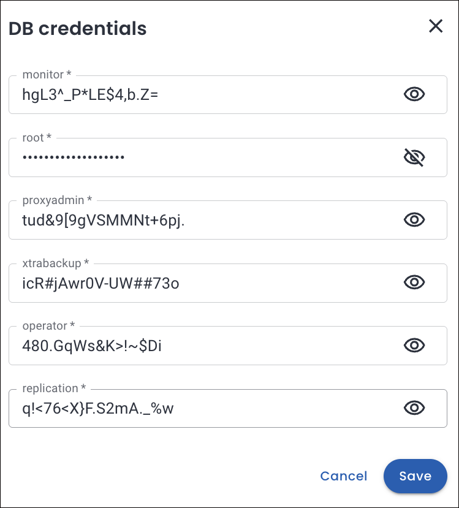
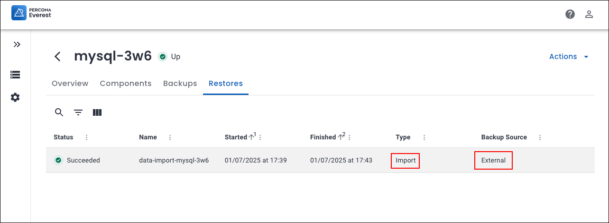
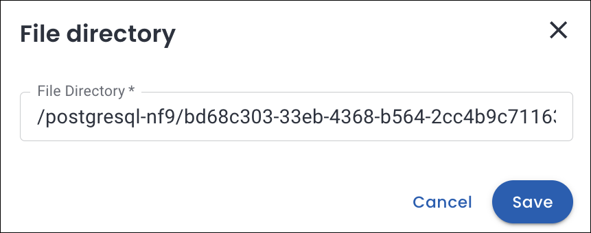
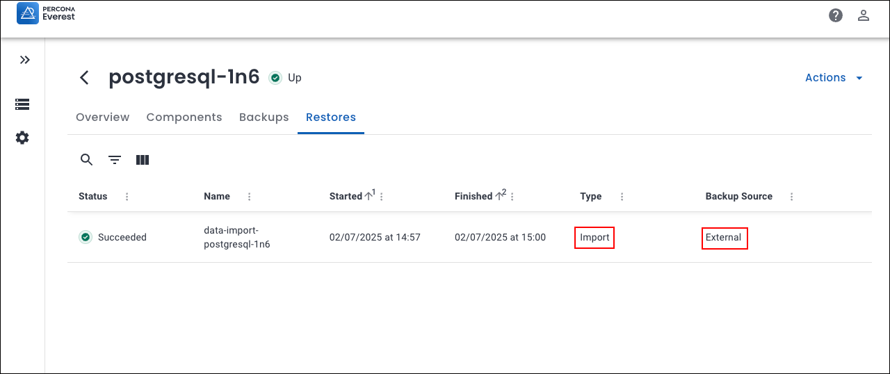

# Import external database backups into Percona Everest

## Introduction

This new feature in Percona Everest enables you to import database **backups stored in external object** storage into clusters managed by Percona Everest using an extensible design.


## Why import external database backups?

Many users looking to adopt Percona Everest already have databases or database backups created with various tools or services, such as AWS RDS, Aurora, or MongoDB Atlas. These backups are often stored in object storage services like Amazon S3. 

Currently, Percona Everest does not offer a method to import these backups into its database clusters. Thus we need a solution where you can easily import external database backups into Percona Everest clusters.

### Goals

This feature aims to achieve the following goals:

- Allow you to import backup data stored in external locations like Amazon S3 into Everest-managed database clusters.

- Support various backup formats and tools, including logical and physical backups using `pg_dump`, `mysqldump`, `mongodump`, and more.

- Provide a pluggable and extensible framework that can adapt to different import needs and workflows.


## Understanding DataImporters

### DataImporters overview

A **DataImporter** is a self-contained, reusable blueprint for importing data into a newly created everest-managed database cluster.

It defines the following:

- The container to be run for your data restore logic.
- The database engines it supports.
- The input configurations it requires (e.g., S3 path, credentials, and custom inputs).
- Any constraints, such as engine version requirements, that your database cluster must meet.

### Why use DataImporters?

Every organization utilizes different backup tools, such as `pg_dump`, `mysqldump`, `mongodump`, physical snapshots, or vendor-specific tools. As a result,, Percona Everest **does not enforce** a one-size-fits-all restore mechanism. Instead, with DataImporters, you can write **custom restore logic** specific to the backup tools or formats you prefer, and percona Everest  just executes them for you.

The benefits of using DataImporters are:

- Reusable: You can define it once and use it across various environments.

- Flexible: ou can use any scripting or programming language, as well as any restore tool, to perform imports.

- Extensible: It supports custom backup formats or workflows.

- Decoupled: Percona Everest manages the manages the infrastructure while you focus on the data logic.


## How to import external database backups using the Percona Everest UI

Here are the steps to import external database backups using Percona Everest UI:
{.power-number}

1. Log into the Percona Everest UI.

2. From the Percona Everest homepage, click **Import**. Select the database type you want to import(MySQL, PostgreSQL, or MongoDB). The **Basic information** page will open.

3. Fill in the required details on the **Basic information** page and click **Continue**. This will take you to the **Import info** page.

3. On the **Import info** page, select the data importer from the dropdown. Based on the selected database type, provide the required details as given in the tabs below.


=== "MongoDB"
    Provide the details of the file you want to import:
    {.power-number}

    1. Click **Fill details** to provide your S3 storage details. The **S3 details** page will open. 
    
        Enter:

        - **Bucket name**:  Enter the unique name identifying your S3 storage bucket.
        - **Region**: Select the geographical AWS region where your bucket is hosted (e.g., us-east-1, eu-west-1)
        - **Access key**: Enter your AWS Access Key ID (like a username for API access).
        - **Secret key**: Enter your AWS Secret Access Key (like a password for secure API access).
        
        Click **Save**.

        

    2. In the **File directory** section, specify the path within your S3 bucket where the backup files are stored. Click **Save**.

        ??? example "Example"

            !!! info "Important"
                You can retrieve the file path using the AWS Management Console, but in this example, we’ll demonstrate how to find it using the AWS CLI.

            How to find the file path using the AWS CLI:
            {.power-number}

            1. Ensure that the AWS CLI installed and configured with your credentials.


                ```sh
                cat > ~/.aws/credentials
                [default]
                aws_access_key_id = SECRET
                aws_secret_access_key = SECRET
                ```

            
            2. List the folders in the bucket:
            
                ```bash
                aws s3 ls <S3 bucket-name>
                ```

                **Output**

                ```plaintext
                PRE mongodb-zh5/
                PRE postgresql-6az/
                ```

            4. List the subfolders:

                ```sh
                aws s3 ls <S3 bucket-name>/mongodb-zh5/
                ```
                
                **Output**

                ```plaintext
                02d0a297-16ca-4b9f-8073-2f16607de3c9/
                ```

            5. Drill down further:

                ```bash
                aws s3 ls <S3 bucket-name>/mongodb-zh5/02d0a297-16ca-4b9f-8073-2f16607de3c9/2025-07-01T07:13:32Z/
                ```

                **Output**

                ```sh
                PRE rs0/
                ```

                !!! note
                    Thus, the full file path for MongoDB should look like this:
                    ```
                    /mongodb-zh5/02d0a297-16ca-4b9f-8073-2f16607de3c9/2025-07-01T07:13:32Z/
                    ```

        


    3. In the **DB Credentials** section, enter the key-value pairs for for credentials, and user secrets.


        ??? example "Example"
            Run the following command to decode the credentials stored in the Kubernetes secret:


            ```sh
            kubectl get secret everest-secrets-mongodb-zh5 -n everest -o jsonpath="{.data}" | jq 'map_values(@base64d)'
            ```

            Replace `everest-secrets-mongodb-zh5` with your secret name.


            Output

            ```sh
            {
                "MONGODB_BACKUP_PASSWORD": "3mBRT5XuJSrMzwhB",
                "MONGODB_BACKUP_USER": "backup",
                "MONGODB_CLUSTER_ADMIN_PASSWORD": "hE1M5Eaut93uWJGCykd",
                "MONGODB_CLUSTER_ADMIN_USER": "clusterAdmin",
                "MONGODB_CLUSTER_MONITOR_PASSWORD": "4ICXY35dqCfjZYR2p7",
                "MONGODB_CLUSTER_MONITOR_USER": "clusterMonitor",
                "MONGODB_DATABASE_ADMIN_PASSWORD": "5aQbEZEDjhoAWoSbc03",
                "MONGODB_DATABASE_ADMIN_USER": "databaseAdmin",
                "MONGODB_USER_ADMIN_PASSWORD": "a9pb12A09pSNchldzq",
                "MONGODB_USER_ADMIN_USER": "userAdmin"
                }
            ```
        
              


    4. Click **Continue** to proceed. You will see the basic information page for your target database.

    5. Enter the information and click on continue until you reach the end of the wizard.

    Your backup import process will now start. You will be notified once the import is successfully completed.

    


=== "MySQL"
    Provide the details of the file you want to import:
    {.power-number}

    1. Click **Fill details** to provide your S3 storage details. The **S3 details** page will open. 
    
        Enter:

        - **Bucket name**:  Enter the unique name identifying your S3 storage bucket.
        - **Region**: Select the geographical AWS region where your bucket is hosted (e.g., us-east-1, eu-west-1)
        - **Access key**: Enter your AWS Access Key ID (like a username for API access).
        - **Secret key**: Enter your AWS Secret Access Key (like a password for secure API access).
        
        Click **Save**.

        

    2. In the **File directory** section, specify the path within your S3 bucket where the backup files are stored. Click **Save**.

        


        ??? example "Example"

            !!! info "Important"
                You can retrieve the file path using the AWS Management Console, but in this example, we’ll demonstrate how to find it using the AWS CLI.

            How to find the file path using the AWS CLI:
            {.power-number}

            1. Ensure that the AWS CLI installed and configured with your credentials.

                ```sh
                cat > ~/.aws/credentials
                [default]
                aws_access_key_id = SECRET
                aws_secret_access_key = SECRET
                ```
            
            2. List the folders in the bucket:
            
                ```bash
                aws s3 ls <S3 bucket-name>
                ```

                Output

                ```plaintext
                PRE mongodb-zh5/
                PRE mysql-wih/
                ```

            4. List the subfolders:

                ```sh
                aws s3 ls <S3 bucket-name>/mysql-wih/
                ```
                
                Output

                ```plaintext
                515f9e1b-301d-4b34-b2bd-959713bc70d0/
                ```

            5. Drill down further:

                ```bash
                aws s3 ls <S3 bucket-name>/mysql-wih/515f9e1b-301d-4b34-b2bd-959713bc70d0/
                ```

                Output

                ```sh
                PRE mysql-wih-2025-07-01-11:40:18-full.sst_info/
                PRE mysql-wih-2025-07-01-11:40:18-full/
                2025-07-01 17:10:49      25765 mysql-wih-2025-07-01-                11:40:18-full.md5
                2025-07-01 17:10:36        128 mysql-wih-2025-07-01-                11:40:18-full.sst_info.md5
                ```

                !!! note
                    Thus, the full file path for MySQL should look like this:
                    ```
                    /mysql-wih/515f9e1b-301d-4b34-b2bd-959713bc70d0/mysql-wih-2025-07-01-11:40:18-full/
                    ```


    3. In the **DB Credentials** section, enter the key-value pairs for for credentials, and user secrets.

        

        ??? example "Example"
            Run the following command to decode the credentials stored in the Kubernetes secret:


            ```sh
            kubectl get secret everest-secrets-mysql-wih -n everest -o jsonpath="{.data}" | jq 'map_values(@base64d)'
            ```

            Output

            ```sh
            {
                "monitor": "hgL3^_P*LE$4,b.Z=",
                "operator": "480.GqWs&K>!~$Di",
                "proxyadmin": "tud&9[9gVSMMNt+6pj.",
                "replication": "q!<76<X}F.S2mA._%w",
                "root": "_bvt*Ip*@r-JOpz>q@1",
                "xtrabackup": "icR#jAwr0V-UW##73o"
            }
            ```

    4. Click **Continue** to proceed. You will see the basic information page for your target database.

    5. Enter the information and click on continue until you reach the end of the wizard.

    Your backup import process will now start. You will be notified once the import is successfully completed.

       


=== "PostgreSQL"
    Provide the details of the file you want to import:
    {.power-number}

    1. Click **Fill details** to provide your S3 storage details. The **S3 details** page will open. 
    
        Enter:

        - **Bucket name**:  Enter the unique name identifying your S3 storage bucket.
        - **Region**: Select the geographical AWS region where your bucket is hosted (e.g., us-east-1, eu-west-1)
        - **Access key**: Enter your AWS Access Key ID (like a username for API access).
        - **Secret key**: Enter your AWS Secret Access Key (like a password for secure API access).
        
        Click **Save**.

        


    2. In the **File directory** section, specify the path within your S3 bucket where the backup files are stored. Click **Save**.

        


        ??? example "Example"

            !!! info "Important"
                You can retrieve the file path using the AWS Management Console, but in this example, we’ll demonstrate how to find it using the AWS CLI.

            How to find the file path using the AWS CLI:
            {.power-number}

            1. Ensure that the AWS CLI installed and configured with your credentials.

                ```sh
                cat > ~/.aws/credentials
                [default]
                aws_access_key_id = SECRET
                aws_secret_access_key = SECRET
                ```
            
            2. List the folders in the bucket:
            
                ```bash
                aws s3 ls <S3 bucket-name>
                ```

                Output

                ```plaintext
                PRE postgresql-nf9/
                ```

            4. List the subfolders:

                ```sh
                aws s3 ls <S3 bucket-name>/postgresql-nf9/
                ```
                
                Output

                ```plaintext
                PRE bd68c303-33eb-4368-b564-2cc4b9c71163/
                ```

            5. Drill down further:

                ```bash
                aws s3 ls <S3 bucket-name>/postgresql-nf9/bd68c303-33eb-4368-b564-2cc4b9c71163/
                ```

                Output

                ```sh
                PRE archive/
                PRE backup/
                ```

            6. Go into the backup folder

                ```bash
                aws s3 ls <S3 bucket-name>/postgresql-nf9/bd68c303-33eb-4368-b564-2cc4b9c71163/backup/
                ``` 


                Output

                ```sh
                PRE db/
                ```

            7. Go deeper into db folder 

                ```bash
                aws s3 ls <S3 bucket-name>/postgresql-nf9/bd68c303-33eb-4368-b564-2cc4b9c71163/backup/db/
                ```


                Output

                ```sh
                PRE 20250702-085755F/
                PRE backup.history/
                2025-07-02 14:28:53       1174 backup.info
                2025-07-02 14:28:53       1174 backup.info.copy
                ```
            
                !!! note
                    Thus, the full file path for PostgreSQL should look like this:
                    ```
                    postgresql-nf9/bd68c303-33eb-4368-b564-2cc4b9c71163/backup/db/PRE 20250702-085755F/
                    ```

    3. Click **Continue**. You will see the basic information page for your target database.

    4. Enter the information and click **Continue** until you reach the end of the wizard.

    Your backup import process will now start. You will be notified once the import is successfully completed.

    


        


