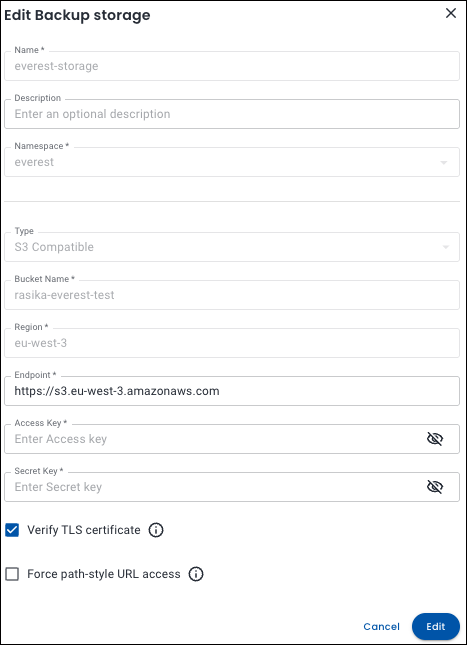

# Manage backup storage

Managing backup storage allows you to edit or remove existing S3 storage configurations used for database backups, helping you keep your backup environment organized, secure, and up-to-date.

## Edit backup storage

To edit a backup storage configuration:
{.power-number}

1. Go to Backup storage settings:

    Navigate to Percona Everest home page and select <i class="uil uil-cog"></i> **Settings > Backup storages**. Then click on the ellipsis (three dots) next to the storage you want to modify.

2. Click **Edit**. The **Edit Backup storage** pop-up will open.

      

4. Make your changes and click **Edit** to save your configuration.

## Delete backup storage

To delete a backup storage:
{.power-number}

1. Go to Backup storage settings:

    Navigate to Percona Everest home page and select <i class="uil uil-cog"></i> **Settings > Backup storages**. Then click on the ellipsis (three dots) next to the storage you want to delete.

2. Click **Delete**. The **Delete storage** confirmation pop-up will open.

3. Click **Delete**. The backup storage will be deleted.

