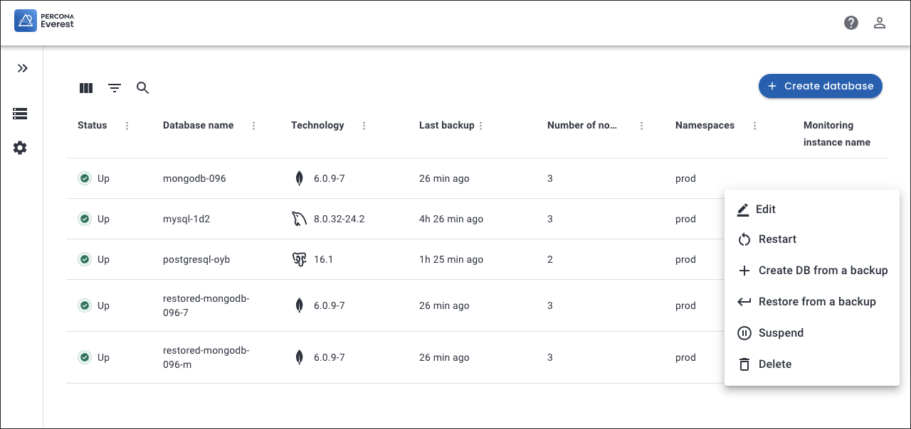
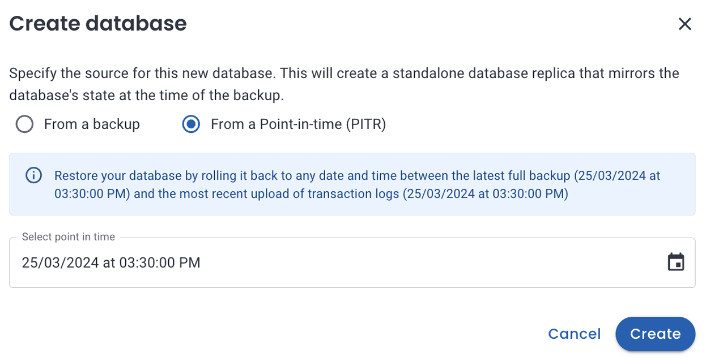

# Create new database from backup or PITR

To create a new database, you can restore from a previously taken backup or perform a point-in-time recovery.

## Create a new database from backup

When you need to recreate a database from a known state, such as when recovering from data loss or corruption, or when setting up a new environment, this method is useful.

There are specific situations that require the creation of a new database from a backup:

- **When the original database is compromised**: Restoring a backup directly to a compromised DB could reintroduce the same issues. Creating a new database from the backup ensures that the restored data is isolated from the original database, preserving data integrity.

- **When you want to debug a problem**: In a disaster recovery situation, it's essential to understand the root problem that led to the need for recovery. Creating a new database allows you to examine the original database for vulnerabilities or issues before restoring the data. This can help identify weaknesses that need to be addressed.

- **When you want to validate backup data before restore**: By creating a new database, you can test the integrity and consistency of the backup data before making it the primary production data. This validation process ensures that the backup is clean and free from corruption, reducing the risk of propagating issues from the backup to the new database.

- **Before upgrading or patching**: In some cases, a disaster recovery event might coincide with the need to upgrade or patch the database software. Creating a new database allows you to apply the necessary upgrades or patches to the new environment, ensuring that the production environment is up-to-date and secure.

- **To create a safety net for rollbacks**: Restoring the backup directly to the original database leaves little room for rolling back the recovery process if issues are discovered later. Creating a new database provides a safety net, as you can decide whether to promote the new database to the production environment or keep the original one if necessary.

To create a new database from backup:
{.power-number}

1. In the <i class="uil uil-database"></i> **Databases** view, select the database you want to replicate.
2. Click on the <i class="uil uil-ellipsis-h"></i> menu next to the database you want to replicate from, then click **Create DB from a backup**. The **Create database** dialogue box opens.

    

3. On the **Create database** pop-up, select **From a backup**.

4. From the dropdown list, select the backup that you want to use for creating a database.

    

5. Click **Create**.

6. On the **Basic information** page, change the default backup name if required, then select one of the classes created by your Kubernetes administrator.
Storage classes define what storage configuration and features will be used for storing your database data. Different classes map to different quality-of-service levels, backup policies, persistent volumes, or to arbitrary policies determined by your cluster administrator. For more information, see [Storage Classes](https://kubernetes.io/docs/concepts/storage/storage-classes/){:target="_blank"} in the Kubernetes documentation. 
7. On the **Resources** page, select the number of nodes and set the resources. For more information see, [Provision a database](../db_provision.md).
8. (Optional) Enable scheduled backups on the **Scheduled Backups** page. Provide a name, select a schedule interval, and choose a backup storage from the dropdown.
9. On the **Point-in-time Recovery (PITR)** page, you may enable **PITR** with the toggle, provided you have previously enabled scheduled backups. Select the **Backup storage** from the dropdown.

10. On the **Advanced Configurations** page, enable external access and database engine parameters by turning the toggle button on. For more information on configuring specific database parameters, see the [MySQL](https://dev.mysql.com/doc/refman/8.0/en/option-files.html){:target="_blank"}, [MongoDB](https://www.mongodb.com/docs/manual/reference/configuration-options){:target="_blank"}, and [PostgreSQL](https://www.postgresql.org/docs/current/config-setting.html#CONFIG-SETTING-CONFIGURATION-FILE){:target="_blank"} configuration documentation.

11. If you’ve added a monitoring endpoint, this option will show as active on the **Monitoring** page, and you can turn it off if required.
12. Click **Create database**.

## Create a new database from PITR

!!! warning
    For PostgreSQL, point-in-time recovery (PITR) can get stuck in a **Restoring** state when you attempt to recover the database after the last transaction. See the [Limitation for PostgreSQL](../../reference/known_limitations.md#limitation-for-postgresql) section for a workaround.

This approach can prove advantageous when you need to revert the database to a particular state, such as reversing unintended modifications to data or restoring from a system breakdown while minimizing data loss.

To create a new database from PITR:
{.power-number}

1. In the <i class="uil uil-database"></i> **Databases** view, select the database you want to replicate.

2. Click on the <i class="uil uil-ellipsis-h"></i> menu next to the database you want to replicate from, then click **Create DB from a backup**. The **Create database** dialogue box opens.

3. On the **Create database** pop-up, select the option **From a Point-in-time (PITR)**. Click on the calendar icon and choose the specific time for which you would like to create the database.

    

4. Follow the steps 4 to 12 from the [Create a new database from backup](#create-a-new-database-from-backup) section.

