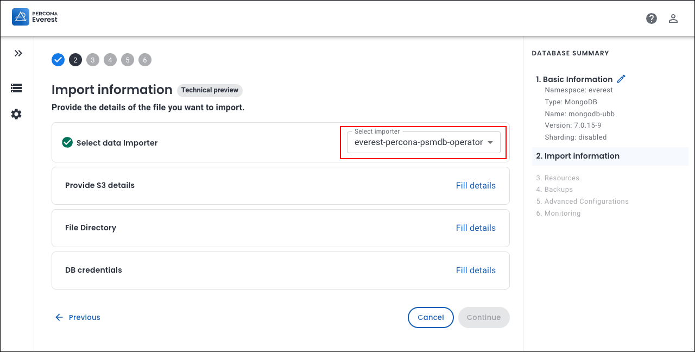

# DataImporter: Percona Operator for MongoDB

The `everest-percona-psmdb-operator` data importer allows you to import backups taken using the Percona Operator for MongoDB.


##  Prerequisites

These are the prerequisites to import external database backups using Percona Everest UI:

- Backup taken using the Percona MongoDB Operator stored in an S3-compatible storage bucket
- Credentials to access the S3 bucket (AccessKeyID and SecretAccessKey)
- System user credentials from the source cluster


## How to import external MongoDB backups using the Percona Everest UI

This section outlines the step-by-step process for importing the backups using the Percona Everest UI.
{.power-number}

1. Log in to the Percona Everest UI.

2. From the Percona Everest homepage, click **Import**. Select the database type as MongoDB. The **Basic Information** page will be displayed.

3. Fill in the details on the **Basic information** page and click **Continue**. This will take you to the **Import info** page.

4. Select the data importer from the dropdown on the **Import information** page.

    

    - Click **Fill details** to provide your S3 storage details. The **S3 details** page will open. Enter the following:
           
        - **Bucket name**:  Enter the unique name identifying your S3 storage bucket.
        - **Region**: Select the geographical AWS region where your bucket is hosted (e.g., us-east-1, eu-west-1)
        - **Access key**: Enter your AWS Access Key ID (like a username for API access).
        - **Secret key**: Enter your AWS Secret Access Key (like a password for secure API access).
            
        Click **Save**.

        

    - In the **File directory** section, specify the path within your S3 bucket where the backup files are stored. Click **Save**.

        !!! info "Important"
            Percona Everest does not validate file paths or verify the existence of files in the specified storage buckets. Make sure that the backup directory path is correct and accessible.

            To verify that the specified path exists, you can use the AWS CLI:

            ```
            aws s3 ls s3://<bucket-name>/<path-to-backup> --region <region>
            ```
   
        ??? example "Find the file path using AWS CLI"
            **Prerequisites:** 
            
            Ensure AWS CLI is installed and configured on your system. To install AWS CLI, refer to the [AWS CLI installation guide](https://docs.aws.amazon.com/cli/latest/userguide/getting-started-install.html){:target="_blank"}.

            1. Run the following command:

                ```
                cat > ~/.aws/credentials
                [default]
                aws_access_key_id = SECRET
                aws_secret_access_key = SECRET
                ```

            2. Navigate your S3 bucket structure:
            
                ```
                # List the folders in the bucket            
                aws s3 ls <S3 bucket-name>
            
                # Output           
                PRE mongodb-zh5/
                PRE postgresql-6az/
            
                # List the subfolders                
                aws s3 ls <S3 bucket-name>/mongodb-zh5/
                                
                # Output                
                PRE 02d0a297-16ca-4b9f-8073-2f16607de3c9/
                
                # Drill down further
                aws s3 ls <S3 bucket-name>/mongodb-zh5/02d0a297-16ca-4b9f-8073-2f16607de3c9/
                
                # Output               
                PRE 2025-07-01T07:13:32Z/
            
                # Dig deeper            
                aws s3 ls <S3 bucket-name>/mongodb-zh5/02d0a297-16ca-4b9f-8073-2f16607de3c9/2025-07-01T07:13:32Z/
        
                # Output
                PRE rs0/

                The file path for MongoDB will be:
                /mongodb-zh5/02d0a297-16ca-4b9f-8073-2f16607de3c9/2025-07-01T07:13:32Z/
                ```

        


    - In the **DB Credentials** section, enter the key-value pairs of the user secrets.

        ??? example "Retrieve the credentials from the Kubernetes secret"
            Run the following command to decode the credentials stored in the Kubernetes secret:

                kubectl get secret everest-secrets-mongodb-zh5 -n everest -o jsonpath="{.data}" | jq 'map_values(@base64d)'

                Replace `everest-secrets-mongodb-zh5` with your secret name.


                Output

                {
                    "MONGODB_BACKUP_PASSWORD": "3mBRT5XuJSrMzwhB",
                    "MONGODB_BACKUP_USER": "backup",
                    "MONGODB_CLUSTER_ADMIN_PASSWORD": "hE1M5Eaut93uWJGCykd",
                    "MONGODB_CLUSTER_ADMIN_USER": "clusterAdmin",
                    "MONGODB_CLUSTER_MONITOR_PASSWORD": "4ICXY35dqCfjZYR2p7",
                    "MONGODB_CLUSTER_MONITOR_USER": "clusterMonitor",
                    "MONGODB_DATABASE_ADMIN_PASSWORD": "5aQbEZEDjhoAWoSbc03",
                    "MONGODB_DATABASE_ADMIN_USER": "databaseAdmin",
                    "MONGODB_USER_ADMIN_PASSWORD": "a9pb12A09pSNchldzq",
                    "MONGODB_USER_ADMIN_USER": "userAdmin"
                    }
        
              


5. Click **Continue** to proceed. You will see the basic information page for your target database.

6. Enter the information and click **Continue** until you reach the end of the wizard.

    Your backup import process will now start. Once the import is successful, the database status will change to **Up**.

    


        


