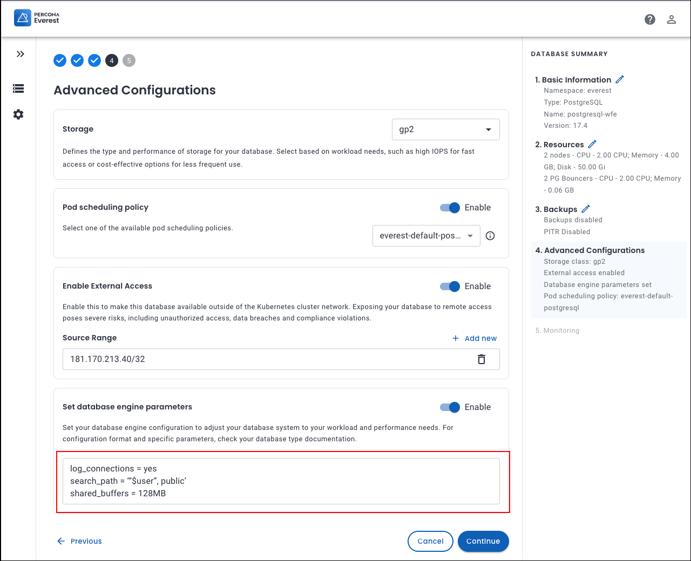

# Database engine configuration

Percona Everest provides configuration settings and options, which are essential for tailoring the database behavior and performance to meet the needs of various applications. You can fine-tune your database operations using these settings and options, thus increasing efficiency and productivity.

To configure your database engine in Percona Everest:

1. From the Percona Everest main page, navigate to **Create databases > Advanced Configurations** page.
2. To update the database engine configuration for your existing database, go to the Everest main page and click on the three dots next to the database you want to update. Then select **Edit**.
3. You can optimize your database's performance using **Database Engine Parameters** on the **Advanced configurations** page.
4. Enable Database engine parameters by moving the slider to the right.
5. Configure specific values to optimize performance, security, and functionality according to your requirements by entering the values in the text box.

    

    Here are some configuration examples for each supported engine type:

    **MySQL** 
    <pre><code>[mysqld]
    key_buffer_size=16M
    max_allowed_packet=128M
    max_connections=250</pre></code>

    **Mongo**
    <pre><code>operationProfiling:
        mode: slowOp
        slowOpThresholdMs: 200</pre></code>

    **PostgreSQL**
    <pre><code>log_connections = yes
    search_path = '"$user", public'
    shared_buffers = 128MB</pre></code>

    For more information on configuring specific database parameters, see the [MySQL](https://dev.mysql.com/doc/refman/8.0/en/option-files.html), [MongoDB](https://www.mongodb.com/docs/manual/reference/configuration-options/), and [PostgreSQL](https://www.postgresql.org/docs/current/config-setting.html#CONFIG-SETTING-CONFIGURATION-FILE) configuration documentation.

6. To enable external access beyond the Kubernetes cluster network, move the slider to the right.

    !!! note alert alert-primary "Note"
        Enabling remote access to your database can lead to serious security risks such as unauthorized access, data breaches, and compliance violations.
    
    

7. Click **Add new** to add the IP addresses in the **Source Range** field.

8. Click **Continue**.

9. If you are creating a new database cluster, click **Create database** and for existing database cluster click **Edit database**. The database engine parameters will be updated.
