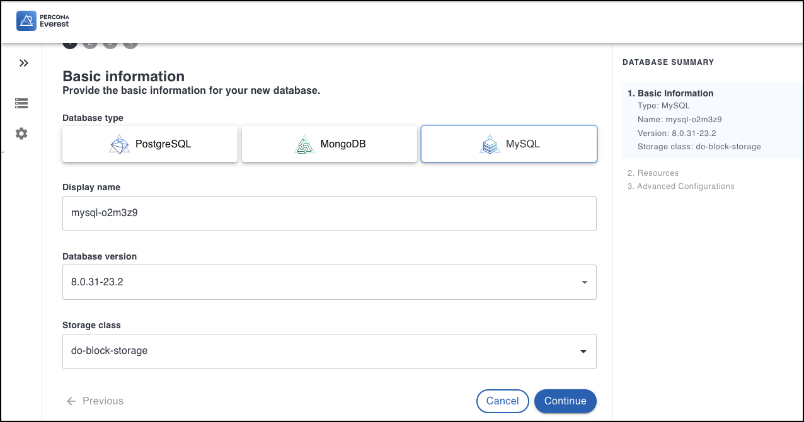
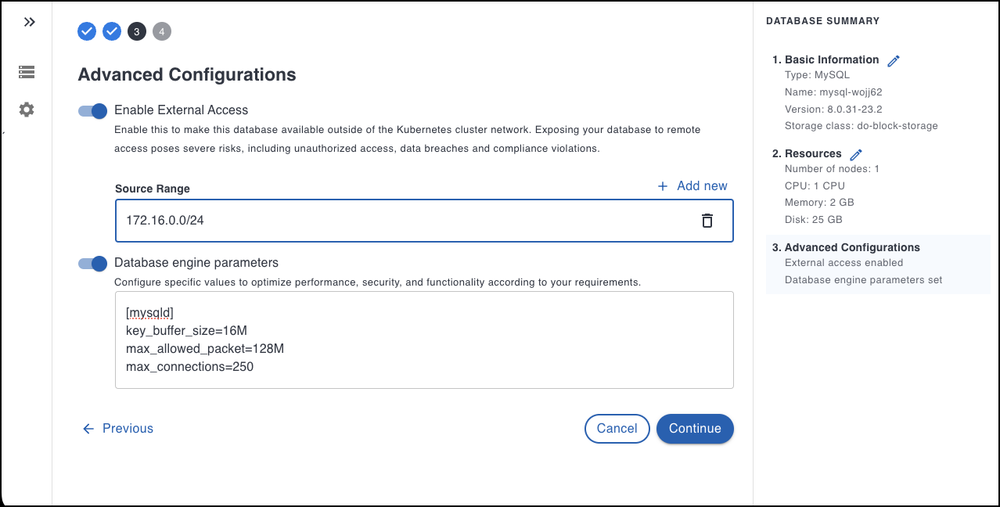

# Database provisioning

Provisioning a database instance involves setting up and configuring a database instance on the Percona Everest platform. 

The steps to provision a new database are:

1. Log into the Percona Everest UI. 

   The Percona Everest homepage will be displayed.

2. Click **Create Database**.

    

    The Basic information page will be displayed.

3. Select the **Database type**: PostgreSQL, MySQL, or MongoDB.

    

4. Choose a name for your database. The name is auto-populated, but you can modify it according to your needs.

5. Select the **Database version** from the dropdown.

6. Select the **[Storage class]()**.

7. Click **Continue**.

    The **Resources** page will be displayed.

8. Select the **Number of nodes**. Also, set the resources per node by selecting one of the predefined presets or by specifying the CPU, Memory, and Disk. For more information on resources, see the [topic]().

    

9. Click **Continue**. 

    The **Advanced Configurations** page will be displayed.

10. On the **Advanced Configurations** page, you can enable external access and database engine parameters by turning the toggle button on.

    

11. Click **Create Database**. Your database will be created.
12. Click Go to list of my databases. You will see the database that you provisioned.

    