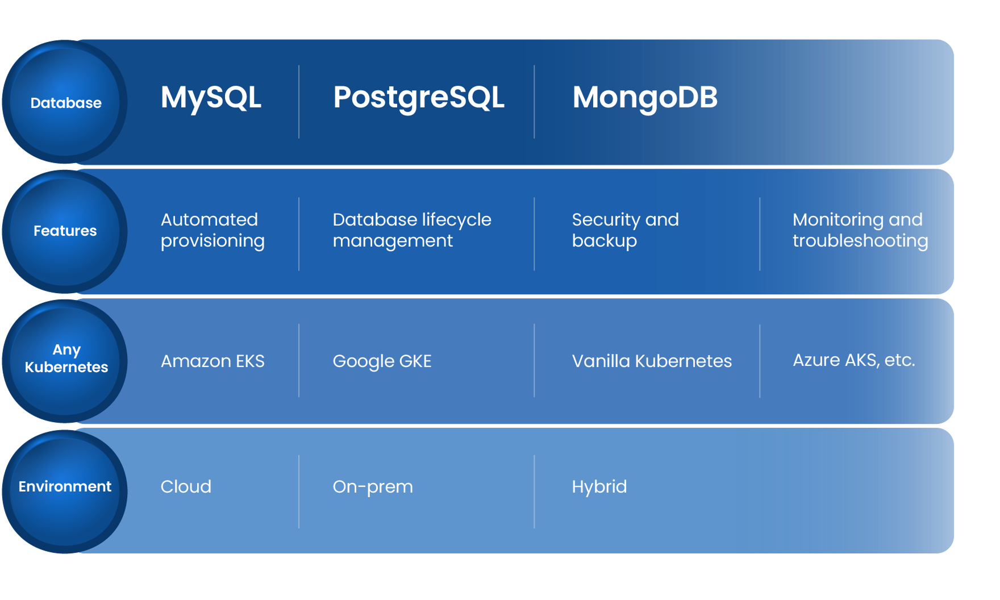

# Welcome to OpenEverest

We are excited to welcome you to OpenEverest, designed to demonstrate the core capabilities of our new open source cloud-native database platform!

## Why OpenEverest?

OpenEverest is the first open-source platform for automated database provisioning and management. It supports multiple database technologies and can be hosted on any Kubernetes infrastructure, in the cloud or on-premises.

  
## Ready to test drive OpenEverest?

Let's start by enabling you to deploy an automated private DBaaS, eliminating vendor lock-in and complex in-house platform development. 

[OpenEverest quickstart guide:material-arrow-right:](quick-install.md){.md-button }  [Manage your first cluster :material-arrow-right:](use/db_provision.md){.md-button }

Refer to our documentation, and you'll be set up in no time.

### :material-telescope: Discover { .title }

Discover how OpenEverest simplifies and streamlines your database management and provisioning.

[Discover OpenEverest :material-arrow-right:](features.md){ .md-button .md-button--primary }

### :material-security: Secure { .title }

Explore how our security features are designed to ensure the security of your hosted databases.

[Secure your deployments :material-arrow-right:](security/sso_idp_integration.md){ .md-button .md-button--primary }

### :material-frequently-asked-questions: Troubleshooting { .title }

Dive into our troubleshooting section designed to guide you through common issues you may encounter while using OpenEverest.

[Troubleshoot :material-arrow-right:](troubleshoot/troubleshoot.md){ .md-button .md-button--primary }

### :material-api: OpenEverest API { .title }

Get ready to dive into our APIs and uncover their potential.

[Dive into our APIs :material-arrow-right:](https://openeverest.io/docs/api/){ .md-button .md-button--primary }

