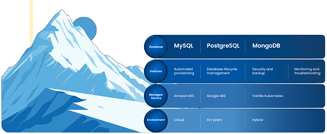

# Welcome to Percona Everest

We are excited to welcome you to GA of Percona Everest, designed to demonstrate the core capabilities of our new open source cloud-native database platform!

## Why Percona Everest?

Percona Everest is the first open-source platform for automated database provisioning and management. It supports multiple database technologies and can be hosted on any Kubernetes infrastructure, in the cloud or on-premises.

Let's start by enabling you to deploy an automated private DBaaS, eliminating vendor lock-in and complex in-house platform development.

  
## Ready to test drive Percona Everest?

Let's start by enabling you to deploy an automated private DBaaS, eliminating vendor lock-in and complex in-house platform development. 

[Percona Everest quickstart guide:material-arrow-right:](install/installEverest.md){.md-button}  [Manage your first cluster :material-arrow-right:](use/db_provision.md){.md-button}

## :material-telescope: Discover { .title }

Discover how Percona Everest simplifies and streamlines your database management and provisioning.

[Discover Percona Everest :material-arrow-right:](features.md){ .md-button .md-button--primary }

## :material-security: Secure { .title }

Learn how Percona Everest ensures the security of your hosted databases.

[Security in Percona Everest :material-arrow-right:](secure/user-auth.mdfeatures.md){ .md-button .md-button--primary }