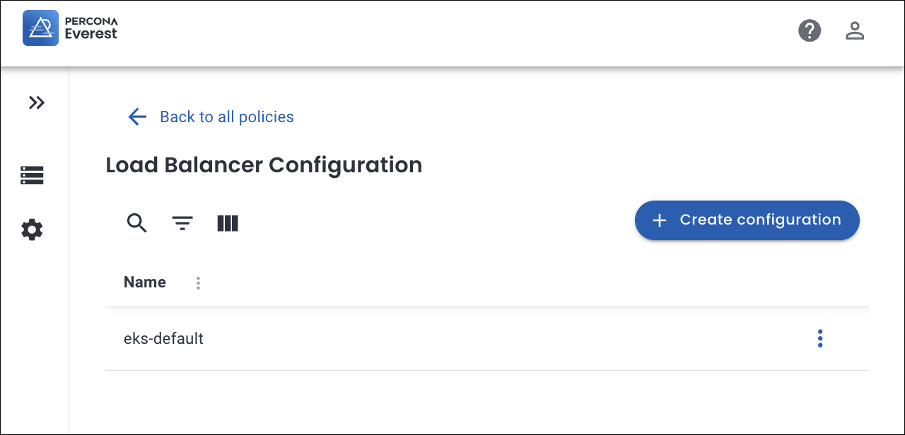
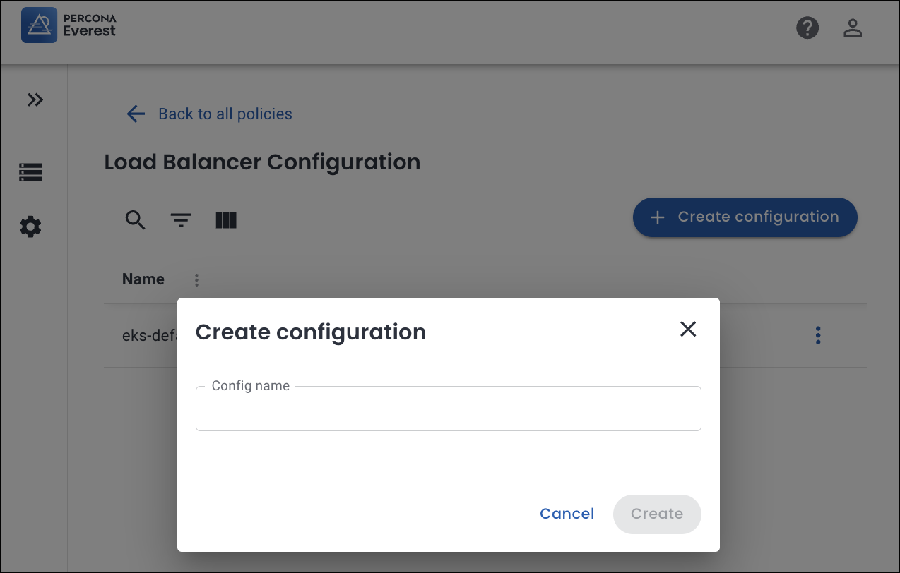
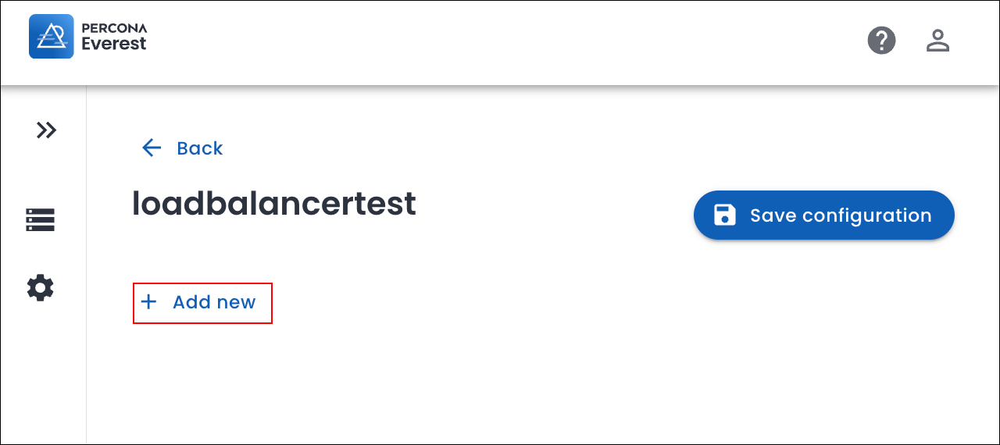
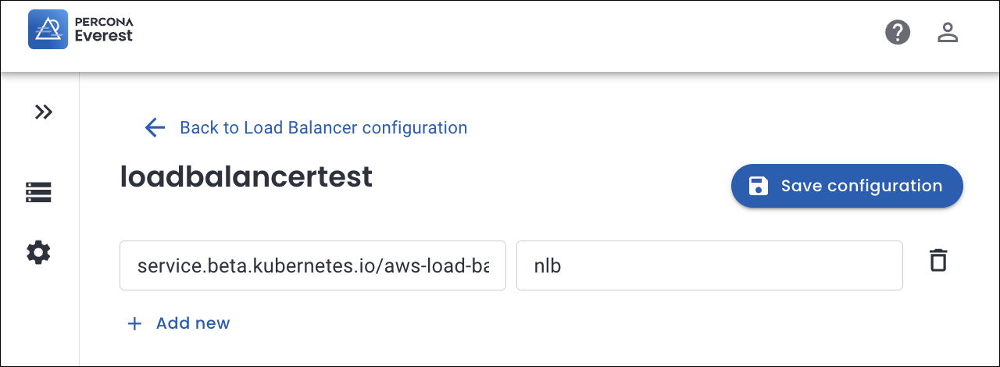
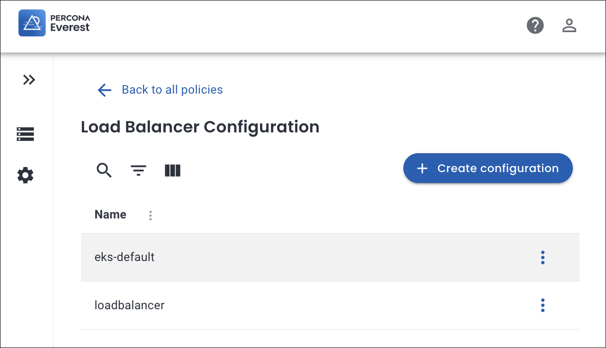
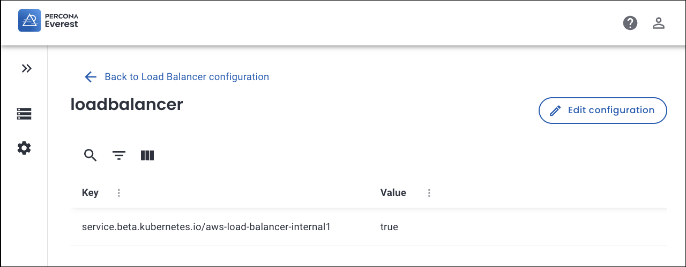
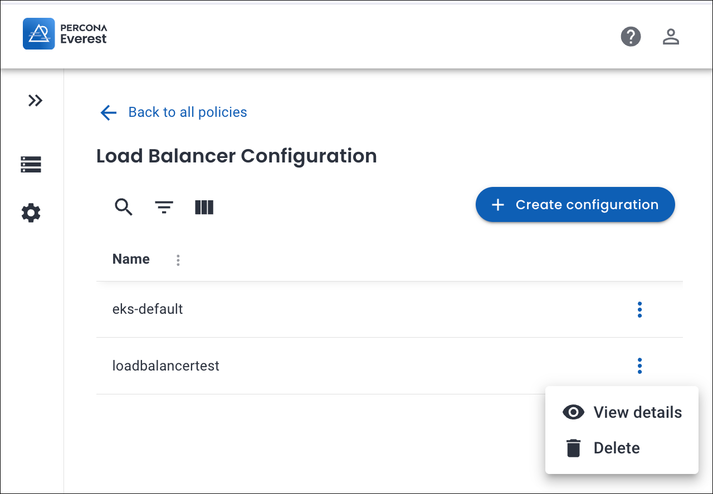
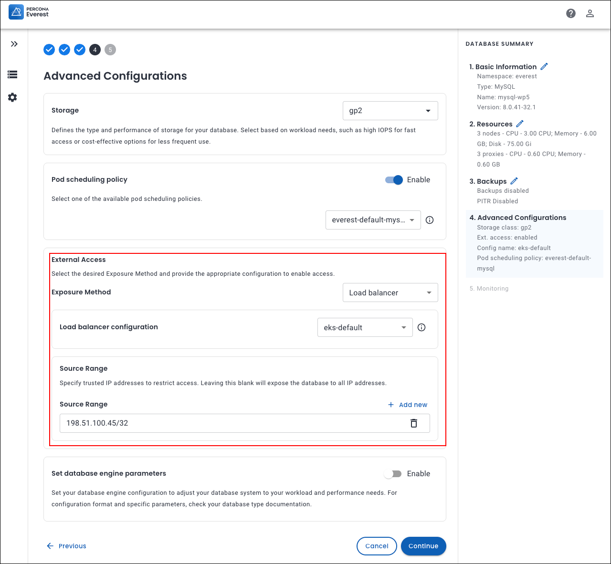

# Creating and managing load balancer configurations

!!! info "Important"
    Before you begin, take a moment to explore the important limitations of [load balancer configuration](../reference/known_limitations.md#load-balancer-configuration).


## Create a load balancer configuration

Here's how you can create a load balancer configuration:
{.power-number}

1.  Navigate to the Percona Everest home page and go to <i class="uil uil-cog"></i> **Settings > Policies**.

    

2. In the **Load Balancer Configuration** section, click **Configure**. The **Load Balancer Configuration** page opens.

    

3. Click **Create configuration**. A pop-up window appears.

    

4. Enter a **Configuration name** and click **Create**.

5. Click **Add new**.

    

6. Enter the annotations (key-value pairs) for your load balancer configuration. 

    

    !!! note
        The **key** and **value** in a Load Balancer configuration for Percona Everest are derived from your Kubernetes environment and the load balancer implementation by your cloud provider.

    ??? example "Examples of keys and values used for Load balancer configuration"

        ```sh
        service.beta.kubernetes.io/aws-load-balancer-type: "nlb"                    # Use Network Load Balancer (NLB)
        service.beta.kubernetes.io/aws-load-balancer-scheme: "internet-facing"        # Internet-facing vs. internal
        service.beta.kubernetes.io/aws-load-balancer-internal: "true"                   # Internal LB
        service.beta.kubernetes.io/aws-load-balancer-ssl-cert: "arn:aws:acm:..."        # Attach ACM SSL cert
        service.beta.kubernetes.io/aws-load-balancer-ssl-ports: "443"                   # SSL termination ports
        service.beta.kubernetes.io/aws-load-balancer-backend-protocol: "http"        # Protocol between LB and pods
        ```

7. Click **Save configuration**.

8. Click **Back** to view the newly created load balancer configuration.

    

## Manage load balancer configuration

Here's how you can edit the load balancer configuration:
{.power-number}

1.  Navigate to the Percona Everest home page and go to <i class="uil uil-cog"></i> **Settings > Policies**.

2. In the **Load Balancer configuration** section, click **Configure**. The list of existing configurations appears.

3. To add new annotations or for an existing load balancer configuration, click on the specific configuration you want to update and click **Edit configuration**.

4. Click **Add new** and add the annotations. Click **Save configuration**.

5. To modify an existing configuration, click on the specific configuration and click **Edit configuration**. Modify the annotations and click **Save configuration**.

    


    !!! note
        **eks-default** is the default load configuration and cannot be edited.


## Delete load balancer configuration

Here's how you can delete the load balancer configuration:
{.power-number}

1. Navigate to the Percona Everest home page and go to <i class="uil uil-cog"></i> **Settings > Policies** 

2. In the **Load Balancer configuration** section, click **Configure**. The list of existing configurations appears.

3. Click on the ellipsis next to the load balancer configuration that you want to delete.

4. Click on **Delete**. A confirmation pop-up will be displayed for deleting the load balancer configuration.

5. Enter the **Config name** in the text box and click **Delete**.

    

    !!! note
        **eks-default** is the default load balancer configuration and cannot be deleted.


## Expose your database cluster

Use the comparison table below to determine whether to expose your database in Percona Everest using `ClusterIP` or `Load balancer`.


| **Criteria**               | **ClusterIP**                                                     | **Load balancer**                                                                                                                                 |
| ------------------------ | ----------------------------------------------------------------- | ------------------------------------------------------------------------------------------------------------------------------------------------ |
| **Purpose**              | Keeps the database accessible only inside the Kubernetes cluster. | Makes the database accessible from outside the cluster.                                                                                          |
| **Accessibility**        | Available only to in-cluster pods and services.                   | Available to external clients through a cloud or external load balancer.                                                                         |
| **Best suited for**      | Applications that run within the same cluster as the database.    | Applications, monitoring tools, or clients that need external connectivity.                                                                      |
| **Security**             | Keeps access internal by default, reducing exposure.                     | Requires strict access controls to prevent unauthorized access.                                                         |
| **Load balancer configuration** | Not supported.                                                    | Allows you apply custom annotations to control load balancer behavior.                                                                   |
| **Limitations**          | No external access possible.                                      | Inherits all the [limitations for load balancer configuration](../reference/known_limitations.md##load-balancer-configuration). |


## Configure load balancer for external database access

You can expose a database cluster outside of the Kubernetes network during database creation:
{.power-number}

1. Log in to the Percona Everest UI.

2. On the Percona Everest homepage, click **Create database**. Select the database that you wish to provision.

3. Continue through the setup until you reach the **Advanced Configurations** page.

4. In the **Enable External Access** section, select **Load balancer** as the **Exposure method** from the dropdown.

    

6. Select the desired **Load balancer configuration** from the dropdown.

7. (Optional) In the **Source range** field, enter trusted IP addresses to restrict access.

    - To add multiple Source ranges, click **Add new**. Enter the specific IP addresses separately.

    - You must always provide a CIDR block (for example, 203.0.113.25/32 to allow only one IP, or 203.0.113.0/24 to allow an entire subnet).

    - Without a network mask (/xx), the configuration is invalid.

    -   Using restrictive IP ranges reduces the risk of unauthorized access and data breaches.

    !!! note
        Leaving the **Source range** blank will expose the database to all the IP addresses (0.0.0.0/0). This is not recommended for production environments.

8. Click **Continue** until you reach the end of the wizard, and then click **create database**.


 


