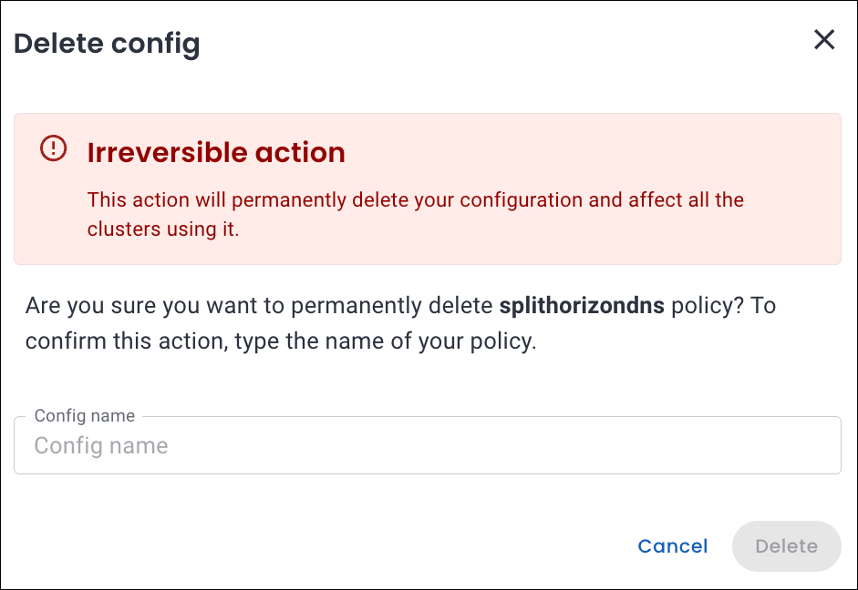
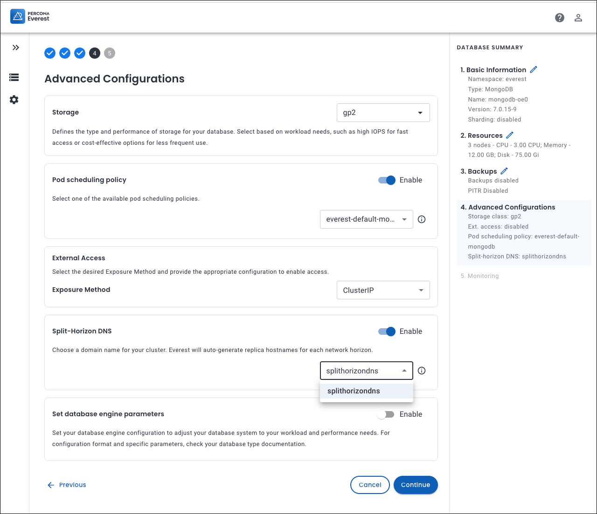

# Creating and managing Split-Horizon DNS configurations

Here's how you can create, edit, and delete Split-Horizon DNS configuration for your Percona Operator for MongoDB cluster in Percona Everest.

## Create a Split-Horizon DNS Config

Follow these steps to create a new Split-Horizon DNS policy:
{.power-number}

1.  Navigate to the Percona Everest home page and go to <i class="uil uil-cog"></i> **Settings > Policies & configurations**.

    

2. In the **Split-Horizon DNS** section, click **Configure**. The **Split-Horizon DNS** page opens.

    

3. Click **Create configuration**. A pop-up window appears.

4. Enter the following:
    
    - **Name**: The desired name for your Split-Horizon policy.
    - **Namespace**: The Kubernetes namespace where you want to create the policy.
    - **Domain**: A domain represents how your database endpoint is identified (for example, mydb.everest.local).
    - **Certificate**: Upload your **Transport Layer Security 
    (TLS)** certificate. 
    For information on how to obtain a TLS certificate, refer to the [TLS Certificate page](split-horizon_create_CA_certs.md).
    - **Secret name**: Kubernetes Secret that stores the TLS certificate and private key associated with a particular domain.
    - **key**: Upload your Private key file. The private key pairs with the TLS certificate and is used to establish encrypted connections.
    - **Ca cert**: Upload your Certificate Authority (CA) Certificate. A CA certificate is the root or intermediate certificate from the Certificate Authority (CA) that signed your TLS certificate. It helps clients verify that your database’s certificate is valid and trustworthy.

5. Click **Create**. Your Split-Horizon DNS policy will be created and appears in the configuration list.

    

## Edit split-horizon DNS policy

!!! info "Important"
    You can edit a Split-Horizon DNS policy only if it is not associated with any active cluster.

Here's how you can edit a Split-Horizon DNS policy for your MongoDB cluster:
{.power-number}

1. Navigate to the Percona Everest home page and go to <i class="uil uil-cog"></i> **Settings > Policies & configurations**.

2. In the **Split-Horizon DNS** section, click **Configure**. The **Split-Horizon DNS** page opens. Here, you can see the existing Split-Horizon DNS policies.

3. Click the ellipsis **(⋮)** next to the Split-Horizon DNS policy you want to modify and select **Edit**. The **Edit configuration** pop-up opens.

    

4. Update the desired fields.

    !!! note
        You can only edit the **Domain, Ca cert, and Ca key** fields. 

5. Click **Save** to apply the changes.

## Delete a Split-Horizon DNS policy

!!! info "Important"
    You can delete a Split-Horizon DNS config only if it is not used by any active cluster.

 Here's how you can delete an existing Split-Horizon DNS policy for a MongoDB cluster:

{.power-number}

1. Navigate to the Percona Everest home page and go to <i class="uil uil-cog"></i> **Settings > Policies & configurations**.

2. In the **Split-Horizon DNS** section, click **Configure**. The **Split-Horizon DNS** page opens. Here, you can see the existing Split-Horizon DNS policies.

3. Click on the ellipsis **(⋮)** next to the Split-Horizon DNS policy you want to delete. 

    

4. Click **Delete**. A confirmation pop-up will be displayed for deleting the Split-Horizon DNS config policy.

    

5. Enter the **Config name** in the text box to confirm the deletion, and click **Delete**. Your Split-Horizon DNS policy will be deleted.

    

## Configure Split-Horizon DNS policy for your MongoDB cluster

!!! info "Important"
    Split-Horizon DNS is currently applicable only to non-sharded clusters.

You can configure Split-Horizon DNS policy for your MongoDB cluster during database creation:
{.power-number}

1. Log in to the Percona Everest UI.

2. On the Percona Everest homepage, click **Create database**. Select the database that you wish to provision.

3. Continue through the setup until you reach the **Advanced Configurations** page.

4. In the **Split-Horizon DNS** section, enable it by turning the toggle ON.
    

6. Select the desired **Split-Horizon DNS** policy from the dropdown.

    

8. Click **Continue** until you reach the end of the wizard, and then click **Create database**.

9. To view the Domain Names and IP Addresses generated for Split-Horizon DNS, open the **Overview** page of the desired database cluster and click the **eye icon** next to **Split-Horizon DNS**. The Domains tab opens. Percona Everest displays all generated domains along with their associated private and public IP addresses.

    

