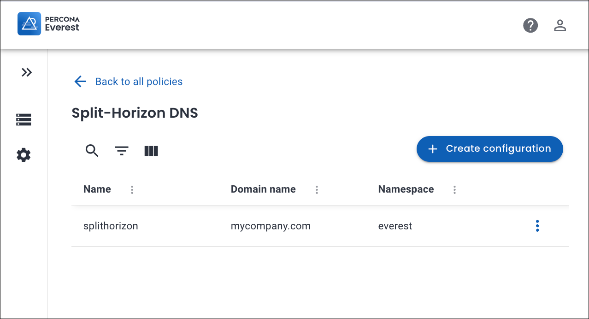
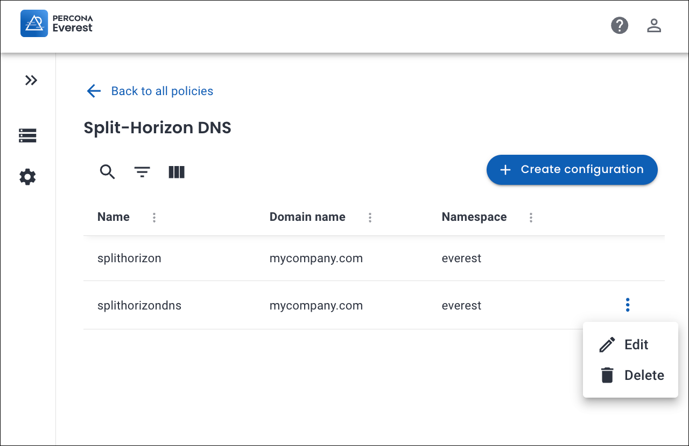
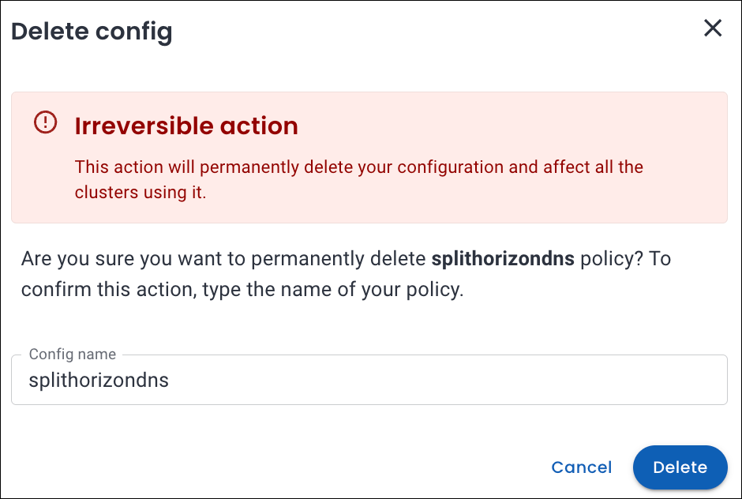

# Configure split-horizon DNS

Here's how you can configure a split-horizon DNS for MongoDB
{.power-number}

1.  Navigate to the Percona Everest home page and go to <i class="uil uil-cog"></i> **Settings > Policies & configurations**.

    

2. In the **Split-Horizon DNS** section, click **Configure**. The **Split-Horizon DNS** page opens.

    

3. Click **Create configuration**. A pop-up window appears.

    

4. Enter the following:

    
    - **Name**: The desired name for your Split-Horizon policy.
    - **Namespace**: The Kubernetes namespace where you want to create the policy.
    - **Domain**: A domain represents how your database endpoint is identified (for example, mydb.everest.local).
    - **Certificate**: Upload your **Transport Layer Security 
    (TSL)** certificate. 
    For information on how to obtain a TSL certificate, refer to the [TLS Certificate page](split-horizon_create_CA_certs.md).
    - **key**: Upload your Private key file. The private key pairs with the TLS certificate and is used to establish encrypted connections.
    - **Ca cert**: Upload your Certificate Authority (CA) Certificate. A CA certificate is the root or intermediate certificate from the Certificate Authority (CA) that signed your TLS certificate. It helps clients verify that your database’s certificate is valid and trustworthy.

5. Click **Create**. Your Split-Horizon policy will be created.

    

## Edit split-horizon DNS policy

Here's how you can edit a split-horizon DNS for MongoDB
{.power-number}

1. Navigate to the Percona Everest home page and go to <i class="uil uil-cog"></i> **Settings > Policies & configurations**.

2. In the **Split-Horizon DNS** section, click **Configure**. The **Split-Horizon DNS** page opens. Here, you can see the existing Split-Horizon DNS policies.

3. Click on the ellipsis (three dots) next to the `Split-Horizon DNS` policy which you want to edit and click **Edit**. The **Edit configuration** pop-up opens.

    

    !!! note
        You cn only edit a Split-Horizon DNS policy if it is not being used by any cluster.

4. Edit the Split-Horizon DNS policy.

    !!! note
    - You can only edit the **Domain, Ca cert, and Ca key** fields. 

5. Click **Save**.

## Delete split-horizon DNS policy

 Here's how you can delete a split-horizon DNS for MongoDB
{.power-number}

1. Navigate to the Percona Everest home page and go to <i class="uil uil-cog"></i> **Settings > Policies & configurations**.

2. In the **Split-Horizon DNS** section, click **Configure**. The **Split-Horizon DNS** page opens. Here, you can see the existing Split-Horizon DNS policies.

3. Click on the ellipsis (three dots) next to the `Split-Horizon DNS` policy you want to delete. 

    

4. Click **Delete**. A confirmation pop-up will be displayed for deleting the Split-Horizon DNS config policy.

    

5. Enter the **Config name** in the text box and click **Delete**.

    

