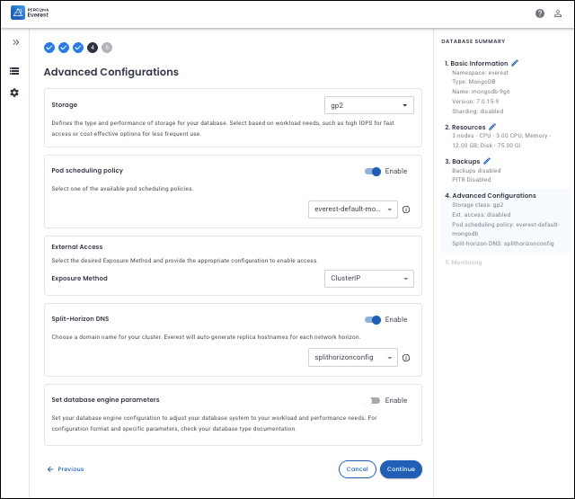

# Split-Horizon DNS scerarios


## Create Split-Horizon DNS config

A Percona Everest administrator can create a set of base domains and generate the necessary TLS certificates in advance. This allows all Percona Everest users to use these domains later without the need to define custom domain names each time they create a Percona Server for MongoDB cluster.

Percona Everest provides an interface to create a Split-Horizon DNS configuration that defines the necessary relationships and stores them for future use.

The following applies to Split-Horizon DNS configs:

- Each config has a unique name within the selected namespace.

- It can only be applied to the Percona Server for MongoDB engine. The other database engines do not support this feature.

- Each config is associated with a specific namespace, which the user defines during creation.

**Split-Horizon DNS config parameters**

| Configuration Parameter      | Description                                                                                                         |
|-------------------------------|---------------------------------------------------------------------------------------------------------------------|
| **Name**                      | Each **Split-Horizon DNS config** has a unique name within the selected namespace.                                   |
| **Namespace**                 | Kubernetes namespace to which this config is applicable. Defined by the user during config creation.                 |
| **Base domain name**          | Domain name suffix used for generating full domain names for each Pod in the Replica Set. This field is also used as the **Split-Horizon DNS config** name. |
| **CA TLS certificates**  |TLS CA files (certificate and key) that will be used by Percona Everest for generating TLS certificates for Split-Horizon domains. For instructions on generating CA certificates, refer to [Generate CA certificates](split-horizon_create_CA_certs.md)|
| **Secret name**  |Kubernetes secret that shall be used for storing TLS CA files.</br> You may create this secret on your own in advance that holds the CA cert and key and refer to it during Split-Horizon DNS Config creation.|

Once all values are entered, the Percona Everest administrator saves the configuration in the system.


## Protect Split-Horizon DNS config with RBAC

A Percona Everest administrator may want to restrict access to the Split-Horizon DNS configuration or the ability to apply a specific Split-Horizon DNS configuration for certain Percona Everest users. To achieve this, the administrator utilizes Percona Everest RBAC to define policies that restrict access to the selected instances. These RBAC policies apply to the entire Split-Horizon DNS configuration.

### Limit access to Split-Horizon DNS config

A Percona Everest administrator may want to allow specific users (for example, Alice) to fully manage (create, edit, read, delete) Split-Horizon DNS configurations.
Other users can only read the Split-Horizon DNS configs and use them in database clusters, but cannot make any changes.

To implement this, the Percona Everest administrator creates an RBAC policy:

```sh
p, alice, enginefeatures/split-horizon-dns-configs, *, */*
p, role:team-dev, enginefeatures/split-horizon-dns-configs, read, */*
```

### Limit usage of Split-Horizon DNS config by users

A Percona Everest administrator may want to allow a specific user (for example, bob) to use a particular Split-Horizon DNS config (for example, `mycompanydns` in namespace `ns-1`).
All other users are not permitted to use this configuration. That is, they cannot see it in the system and cannot assign it to any database clusters they create or modify.

To implement this, the Percona Everest administrator creates an RBAC policy:

```sh
p, bob, enginefeatures/split-horizon-dns-configs, read, ns-1/mycompany.com
```

## Apply Split-Horizon DNS config to new database cluster

!!! info "important"
    - Only one **Split-Horizon DNS config** can be applied to one database cluster.
    - **Split-Horizon DNS** feature can be enabled only if **Sharding** is disabled.

When creating a new cluster for Percona Server for MongoDB, you can choose to enable the Split-Horizon DNS feature.

The system provides an additional **Split-Horizon DNS** panel on the **Advanced Configuration** step of the database cluster creation wizard. By default, the Split-Horizon DNS feature toggle is disabled.




For detailed instructions on applying a Split-Horizon DNS config to a new database cluster, see the section [configure Split-Horizon DNS policy for a new database cluster](split-horizon_config.md#configure-split-horizon-dns-policy-for-your-mongodb-cluster).


## Update Split-Horizon DNS config

In certain situations, a specific Split-Horizon DNS configuration may need modifications, such as altering the base domain name or uploading new Transport Layer Security (TLS) certificates. A Percona Everest administrator, or any user with the necessary Role-Based Access Control (RBAC) permissions, can update the Split-Horizon DNS configuration.


For detailed instructions on updating a Split-Horizon DNS config, see [edit split-horizon DNS policy](split-horizon_config.md#edit-split-horizon-dns-policy).


## Delete Split-Horizon DNS config

If a particular Split-Horizon DNS config is no longer needed, the Percona Everest administrator can choose to delete it.

For detailed instructions on deleting a Split-Horizon DNS config, see [delete split-horizon DNS policy](split-horizon_config.md#delete-a-split-horizon-dns-policy).


