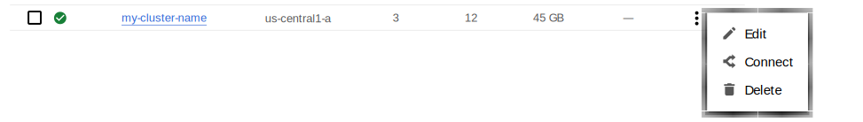

# Create Kubernetes cluster on Google Kubernetes Engine (GKE)

## Prerequisites

All commands from this guide can be run either in the **Google Cloud shell** or in **your local shell**.

To use *Google Cloud shell*, you need nothing but a modern web browser.

If you would like to use *your local shell*, install the following:
{.power-number}

1. [gcloud](https://cloud.google.com/sdk/docs/quickstarts){:target="_blank"}. This tool is
    part of the Google Cloud SDK. To install it, select your operating
    system on the [official Google Cloud SDK documentation page](https://cloud.google.com/sdk/docs){:target="_blank"}
    and then follow the instructions.

2. [kubectl](https://cloud.google.com/kubernetes-engine/docs/quickstart#choosing_a_shell){:target="_blank"}.
    It is the Kubernetes command-line tool you will use to manage and deploy
    applications. To install the tool, run the following command:

    ``` {.bash data-prompt="$" }
    $ gcloud auth login
    $ gcloud components install kubectl
    ```

## Create and configure the GKE cluster

!!! caution alert alert-warning "Important"
    To run a 3-node pxc cluster, you will need at least a 3-node cluster with 2vCPUs available. The database will not be created if you attempt to create a database cluster in a Kubernetes cluster without sufficient resources.

You can configure the settings using the `gcloud` tool. You can run it either in
the [Cloud Shell](https://cloud.google.com/shell/docs/quickstart){:target="_blank"} or in your
local shell (if you have installed Google Cloud SDK locally on the previous
step). The following command will create a cluster named `my-cluster-name`:

``` {.bash data-prompt="$" }
$ gcloud container clusters create my-cluster-name --project <project name> --zone us-central1-a --cluster-version 1.29 --machine-type n1-standard-4 --num-nodes=3
```

!!! note

    You must edit the previous command and other command-line statements to
    replace the `<project name>` placeholder with your project name. You may
    also be required to edit the *zone location*, which is set to `us-central1`
    in the above example. Other parameters specify that we are creating a
    cluster with 3 nodes and with machine type of 4 vCPUs.

You may wait a few minutes for the cluster to be generated.

???+ note "When the process is over, you can see it listed in the Google Cloud console"

    Select *Kubernetes Engine* → *Clusters* in the left menu panel:

    

Now you should configure the command-line access to your newly created cluster
to make `kubectl` be able to use it.

In the Google Cloud Console, select your cluster and then click the *Connect*
shown on the above image. You will see the connect statement which configures
the command-line access. After you have edited the statement, you may run the
command in your local shell:

``` {.bash data-prompt="$" }
$ gcloud container clusters get-credentials my-cluster-name --zone us-central1-a --project <project name>
```

Finally, use your [Cloud Identity and Access Management (Cloud IAM)](https://cloud.google.com/iam){:target="_blank"}
to control access to the cluster. The following command will give you the
ability to create Roles and RoleBindings:

```sh
kubectl create clusterrolebinding cluster-admin-binding --clusterrole cluster-admin --user $(gcloud config get-value core/account)
```

??? example "Expected output"

    ``` {.text .no-copy}
    clusterrolebinding.rbac.authorization.k8s.io/cluster-admin-binding created
    ```

## Remove the GKE cluster

You can clean up the cluster with the `gcloud` command as follows:

```{.bash data-prompt="$" }
$ gcloud container clusters delete <cluster name>
```

The return statement requests your confirmation of the deletion. Type `y` to confirm.

??? note "Also, you can delete your cluster via the Google Cloud console"

    Just click the `Delete` popup menu item in the clusters list:

    

The cluster deletion may take time.

!!! warning

    After deleting the cluster, all data stored in it will be lost!