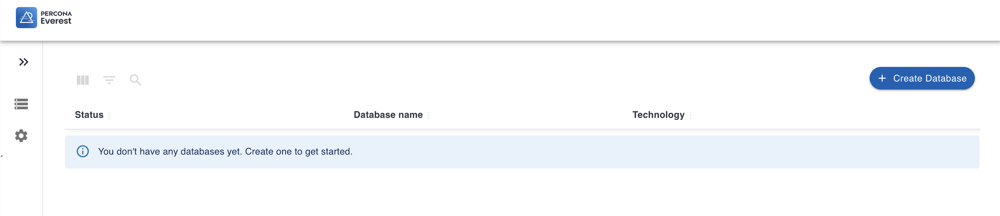

# Install Percona Everest using the Quickinstall script

As soon as you create a Kubernetes cluster on Amazon Elastic Kubernetes Service (EKS) or Google Kubernetes Engine (GKE), you can install Percona Everest. 

For more information, see the [Prerequisites](qs-prerequisites.md) section. 
{.power-number}

1. Create the `percona-everest` namespace:

    ```sh
    kubectl create namespace percona-everest
    ```

2. Create a kubernetes secret with an auto-generated root key used for encrypting secrets:
   
    ```sh
    ENCODED_SECRETS_ROOT_KEY=$(openssl rand -base64 32 | tr -d '\n' | base64); cat <<EOF | envsubst | kubectl apply -n percona-everest -f -
    apiVersion: v1
    kind: Secret
    metadata:
        name: everest-secrets-root-key
    data:
        secrets-root-key: $ENCODED_SECRETS_ROOT_KEY
    EOF
    ```
    
    ??? example "Expected output"
    
        ```{.text .no-copy}
        secret/everest-secrets-root-key configured
        ```


3. Deploy Everest to Kubernetes:

    ```sh
    kubectl apply -f https://raw.githubusercontent.com/percona/percona-everest-backend/v0.4.0/deploy/quickstart-k8s.yaml -n percona-everest
    ```

4. To install Percona Everest, run the following command:

    ```{.bash data-prompt="$"}
    $ curl -sfL "https://raw.githubusercontent.com/percona/percona-everest-cli/v0.4.0/install.sh" | bash
    ```

    !!! note
    
        Everest will search for the kubeconfig file in the `~/.kube/config` path. If your file is located elsewhere, add the `KUBECONFIG` environment variable when running the `install.sh` script. 
    
    ```{.bash data-prompt="$"}
    $ curl -sfL "https://raw.githubusercontent.com/percona/percona-everest-cli/v0.4.0/install.sh" | KUBECONFIG=<path/to/config/file> bash
    ```

    ??? example "Expected output"

        ```{.text .no-copy}
        2023-09-22T11:35:02Z	info	install/operators.go:242	Checking connection to Everest	{"component": "install/operators"}
        2023-09-22T11:35:02Z	info	install/operators.go:663	Creating namespace percona-everest	{"component": "install/operators"}
        2023-09-22T11:35:03Z	info	install/operators.go:669	Namespace percona-everest has been created	{"component": "install/operators"}
        2023-09-22T11:35:03Z	info	install/operators.go:675	Started provisioning the cluster	{"component": "install/operators"}
        2023-09-22T11:35:03Z	info	install/operators.go:695	Installing Operator Lifecycle Manager	{"component": "install/operators"}
        2023-09-22T11:35:43Z	info	install/operators.go:700	OLM has been installed	{"component": "install/operators"}
        2023-09-22T11:35:43Z	info	install/operators.go:701	Installing Percona OLM Catalog	{"component": "install/operators"}
        2023-09-22T11:36:14Z	info	install/operators.go:706	Percona OLM Catalog has been installed	{"component": "install/operators"}
        2023-09-22T11:36:14Z	info	install/operators.go:747	Installing percona-xtradb-cluster-operator operator	{"component": "install/operators"}
        2023-09-22T11:36:26Z	info	install/operators.go:763	percona-xtradb-cluster-operator operator has been installed	{"component": "install/operators"}
        2023-09-22T11:36:26Z	info	install/operators.go:747	Installing percona-server-mongodb-operator operator	{"component": "install/operators"}
        2023-09-22T11:36:48Z	info	install/operators.go:763	percona-server-mongodb-operator operator has been installed	{"component": "install/operators"}
        2023-09-22T11:36:48Z	info	install/operators.go:747	Installing percona-postgresql-operator operator	{"component": "install/operators"}
        2023-09-22T11:37:05Z	info	install/operators.go:763	percona-postgresql-operator operator has been installed	{"component": "install/operators"}
        2023-09-22T11:37:05Z	info	install/operators.go:747	Installing everest-operator operator	{"component": "install/operators"}
        2023-09-22T11:37:27Z	info	install/operators.go:763	everest-operator operator has been installed	{"component": "install/operators"}
        2023-09-22T11:37:27Z	info	install/operators.go:835	Creating service account for Everest	{"component": "install/operators"}
        2023-09-22T11:37:28Z	info	install/operators.go:840	Creating role for Everest service account	{"component": "install/operators"}
        2023-09-22T11:37:31Z	info	install/operators.go:846	Binding role to Everest Service account	{"component": "install/operators"}
        2023-09-22T11:37:32Z	info	install/operators.go:857	Creating cluster role for Everest service account	{"component": "install/operators"}
        2023-09-22T11:37:34Z	info	install/operators.go:865	Binding cluster role to Everest Service account	{"component": "install/operators"}
        2023-09-22T11:37:35Z	info	install/operators.go:787	Generating kubeconfig	{"component": "install/operators"}
        2023-09-22T11:37:38Z	info	install/operators.go:793	Connecting your Kubernetes cluster to Everest	{"component": "install/operators"}
        ```

5. The Percona Everest site opens in your browser. Now, you can create databases in Percona Everest.

    

## Next steps

[Create a database :material-arrow-right:](../use/db_provision.md){.md-button}

<!-- 
[Monitor the database with PMM :material-arrow-right:](../use/monitorDBs.md){.md-button}
-->
