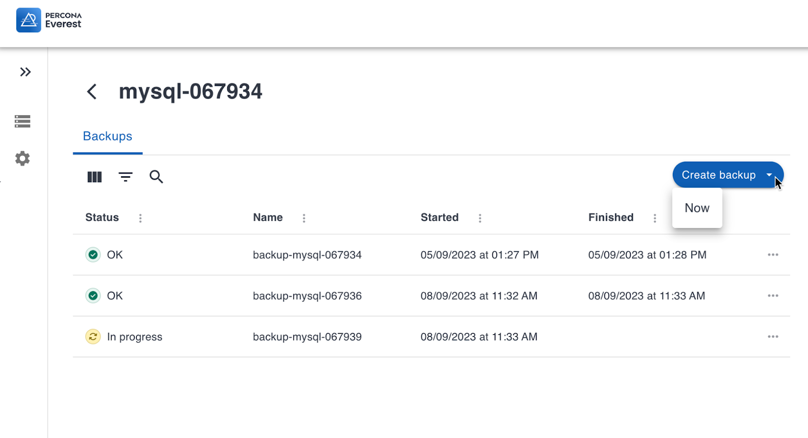
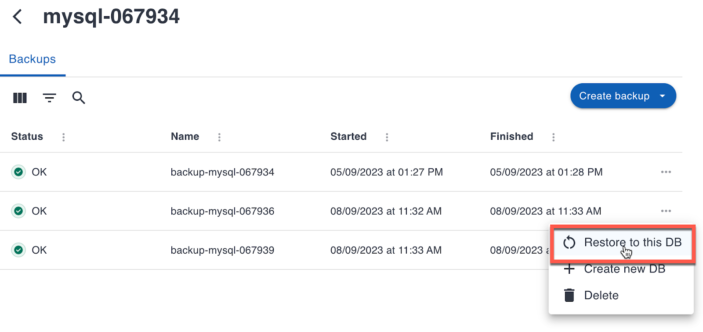
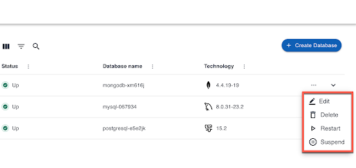
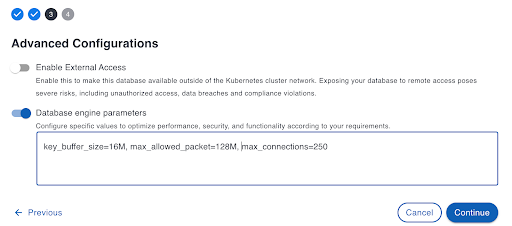
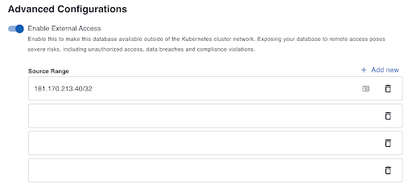

# 📫 What’s new in Everest 0.2.0?

Since our initial internal release last month, we have been working on integrating more advanced features as we progress toward our upcoming public launch.

When exploring this new version, check out the following new enhancements:

## New feature: Back up and restore 

You can now create on-demand backups, create databases from existing backups, and restore backups to existing database clusters. 

To create a backup, go to the  **Databases** view, select the database you want to back up, and click **Create backup > Now**. This menu will soon also include the option to create backup schedules. 

  

To restore a database from a backup, click the  Actions menu next to a backup in the database view, then click **Restore to this DB**.

  

## New feature: DB Cluster management 

We have added cluster operation options in the **Databases** view that enable you to modify, remove, restart, or suspend available clusters.

With the editing option, you can easily adjust a cluster’s settings and resources, to meet specific performance and availability requirements. As for the other options, well, they do pretty much what they say. 

  

## New feature: Engine configuration

The **Advanced Configurations** page on the database creation wizard now includes a **Database engine parameters** option that you can use to tweak and optimize the performance of your database. 

Here are some configuration examples for each supported engine type: 

**MySQL** 
<pre><code>[mysqld]
key_buffer_size=16M
max_allowed_packet=128M
max_connections=250</pre></code>

**Mongo**
<pre><code>operationProfiling:
mode: slowOp
slowOpThresholdMs: 200</pre></code>

**PostgreSQL**
<pre><code>log_connections = yes
search_path = '"$user", public'
shared_buffers = 128MB</pre></code>

For more information on configuring specific database parameters, see the [MySQL](https://dev.mysql.com/doc/refman/8.0/en/option-files.html), [MongoDB](https://www.mongodb.com/docs/manual/reference/configuration-options/), and [( [PostgreSQL](https://www.postgresql.org/docs/current/config-setting.html#CONFIG-SETTING-CONFIGURATION-FILE) configuration documentation.

 

## New feature: Cluster monitoring in the DB creation wizard

You can now set up monitoring for one database via the CLI installation wizard by using the following flags during provisioning: 

<pre><code>-m, --monitoring.enable              Enable monitoring (default true)
--monitoring.instance-name string    Monitoring instance name from Everest. If defined, other monitoring configuration is ignored
--monitoring.new-instance-name string     Name for a new monitoring instance 
--monitoring.pmm.endpoint string     PMM endpoint URL (default is "http://127.0.0.1")
--monitoring.pmm.password string     PMM password
--monitoring.pmm.username string     PMM username (default "admin")
--monitoring.type string             Monitoring type (default "pmm")</pre></code>

### CLI command example

<pre><code>./everestctl install operators --backup.enable=false --everest.endpoint=http://127.0.0.1:8080 --operator.mongodb=true --operator.postgresql=true --operator.xtradb-cluster=true --monitoring.enable=true --monitoring.type=pmm --monitoring.new-instance-name=local-pmm --monitoring.pmm.endpoint=http://127.0.0.1 --monitoring.pmm.username=admin --monitoring.pmm.password=admin --skip-wizard</pre></code>

If monitoring is not enabled during CLI provisioning, the **Monitoring** page on the **Create Database** wizard will also be disabled.

## Possibility to restrict external access to multiple IP addresses/ranges

In Everest 0.1.0, only one IP address could be added when restricting external access to the database. You can now add an unlimited number of connections for secure testing.

 

## Quick install script

There’s a new, faster way to deploy Everest using a dedicated quick installation script!

[install.sh](https://raw.githubusercontent.com/percona/percona-everest-cli/v0.2.0/install.sh) is a bash script that you can run to easily download and install all Everest components. To try it out, check out the <installation instructions> in the Everest documentation to download and run the script with a single command.

## Fixed issues and other enhancements

If you want to dive into the specifics of this update, take a look at the [complete list of bug fixes and improvements](https://jira.percona.com/issues/?filter=15715).

## What’s not in yet?

Currently, this second internal release has the following limitations, which we are planning to address in a future release: 

- The options to define default database configuration will be available on the
 **Settings** view soon.

- Currently, you cannot create backup storage locations straight from the **Create Backup** page. Until this option becomes available, make sure to provision locations from **Settings > Storage Locations** before creating backups.
- No support for database cluster management via CLI yet.
- Scheduled backups are planned following the 0.3.0 release. ([EVEREST-224](https://jira.percona.com/browse/EVEREST-224))
- The uninstall script to remove Everest and all associated resources is coming soon. ([EVEREST-314](https://jira.percona.com/browse/EVEREST-314))
- The splash screen for **Welcome to Everest message** is work in progress. ([EVEREST-305](https://jira.percona.com/browse/EVEREST-305))
- No current support for adding monitoring instances via the UI. ([EVEREST-135](https://jira.percona.com/browse/EVEREST-135))
- No current support for K8s clusters without a public API server. [(EVEREST-300](https://jira.percona.com/browse/EVEREST-300))
- Information regarding Percona Monitoring Management (PMM) monitoring is not yet visible on the UI. ([EVEREST-388](https://jira.percona.com/browse/EVEREST-388))	
- No current support for using https for connecting to PMM instances that use a self-signed certificate. ([EVEREST-396]((https://jira.percona.com/browse/EVEREST-388)))

## Tell us what you think!

During this pre-Alpha phase, we are counting on your help to explore and experience Everest firsthand. Your valuable feedback and insights will help us shape the final product and make it even better. 

We encourage you to try out all the features, report any issues you come across, and let us know how we can enhance your user experience:

- [Leave feedback on the application](https://www.notion.so/percona/d67b6dd6afa04a149ab8685c609dbda8?v=ee3ab0c7c4d5490aa57552eb506da3bb)
- [Leave feedback on the documentation](https://everest-doc.onrender.com/)(Everest documentation is planned for the 0.3.0 release so everything here is still work in progress)	

## What’s next?

We're excited for the upcoming 0.3.0 release, which will mark Everest's Alpha version. 
Until then, we're working hard to fine-tune stability, polish a few rough edges, and generally ensure that Everest is ready for the big launch. We cannot wait to share it with you!