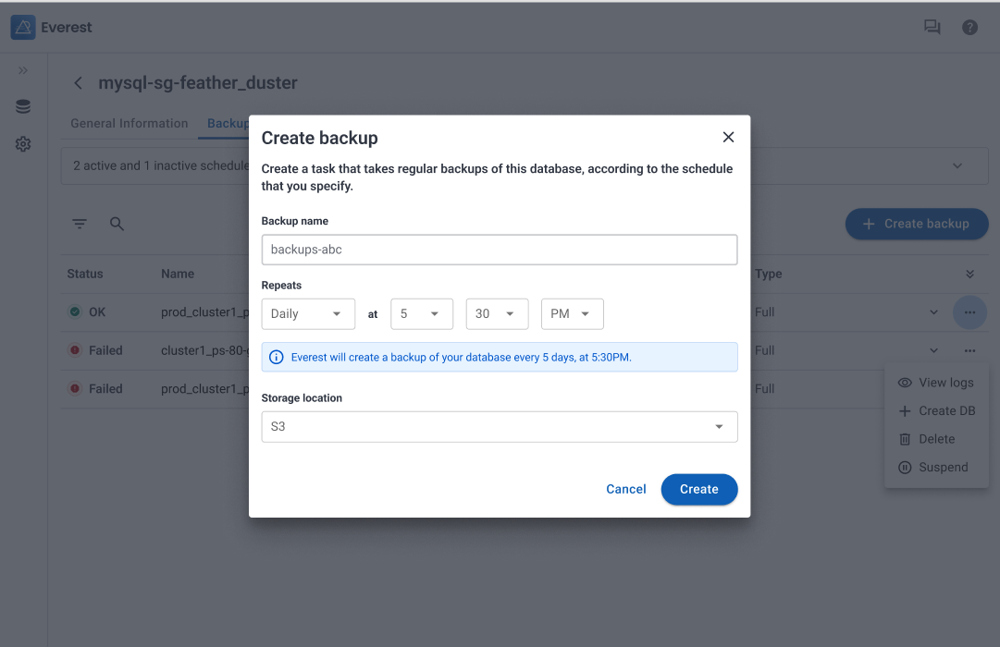

# What's new in Percona Everest 0.4.0

To begin your journey with Percona Everest, check out the [Quickstart Guide for Percona Everest](../quickstart-guide/quick-install.md).

Percona Everest is an open source private database-as-a-service that helps developers deploy code faster, scale deployments rapidly, and reduce database administration overhead. Plus, you can regain control over your data, database configuration, and DBaaS costs.

## Release highlights

Version 0.4.0 introduces several exciting features, enhancements, and notable changes:

### Breaking changes in Everest 0.4.0

This release introduces major changes to the core structure of Everest. As a result, some 0.3.0 components are not compatible with Everest 0.4.0, and migrating from the previous version is not possible. 

Make sure to uninstall Everest and install it again using the [Quick Installation script](../quickstart-guide/qs-overview.md) or the [manual installation procedure](../install/SetupPrereqs.md). 

### Scheduled backups

You can now schedule automatic backups to run automatically at predefined times. 

Automatic backups will repeat within the time frame given, ensuring you have a backlog of database snapshots to roll back to if needed.

To set up a backup schedule, head over to the **Backups** tab in the database view. Here, you'll find the option to initiate a backup right away, or schedule one for later. 

Keep an eye out for future releases, as we'll soon enable backup scheduling from the database creation wizard as well.

For more information about working with backups, see [Back up and restore databases](../use/AboutBackups.md).

### Option to provide anonymous usage statistics enabled

In creating Percona Everest, we've leveraged our years of experience in open-source database development, and collaborated closely with the Percona community through interviews to ensure our new product will meet user needs.

With our latest release, we're adding in product telemetry to fill-in the gaps in our understanding of how users are actually using Everest, and ultimately ensure that we're building the best-in-class DBaaS software for the open-source community.

Participation in this anonymous program is optional, and you can opt-out if prefer not to share any information. 

Read our [privacy statement](https://www.percona.com/privacy-policy#h.e34c40q8sb1a) and [telemetry documentation](../reference/telemetry.md) to learn more.

### Enhanced UX for backup creation

We've optimized the backup creation process, providing you with the flexibility to access **Settings** and set up a storage location when none is configured yet.
This ensures that you can quickly generate the resources you need right when creating on-demand and scheduled backups.

### Option to install Everest on Kubernetes (experimental)

There's also a [new manual installation option](../install/installEverest.md) for setting up Everest on Kubernetes. 

This new installation option is currently in a technical preview stage, and we recommend using it solely for testing purposes! For a more secure and recommended installation process, make sure to install Everest using the Docker Compose procedure, either using the [QuickInstall script](../quickstart-guide/qs-overview.md) or the [manual installation procedure](../install/installEverest.md).

## Known limitations

Here are the limitations associated with this release. Some of them you might encounter depending on your settings, and some of them will be addressed in a future release: 

- If you're using PostgreSQL, make sure not to share the same backup storage location for multiple database clusters. Use a unique storage location for backing up PostgreSQL clusters.
- The options to define default database configuration will be available on the **Settings** view soon.
- No support for database cluster management via CLI yet.
- No support for adding backup storages via CLI yet.
- No current support for K8s clusters without a public API server.
- No current support for adding monitoring instances via the UI. 
- Information regarding Percona Monitoring Management (PMM) monitoring is not yet visible on the UI.
- No current support for using https for connecting to PMM instances that use a self-signed certificate.
- Information regarding CPU/Memory resources doesn’t clearly state that is applied per replica and not per database cluster.
