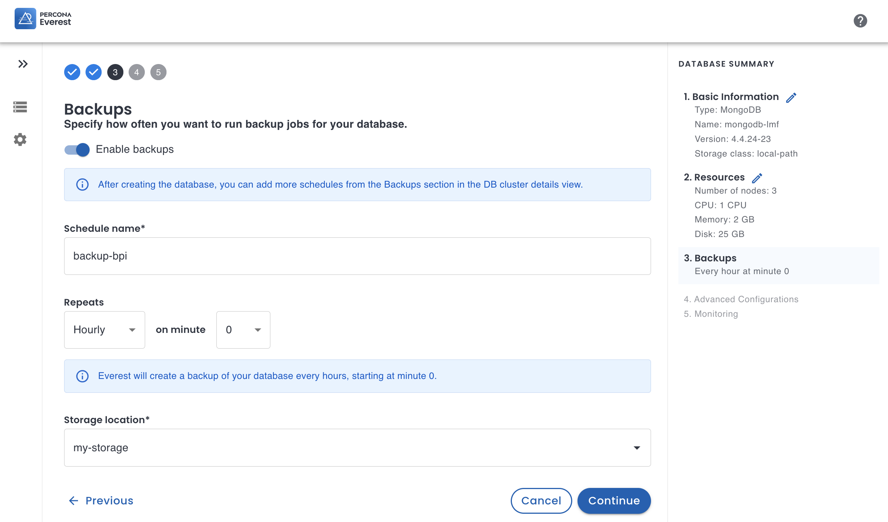
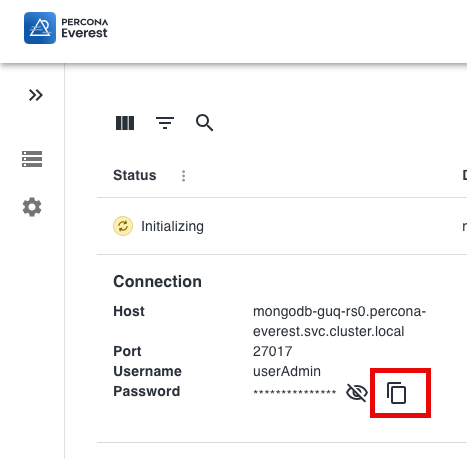
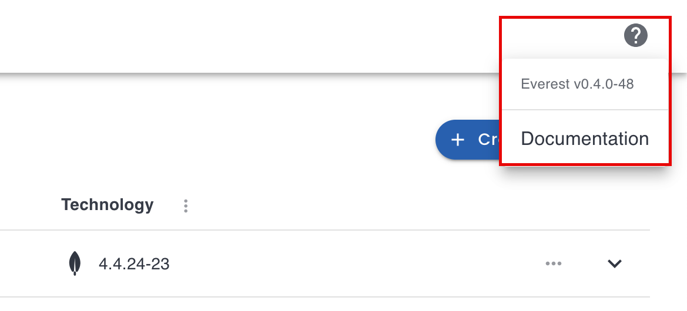

# What's new in Percona Everest 0.5.0

To begin your journey with Percona Everest, check out the [Quickstart Guide for Percona Everest](../quickstart-guide/quick-install.md).

Percona Everest is an open source private database-as-a-service that helps developers deploy code faster, scale deployments rapidly, and reduce database administration overhead. Plus, you can regain control over your data, database configuration, and DBaaS costs.

## Release highlights

Version 0.5.0 introduces the following enhancements:

## Enhanced installation robustness

This Everest release streamlines the installation workflow by transitioning from Docker Compose to Kubernetes, for easier and more robust deployments. 

Previously confined to Docker containers through Docker Compose, Everest now operates directly within the Kubernetes cluster. 
This eliminates complexities and restrictions associated with running Everest outside the K8 cluster. Consequently, Everest works not only on public K8 clusters but also on private ones, enhancing its accessibility and adaptability. 

To install Everest 0.5.0, check the [updated installation procedure](//docs/install/installtoK8.md).

### Enhanced Backup scheduling

Previously exclusively available from the **Backups** tab within the database view, backup scheduling is now seamlessly integrated into the database creation wizard as an added step.

This completes the Backup Scheduling functionality and enables you to define a comprehensive setup for your new database from the get-go.

### Option to copy database password

We've added a convenient way to copy database passwords. Since clipboard access is restricted in unsecured contexts, this option is only enabled when you access these pages via HTTPS or localhost.

Database cluster list            |  Database cluster **Overview** page
:-------------------------:|:-------------------------:
  |  

### Option to check Everest version

You may notice there's now a Help icon in the upper right corner. It's a handy way to access the online Help and swiftly verify the current Everest version you're using.

## Fixed issues

- [EVEREST-395](https://jira.percona.com/browse/EVEREST-395) - In specific scenarios, when creating a new database, Everest would reset the specified database name, version, and storage class to automatically generated values. This issue is now fixed.