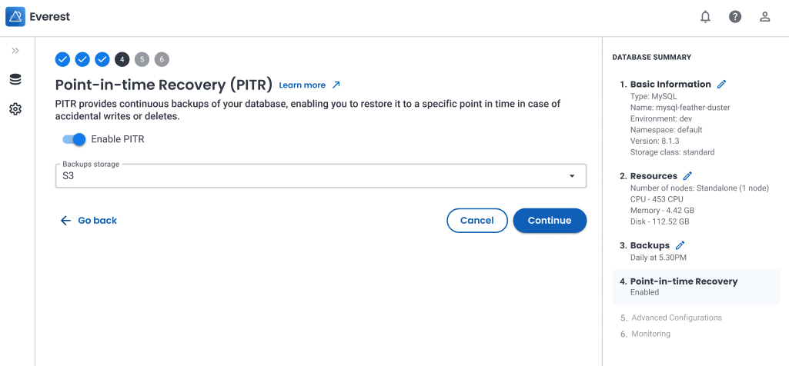

# What's new in Percona Everest 0.6.0

To begin your journey with Percona Everest, check out the [Quickstart Guide for Percona Everest](../quickstart-guide/quick-install.md).

Percona Everest is an open source private database-as-a-service that helps developers deploy code faster, scale deployments rapidly, and reduce database administration overhead. Plus, you can regain control over your data, database configuration, and DBaaS costs.

## Release highlights

Version 0.6.0 introduces the following enhancements:

### Point-in-Time Recovery (PITR) for finer backup granularity

In addition to on-demand and scheduled backups, Everest now also offers PITR functionality to restore databases from past timestamps on the same cluster.

PITR works by constantly backing up your database transaction logs following an initial full backup of the database. This enables you to:

- Handle incorrect database writes by rolling back the database to a state before the error occurred
- Minimize the potential for data loss by enabling very specific recovery points  
- Fulfill historical data auditing requirements to comply with laws and regulations

For now, PITR is only available for MySQL databases. Future releases will enable this functionality for MongoDB and PostgreSQL databases as well.

To get started, enable the new PITR option on the database creation wizard:

For more information about working with PITR backups, see [Enable Point-in-time Recovery](../use/EnablePITR.md).

### Secure access through user authentication

We have taken a significant step towards ensuring the security of Percona Everest by introducing user authentication in our latest release. This feature is designed to restrict access to the databases hosted on Percona Everest, thereby safeguarding any sensitive information stored within them. With user authentication in place, only authorized users will be able to access the databases.

If you’re looking to dive deep into this feature, see our comprehensive [documentation](https://docs.percona.com/everest/secure/user-auth.html).

### Dark mode 

We are excited to announce that the latest version of Percona Everest 0.6.0 introduces a new feature called Dark Mode. This feature enables you to switch the color scheme of the Percona Everest user interface from a predominantly light or white background to a predominantly dark one. 

Dark Mode gives you a more comfortable and easy-on-the-eyes visual experience while navigating through Percona Everest. To use this feature, simply toggle it on or off from the UI. Once enabled, the color palette of the user interface changes to a darker shade, enhancing the overall user experience.

### Enhanced user experience for database restoration from backups

When restoring a backup to a new database, you no longer need to manually confirm that you’re using the same secret as the selected backup. Everest now seamlessly handles this verification in the background.
