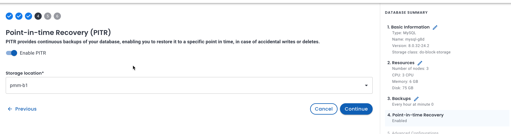

# What's new in Percona Everest 0.7.0

To begin your journey with Percona Everest, check out the [Quickstart Guide for Percona Everest](../quickstart-guide/quick-install.md).

Percona Everest is an open source private database-as-a-service that helps developers deploy code faster, scale deployments rapidly, and reduce database administration overhead. Plus, you can regain control over your data, database configuration, and DBaaS costs.

Version 0.7.0 introduces the following changes:

## Point-in-Time Recovery (PITR) for MongoDB databases

We're expanding Percona Everest's PITR capabilities to include MongoDB databases.

You can now also restore MongoDB databases to specific points in time within the same cluster. This gives you more control over your MongoDB environments and more options for data recovery.

Future releases will cover PITR support for PostgreSQL databases and PITR restores to different clusters.

### Post-Restore step for MongoDB

PITR restores alter the timeline of MongoDB oplog events. As a result, MongoDB oplog slices created after the restore timestamp and before the last backup become invalid.

To seamlessly resume PITR after a restore, make sure to run a new full backup. This new backup will serve as the starting point for oplog updates, ensuring the continuity and integrity of your data.

### Monitoring

Percona Everest now comes with amazing monitoring capabilities that will ensure your database infrastructure is always reliable and secure. 

Here are some fundamental values you’ll get by monitoring Percona Everest:

- Monitoring helps track database availability and uptime
- Monitoring provides insights into database performance
- Monitoring helps detect and address issues proactively
- Continuous monitoring helps maintain a stable and reliable database environment.

 

If you're looking for in-depth insights into this feature, refer to our comprehensive [documentation](https://docs.percona.com/everest/use/monitor_endpoints.html).

