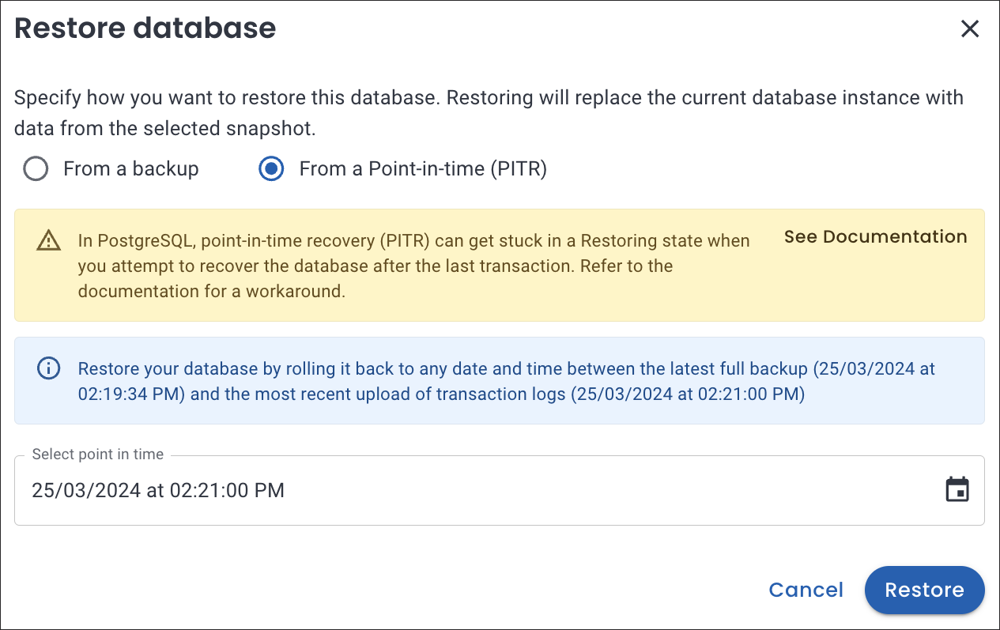

# What's new in Percona Everest 0.9.0

To begin your journey with Percona Everest, check out the [Quickstart Guide for Percona Everest](../quickstart-guide/quick-install.md).

Percona Everest is an open source cloud native database platform that helps developers deploy code faster, scale deployments rapidly, and reduce database administration overhead. Plus, you can regain control over your data, database configuration, and DBaaS costs.

Version 0.9.0 introduces the following changes:

!!! warning
    To install Percona Everest version 0.9.0, make sure to uninstall any previous versions by running the `everestctl uninstall` command.

## Release highlights

We've taken a step forward in enhancing Percona Everest's point-in-time (PITR) capabilities for PostgreSQL, MySQL as well as MongoDB databases. 

You can now restore your databases to specific points in time within the same cluster as well as a new cluster. This gives you more control over your database environments and more options for data recovery.

If you're looking for in-depth insights into this feature, refer to the sections [Create new database from a point-in-time recovery](https://docs.percona.com/everest/use/createBackups/create_new_database.html#create-a-new-database-from-pitr) and [Restore to a point-in-time recovery](https://docs.percona.com/everest/use/RestoreBackup.html#restore-to-a-point-in-time-recovery) in our documentation.

## New features and improvements

- [EVEREST-618](https://perconadev.atlassian.net/browse/EVEREST-618), [EVEREST-620](https://perconadev.atlassian.net/browse/EVEREST-620) - Starting with Percona Everest 0.9.0, you can now create a new database using point-in-time recovery for your MySQL and MongoDB databases. If you're looking to explore this feature further, see our comprehensive [documentation](https://docs.percona.com/everest/use/createBackups/create_new_database.html).

- [EVEREST-914](https://perconadev.atlassian.net/browse/EVEREST-914) - We have added a Kubernetes cluster ID to the VMAgent configuration, enabling you to use the same PMM instance to monitor multiple Kubernetes clusters.

- [EVEREST-871](https://perconadev.atlassian.net/browse/EVEREST-871) - We have improved Percona Everest to ensure you don't accidentally delete a cluster. We've introduced a confirmation pop-up that will prompt you to enter the database's name correctly. Only when the correct database name is entered can you proceed with deleting the cluster.

### Point-in-time recovery for PostgreSQL

- [EVEREST-598](https://perconadev.atlassian.net/browse/EVEREST-598) - We have now added support for Point-In-Time Recovery (PITR) functionality for PostgreSQL databases.

- [EVEREST-624](https://perconadev.atlassian.net/browse/EVEREST-624) - We have added a message on the Percona Everest UI for PostgreSQL informing users that Point-in-time recovery (PITR) is enabled by default and cannot be turned off.

- [EVEREST-619](https://perconadev.atlassian.net/browse/EVEREST-619) - Starting with Percona Everest 0.9.0, you can now create a new database using point-in-time recovery for your PostgreSQL databases.

- [EVEREST-896](https://perconadev.atlassian.net/browse/EVEREST-896) - We have added a warning on the Percona Everest UI to inform users about the [limitations of PostgreSQL](https://docs.percona.com/everest/use/createBackups/EnablePITR.html#limitation-for-postgresql) for PITR. 

## Bugs fixed

- [EVEREST-656](https://perconadev.atlassian.net/browse/EVEREST-656) - While initiating a backup for MongoDB, the backup status was being displayed as unknown. The issue has been resolved now.

- [EVEREST-759](https://perconadev.atlassian.net/browse/EVEREST-759) - We have added an error message to the Percona Everest UI for scheduled backups, which reminds you to set a backup storage location before configuring backup schedules to avoid any hassles.

- [EVEREST-786](https://perconadev.atlassian.net/browse/EVEREST-786) - Fixed an issue where the PMM monitoring URL accepted incorrect credentials.

- [EVEREST-813](https://perconadev.atlassian.net/browse/EVEREST-813) - When choosing the appropriate cluster size (small, medium, large) on the **Resources** page, the selector invariably switched to the **Custom** option. The issue has been resolved now.

- [EVEREST-856](https://perconadev.atlassian.net/browse/EVEREST-856) - When editing a database with multiple backup schedules, an error was thrown. The issue has been resolved now.

- [EVEREST-862](https://perconadev.atlassian.net/browse/EVEREST-862) - We resolved an issue where the column hide/unhide option was not functioning correctly on various UI pages.

- [EVEREST-885](https://perconadev.atlassian.net/browse/EVEREST-885) - Fixed an issue where the Quick install script did not work on Linux machines with ARM CPUs.

- [EVEREST-887](https://perconadev.atlassian.net/browse/EVEREST-887) - Storage location could not be chosen if scheduled backups were enabled for the first time while editing a MongoDB database.

- [EVEREST-888](https://perconadev.atlassian.net/browse/EVEREST-888) - When creating a backup, the Backup storage field was not automatically populated as it was for scheduled backups. We have resolved this issue now.

- [EVEREST-890](https://perconadev.atlassian.net/browse/EVEREST-890) - We have fixed an issue that was causing problems with restoring data to a new MySQL database using point-in-time recovery (PITR).

- [EVEREST-913](https://perconadev.atlassian.net/browse/EVEREST-913) - We corrected the AWS load balancer type for the HAProxy replicas to use the network LB type when enabling external access to the DB cluster instead of the classic LB type.

