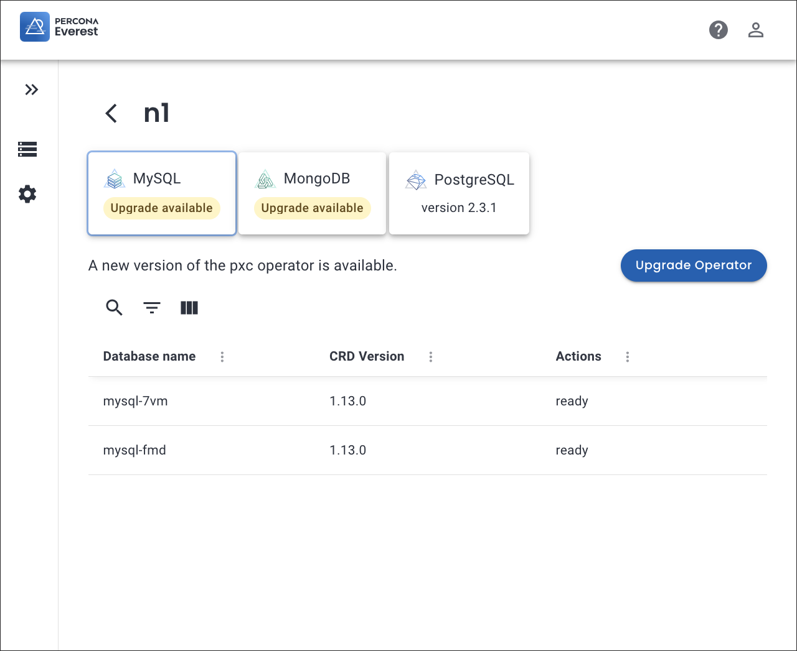
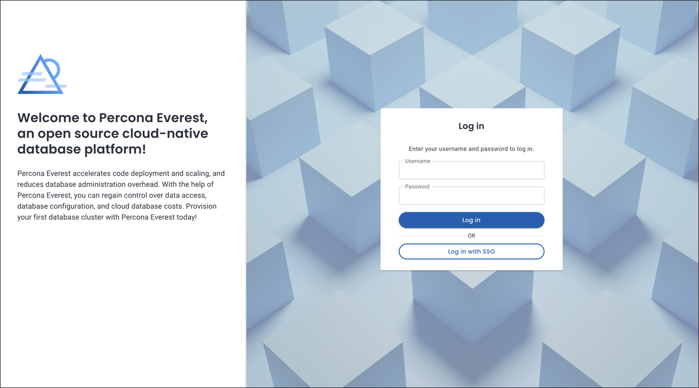

# What's new in Percona Everest 1.0.0

To begin your journey with Percona Everest, check out the [Quickstart Guide for Percona Everest](../quickstart-guide/quick-install.md).

Percona Everest is an open source cloud native database platform that helps provision and manage databases faster, scale deployments rapidly, and reduce database administration overhead. Plus, you can regain control over your data, database configuration, and DBaaS costs.

Version 1.0.0 introduces the following changes:

## Release highlights

## Simplified database operator upgrades

We are excited to announce that you can now upgrade database operators and all their components across any namespace with just a single click using our intuitive UI.

Morever, before initiating the upgrade process, Everest provides a comprehensive list of tasks that must be completed to ensure a seamless transition of your clusters to the next version of the database operators.

For deep dive into this feature, see our comprehensive [documentation](https://docs.percona.com/everest/upgrade/upgrade_operators.html).

## User management

Percona Everest 1.0.0 introduces user management features, enabling you to securely log in to the platform through either the Percona Everest user interface or the API. So, get ready for a more secure and user-friendly experience with this update.
		
Local user management involves administering Percona Everest users to ensure secure access to database resources. This encompasses tasks such as creating and deleting users, updating their passwords, etc.

If you’re looking for in-depth insights into this feature, see our [documentation]() 

## IdP integration for enhanced security

Starting with Percona Everest 1.0.0, you can now integrate your Percona Everest instance using an external identity provider (IdP). This enables centralized authentication and authorization management, streamlining and simplifying user access. By tapping into IdP integration, you can ensure that users are authenticated and authorized securely.

Percona Everest uses [OpenID Connect](https://auth0.com/docs/authenticate/protocols/openid-connect-protocol){:target="_blank"} (OIDC) Protocol to integrate with external Identity Providers (IdP).

To integrate IdP with Percona Everest, first, [install Percona Everest](../install/installEverest.md) and then [configure OIDC](../secure/IdP_integration#configure-oidc-on-the-providerss-side) on the IdP's side as well as the [Percona Everest side](../secure/IdP_integration#configure-oidc-on-percona-everest-side).

To explore the depths of this feature, delve into our [documentation](https://docs.percona.com/everest/secure/IdP_integratiopn.html).

## New features

- [EVEREST-816](https://perconadev.atlassian.net/browse/EVEREST-816) - Starting with Percona Everest 1.0.0, you can now upgrade database operators and all their components across any namespace with just a single click using our intuitive UI.

- [EVEREST-1087](https://perconadev.atlassian.net/browse/EVEREST-1087) - You can now integrate your Percona Everest instance using an external identity provider (IdP). This enables centralized authentication and authorization management, streamlining and simplifying user access.

- [EVEREST-1025](https://perconadev.atlassian.net/browse/EVEREST-1025) - We introduced the user management feature with Percona Everest 1.0.0, enabling you to securely log in to the platform through either the user interface or the API.

- [EVEREST-731](https://perconadev.atlassian.net/browse/EVEREST-731) Add support for new Load balancer setting

- [EVEREST-866](https://perconadev.atlassian.net/browse/EVEREST-866) - In the past, when viewing the DB cluster in the backups list, it was confusing to find information about the Point-in-Time Recovery (PITR) for restores. With the release of Percona Everest 1.0.0, PITR is now visible. However, PITR is only available to select if the chosen backup is the most recent full backup.

- [EVEREST-872](https://perconadev.atlassian.net/browse/EVEREST-872) - When deleting a backup, you can now choose to delete the data from the backup storage as well.

- [EVEREST-1095](https://perconadev.atlassian.net/browse/EVEREST-1095) - The new API method GET /v1/settings has been added to the Everest API. This method does not require the auth token so that the UI can get the initial Everest settings.

## Improvements

- [EVEREST-937](https://perconadev.atlassian.net/browse/EVEREST-937) - We have made some improvements in our telemetry, including sending telemetry data about the DB cluster every time a user creates one and adding information about the Everest version reported for the instance ID.

- [EVEREST-909](https://perconadev.atlassian.net/browse/EVEREST-909) - Percona Everest now validates scheduled backups if another backup is already scheduled for the same time and location.

- [EVEREST-924](https://perconadev.atlassian.net/browse/EVEREST-924) - Starting with Percona Everest 1.0.0, you now have the option to create multiple backup schedules using the wizard.

- [EVEREST-931](https://perconadev.atlassian.net/browse/EVEREST-931) - When you go through a wizard, return to a specific step, and delete something from a mandatory field, the editing functionality is now disabled.

- [EVEREST-953](https://perconadev.atlassian.net/browse/EVEREST-953) - For an improved user interface (UI) experience, we have consolidated backups and PITR on the same page.

- [EVEREST-971](https://perconadev.atlassian.net/browse/EVEREST-971) - Access and secret key inputs are now visible on the UI when adding a storage location. You can use the eye icon to toggle between making the keys visible or hidden. This feature allows you to conveniently view the S3 keys directly from the UI.

- [EVEREST-974](https://perconadev.atlassian.net/browse/EVEREST-974) Allow updating db engine version

- [EVEREST-975](https://perconadev.atlassian.net/browse/EVEREST-975) \[UI\] Allow editing the db engine property

- [EVEREST-1007](https://perconadev.atlassian.net/browse/EVEREST-1007) - For an improved user experience, the **Actions** button has been moved to the Database Details tab on the right side of the database name.

- [EVEREST-1055](https://perconadev.atlassian.net/browse/EVEREST-1055) Starting with Percona Everest 1.0.0, we have introduced a new **deleting** state. This state will persist until all resources associated with the database have been removed.

- [EVEREST-1069](https://perconadev.atlassian.net/browse/EVEREST-1069) We are always working to enhance our user experience, and we've recently introduced a new page - the components page. This page provides detailed information about the pods and containers, including their status, type, age, and more.

- [EVEREST-1093](https://perconadev.atlassian.net/browse/EVEREST-1093) - We now offer users the choice to select or deselect **Delete backup storage data** when attempting to delete a database without backups.

### Bugs

[EVEREST-807](https://perconadev.atlassian.net/browse/EVEREST-807) - Fixed an issue where PITR did not display the storage location being used when enabling PITR during database creation or editing.

[EVEREST-837](https://perconadev.atlassian.net/browse/EVEREST-837) - We have now updated the help for the Command Line Interface (CLI) commands to include the descriptions.

[EVEREST-841](https://perconadev.atlassian.net/browse/EVEREST-841) - Fixed an issue where the user interface (UI) could not identify the correct operator/database cluster for different namespaces.

[EVEREST-859](https://perconadev.atlassian.net/browse/EVEREST-859) - While uninstalling Percona Everest, an error occurred when attempting to delete a namespace. The issue is resolved now.

[EVEREST-869](https://perconadev.atlassian.net/browse/EVEREST-869) \[CLI\] everestctl install should fallback to the default namespace in case its blank

[EVEREST-870](https://perconadev.atlassian.net/browse/EVEREST-870) \[CLI\] everestctl install does not recognize the option to install the operators

[EVEREST-983](https://perconadev.atlassian.net/browse/EVEREST-983) \[UI\] Backup schedules remain active after backups are disabled

[EVEREST-1003](https://perconadev.atlassian.net/browse/EVEREST-1003) \[CLI\] Installation of operators in a new namespace fails

[EVEREST-1016](https://perconadev.atlassian.net/browse/EVEREST-1016) Last backup 'inactive' status

[EVEREST-1034](https://perconadev.atlassian.net/browse/EVEREST-1034) \[UI\] Restores page should display the restores in a sorted order

[EVEREST-1050](https://perconadev.atlassian.net/browse/EVEREST-1050) \[UI\] Restore information does not get updated on the restores page

[EVEREST-1060](https://perconadev.atlassian.net/browse/EVEREST-1060) \[UI\] Backup schedules more than three should not be created for postgresql database

[EVEREST-1137](https://perconadev.atlassian.net/browse/EVEREST-1137) External IP for mysql is not displayed if external access is enabled

[EVEREST-1139](https://perconadev.atlassian.net/browse/EVEREST-1139) Postgresql database gets stuck during deletion

[EVEREST-1143](https://perconadev.atlassian.net/browse/EVEREST-1143) Everest gets uninstalled on selecting "no"

[EVEREST-1145](https://perconadev.atlassian.net/browse/EVEREST-1145) \[operator\] PSMDB and PG should use AWS's NLB instead of "classic" LB

## Known limitations

