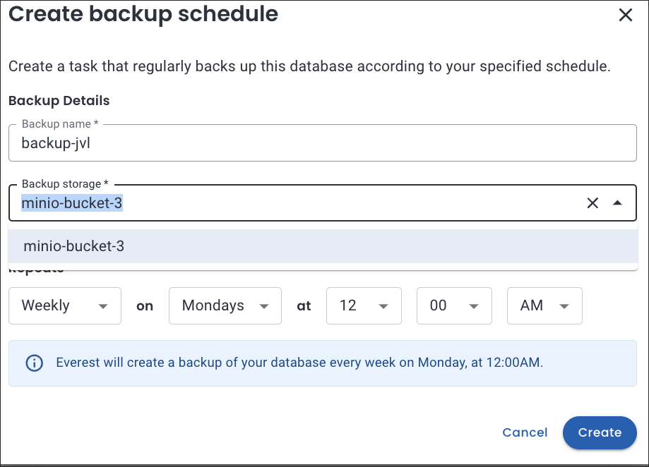

# What's new in Percona Everest 1.1.0

To begin your journey with Percona Everest, check out the [Quickstart Guide for Percona Everest](../quickstart-guide/quick-install.md).

Percona Everest is an open source cloud native database platform that helps provision and manage databases faster, scale deployments rapidly, and reduce database administration overhead. Plus, you can regain control over your data, database configuration, and DBaaS costs.

Version 1.1.0 introduces the following changes:

## Release highlights

### Enhancements in the functionality for PostgreSQL backups and schedules

We're excited to announce that we've improved our on-demand backups and schedules to address some limitations with PostgreSQL. These enhancements are aimed at providing our users with an even more seamless and efficient experience when using these features.

These improvements are:

- If you create more than three backup storages, you can use any of the existing storages across on-demand backups and schedules, as long as the total number of storages in use (by existing on-demand backups and schedules) does not exceed three.
 

    ???+ example "Example"
        If you have created two schedules using backup storage bucket-1 and bucket-2, and an on-demand backup using backup storage bucket-3, you can only utilize one of these three backup storages to create the next on-demand backup or a schedule.

## New features

- [EVEREST-1239](https://perconadev.atlassian.net/browse/EVEREST-1239) Add support for PSMDB Operator v1.16.2

- [EVEREST-1240](https://perconadev.atlassian.net/browse/EVEREST-1240) Add support for PG Operator v2.4.0

## Improvements

- [EVEREST-247](https://perconadev.atlassian.net/browse/EVEREST-247) \[UI\] Postgresql icon on databases UI should be improved

- [EVEREST-1070](https://perconadev.atlassian.net/browse/EVEREST-1070) \[UI\] \[S-Alex\] Update 'restore' icon everywhere

- [EVEREST-1071](https://perconadev.atlassian.net/browse/EVEREST-1071) Add Backup "deleting" state

- [EVEREST-1088](https://perconadev.atlassian.net/browse/EVEREST-1088) \[UI\] \[S-Daniel\] Update technology column in DB list table

- [EVEREST-1092](https://perconadev.atlassian.net/browse/EVEREST-1092) Forbid running an on-demand backup if another backup is already running

- [EVEREST-1134](https://perconadev.atlassian.net/browse/EVEREST-1134) DB engine upgrade should be available in the Namespaces page

- [EVEREST-1153](https://perconadev.atlassian.net/browse/EVEREST-1153) \[CLI\] Improve CLI UX for install/upgrade/uninstall commands

- [EVEREST-1157](https://perconadev.atlassian.net/browse/EVEREST-1157) Implement rate limit for the /session endpoint

- [EVEREST-1165](https://perconadev.atlassian.net/browse/EVEREST-1165) Upgrade all operators in a given namespace at the same time

- [EVEREST-1196](https://perconadev.atlassian.net/browse/EVEREST-1196) \[UI\] Add confirmation dialog when leaving the wizard through the side navigation

- [EVEREST-1211](https://perconadev.atlassian.net/browse/EVEREST-1211) \[UI\] Edit resources \(logic\)

- [EVEREST-1214](https://perconadev.atlassian.net/browse/EVEREST-1214) Remove PG schedules deletion restriction

- [EVEREST-1217](https://perconadev.atlassian.net/browse/EVEREST-1217) Remove the PG "maximum 3 schedules" warning 

- [EVEREST-1220](https://perconadev.atlassian.net/browse/EVEREST-1220) PG: restrict usage of 4th storage when there are already 3 storages used

- [EVEREST-1223](https://perconadev.atlassian.net/browse/EVEREST-1223) Restrict editing backup storages 

- [EVEREST-1226](https://perconadev.atlassian.net/browse/EVEREST-1226) Restrict creating backup storages with the same bucket, region, url 

- [EVEREST-1229](https://perconadev.atlassian.net/browse/EVEREST-1229) \[UI\] Show storage in the schedules list and in the backups list

- [EVEREST-1259](https://perconadev.atlassian.net/browse/EVEREST-1259) \[UI\] Show rate limit error message on /session endpoint

## Bug

- [EVEREST-307](https://perconadev.atlassian.net/browse/EVEREST-307) \[CLI\] Errors should not contain exceptions or stack traces

- [EVEREST-740](https://perconadev.atlassian.net/browse/EVEREST-740) \[UI\] Mysql is not the selected engine in database creation when it is not installed as the first operator

- [EVEREST-859](https://perconadev.atlassian.net/browse/EVEREST-859) \[CLI\] Uninstall gives error during namespace deletion

- [EVEREST-910](https://perconadev.atlassian.net/browse/EVEREST-910) \[UI\] Schedule name and storage location information not visible on backup dashboard

- [EVEREST-1000](https://perconadev.atlassian.net/browse/EVEREST-1000) \[UI\] Advanced Configurations toggle buttons alignment is incorrect

- [EVEREST-1050](https://perconadev.atlassian.net/browse/EVEREST-1050) \[UI\] Restore information does not get updated on the restores page

- [EVEREST-1074](https://perconadev.atlassian.net/browse/EVEREST-1074) \[UI\] Backups page is slow in adding/editing scheduled backups

- [EVEREST-1141](https://perconadev.atlassian.net/browse/EVEREST-1141) Backup files are not deleted from S3 if database is deleted

- [EVEREST-1144](https://perconadev.atlassian.net/browse/EVEREST-1144) Editing a backup storage in a backup schedule for a postgresql database displays an error when 3 backup schedules have been created

- [EVEREST-1161](https://perconadev.atlassian.net/browse/EVEREST-1161) PG operator crashed after pg db restore

- [EVEREST-1175](https://perconadev.atlassian.net/browse/EVEREST-1175) minor UI issues with fields and descriptions

- [EVEREST-1179](https://perconadev.atlassian.net/browse/EVEREST-1179) No confirmation msg on canceling creating a DB cluster by clicking on setting or Databases page 

- [EVEREST-1181](https://perconadev.atlassian.net/browse/EVEREST-1181) \[UI\] DB engine major version upgrade/downgrade should be disabled

- [EVEREST-1197](https://perconadev.atlassian.net/browse/EVEREST-1197) Mongodb database is not able to come up

- [EVEREST-1204](https://perconadev.atlassian.net/browse/EVEREST-1204) \[UI\] Use \`Gi\` for storage size, not \`G\`

- [EVEREST-1233](https://perconadev.atlassian.net/browse/EVEREST-1233) \[API\] Trying to downgrade a major version returns incorrect error message

- [EVEREST-1243](https://perconadev.atlassian.net/browse/EVEREST-1243) \[UI\] Strange shapes coming on top of Started/Finished column name after restore

- [EVEREST-1244](https://perconadev.atlassian.net/browse/EVEREST-1244) \[UI\] Recovery message and actions are inconsistent
