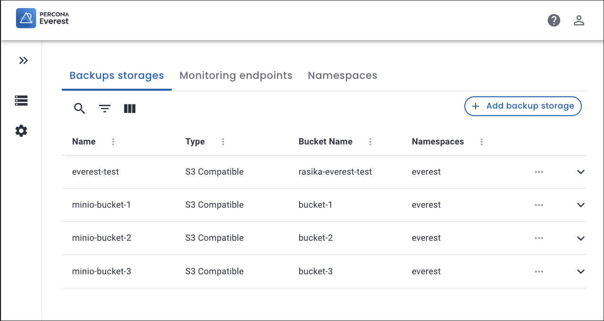
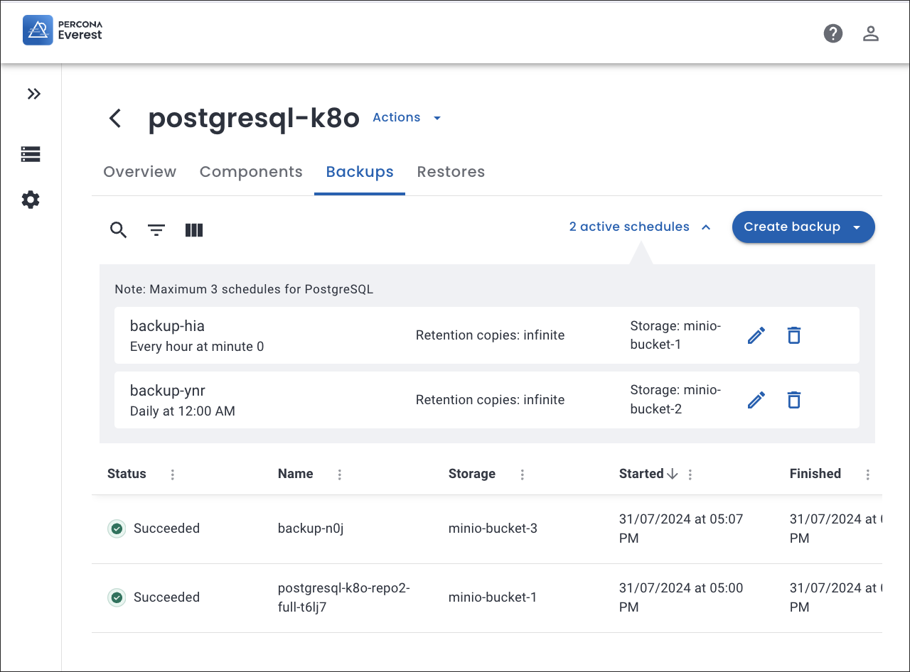
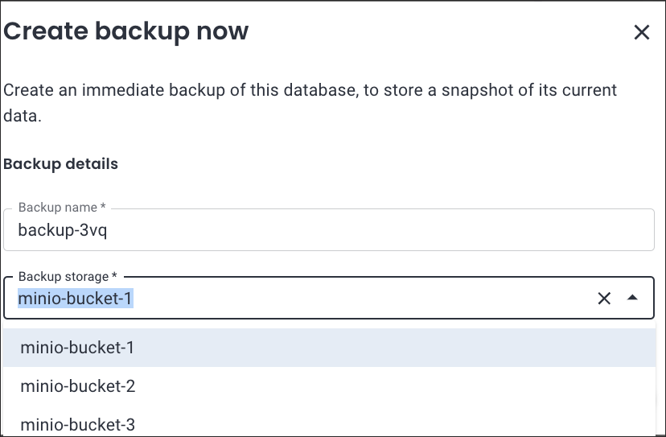
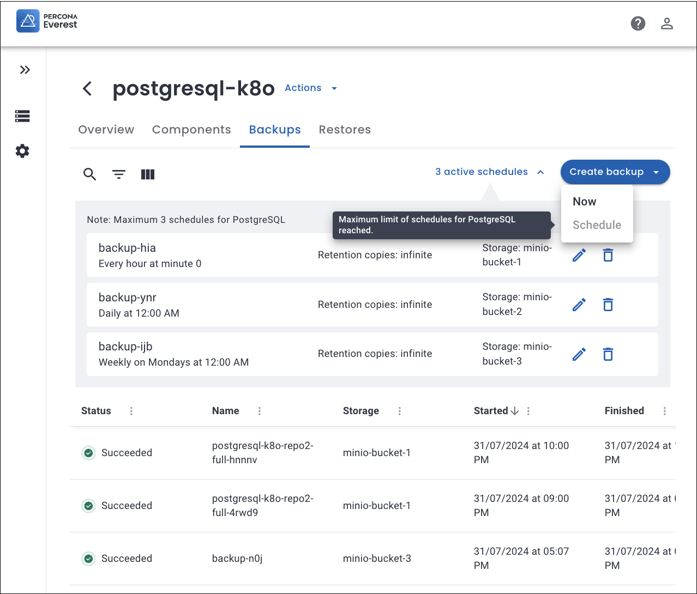

# What's new in Percona Everest 1.1.0

To begin your journey with Percona Everest, check out the [Quickstart Guide for Percona Everest](../quickstart-guide/quick-install.md).

Percona Everest is an open source cloud native database platform that helps provision and manage databases faster, scale deployments rapidly, and reduce database administration overhead. Plus, you can regain control over your data, database configuration, and DBaaS costs.

Version 1.1.0 introduces the following changes:


## Upgrade instructions

!!! warning
    If you are using everestctl v1.1.0 or newer to upgrade from a version prior to v1.0.0, you need to execute the following command:

    ```sh
    kubectl get deployments everest-operator-controller-manager -n everest-system -o jsonpath='{.spec.template.spec.containers[?(@.name=="manager")].env[?(@.name=="DB_NAMESPACES")].value}' | tr ',' '\n' | xargs -I {} kubectl label namespaces {} app.kubernetes.io/managed-by=everest
    ```


## Release highlights

!!! info "Important"
    Percona Everest 1.1.0 comes with its own set of [limitations](Percona-Everest-1.1.0-(2024-08-12).md#known-limitations) that you should be aware of.


### Enhancements for PostgreSQL disaster recovery

We've made our backups and restores more reliable by setting limits on how we manage backup storage. This proactive approach ensures that we can prevent potential issues from being triggered in edge-case scenarios.

Here's how it works:

- You can have up to three backup storages in use at a time, across both on-demand backups and schedules.
 

    ???+ example "Example"
        If you already have two scheduled backups using storage `bucket-1` and `bucket-2`, and an on-demand backup using `bucket-3`, you’ll need to use one of these three storages for any new on-demand backup or schedule.


    

    


    

- You can only create up to three backup schedules for PostgreSQL.

    

- You cannot change the storage location in existing schedules.

- You cannot use the same storage location for multiple backup schedules.


## Improvements

- [EVEREST-1259](https://perconadev.atlassian.net/browse/EVEREST-1259) - We've implemented a rate limiter to control how many API requests you can make within a set time frame. If you exceed this limit on the login page, you'll receive an error message.

- [EVEREST-1134](https://perconadev.atlassian.net/browse/EVEREST-1134) --Starting with Percona Everest 1.1.0, you can now upgrade the database version directly from the **Namespaces** page, skipping the need to use the edit DB wizard.

- [EVEREST-1153](https://perconadev.atlassian.net/browse/EVEREST-1153) - We've improved the CLI experience for install, upgrade, and uninstall commands by streamlining it with concise loading animations and spinners.

- [EVEREST-1088](https://perconadev.atlassian.net/browse/EVEREST-1088) -  We've removed the icons from the **Technology** column in the database list table.

- [EVEREST-1196](https://perconadev.atlassian.net/browse/EVEREST-1196) - We've added a confirmation dialog that appears when you try to exit the wizard using the side navigation.


- [EVEREST-1070](https://perconadev.atlassian.net/browse/EVEREST-1070) - We've updated the **restore** icon across Percona Everest for a consistent look.

- [EVEREST-247](https://perconadev.atlassian.net/browse/EVEREST-247) - We've updated the Postgresql database icon on the UI for better clarity and visibility.

### Backups and schedules

- [EVEREST-1092](https://perconadev.atlassian.net/browse/EVEREST-1092) - Starting with Percona Everest 1.1.0, you can no longer initiate an on-demand backup while another backup is in progress. This change helps maintain data integrity and minimizes potential impact on database performance.

- [EVEREST-1220](https://perconadev.atlassian.net/browse/EVEREST-1220) -  In Percona Everest 1.1.0, you're limited to using a maximum of three different backup storages for PostgreSQL, including those used in existing backup schedules. This restriction ensures reliable backup restoration.

- [EVEREST-1071](https://perconadev.atlassian.net/browse/EVEREST-1071)- We've introduced a **Deleting** state that remains active until all resources associated with the backup are fully removed.

- [EVEREST-1214](https://perconadev.atlassian.net/browse/EVEREST-1214) - We've made it easier to manage backup schedules by removing the restriction on deleting PostgreSQL schedules.


- [EVEREST-1223](https://perconadev.atlassian.net/browse/EVEREST-1223) - Starting with Percona Everest 1.1.0, you cannot edit the region and bucket for the existing backup storage.

- [EVEREST-1226](https://perconadev.atlassian.net/browse/EVEREST-1226) - Starting with Percona Everest 1.1.0, you cannot create backup storages with the same bucket, region, and URL. 

- [EVEREST-1229](https://perconadev.atlassian.net/browse/EVEREST-1229) - For a better user experience, you can now see which backup storage is being used for both on-demand backups and schedules.

- [EVEREST-910](https://perconadev.atlassian.net/browse/EVEREST-910) - The schedule name and storage location for scheduled backups are now displayed on the UI.


## Bugs fixed

- [EVEREST-1233](https://perconadev.atlassian.net/browse/EVEREST-1233) - You will now see the correct error message when attempting to downgrade a major database version.

- [EVEREST-740](https://perconadev.atlassian.net/browse/EVEREST-740) -  MySQL is now correctly selected as the default database engine when creating a database, even if it wasn't the first operator installed.

- [EVEREST-1181](https://perconadev.atlassian.net/browse/EVEREST-1181) - The option to upgrade the major version of the database engine for MongoDB and PostgreSQL is now correctly disabled in the database edit section, reflecting the intended functionality.

- [EVEREST-859](https://perconadev.atlassian.net/browse/EVEREST-859) - The issue causing an error during namespace deletion while uninstalling Percona Everest has been resolved.


- [EVEREST-1074](https://perconadev.atlassian.net/browse/EVEREST-1074) - The backup page performance is now optimized for adding and editing backup.

- [EVEREST-1141](https://perconadev.atlassian.net/browse/EVEREST-1141) - Backup files in the S3 bucket are now properly removed when the corresponding database is deleted.

- [EVEREST-1144](https://perconadev.atlassian.net/browse/EVEREST-1144) - While editing the backup storage in a PostgreSQL database backup schedule, an error was encountered after three backup schedules were created. The issue has been resolved now.


- [EVEREST-1050](https://perconadev.atlassian.net/browse/EVEREST-1050) - The restore page now correctly updates the restore information. 

- [EVEREST-1244](https://perconadev.atlassian.net/browse/EVEREST-1244) - While attempting to restore a database, there was a discrepancy between the messages indicating the status of the restoration process and the actual actions being taken by Percona Everest. The issue has been resolved now.

- [EVEREST-307](https://perconadev.atlassian.net/browse/EVEREST-307) - CLI errors now display more user-friendly messages without exceptions and stack traces.


## Known limitations

You can't use the same URL, bucket, and region in two different backup storages. Doing so may cause issues with restoring from the existing backups.

Here’s what you need to know:

**Scenario 1**

=== ":simple-mongodb::simple-mysql: MongoDB, MySQL"

If you have multiple storages with the same bucket, URL, and region, you won’t be able to edit them after the 1.1.0 update. You’ll need to delete the duplicates.


To check whether your existing Everest installation has any backup storages using the same bucket, region, and endpoint URL, execute the following command:

```sh
curl -sS "https://raw.githubusercontent.com/percona/everest-doc/main/tools/bin/check-duplicated-storages.sh" | bash
```


**Scenario 2**

What to do if you have schedules or backups that are using duplicated storages in different database technologies.

=== ":simple-mongodb: MongoDB"

- MySQL, MongoDB: Create a new backup using a different backup storage. Then, delete the old schedules and backups that use the duplicated storage.

- PostgreSQL: Any backups using duplicated backup storages should be deleted. First, delete the backups from both backup storages, then delete the backup schedules, and finally, delete the backup storages themselves. Then, create a new backup storage and take backups using the new backup storage.

