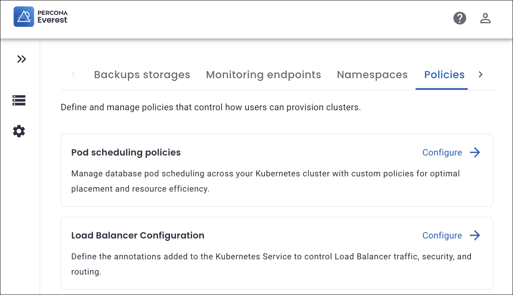
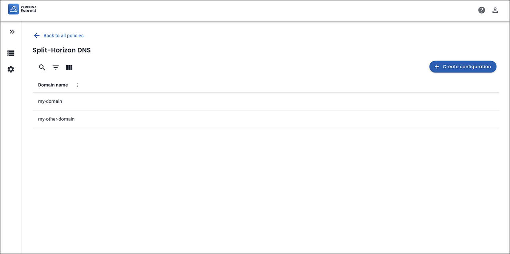
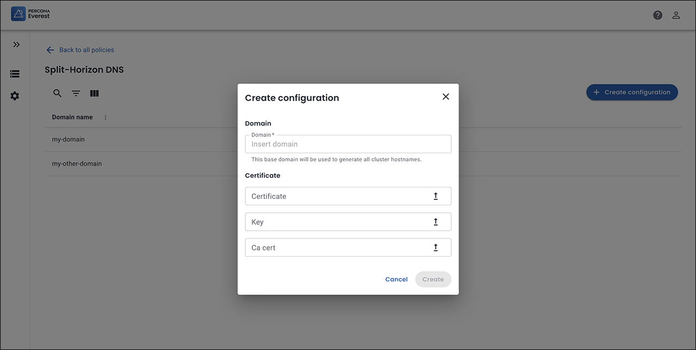

# What's new in Percona Everest 1.10.0

➡️ **New to Percona Everest?** Get started with our [Quickstart Guide](https://docs.percona.com/everest/quick-install.html).

??? info "Expand to unleash the key updates"

    ## 📋 Release summary

    |**#**|**Category**|**Description**|
    |---------|---------------------|---------|
    | **1.**|[Support Split-Horizon DNS for Percona Server for MongoDB ](https://docs.percona.com/everest/release-notes/Percona-Everest-1.9.0-%282025-09-23%29.html#load-balancer-configuration-in-percona-everest)| Enable database administrators to use custom domain names to expose ReplicaSet Pods, both inside and outside the Kubernetes cluster, without conflicting with the default DNS settings.|
    | **2.**|[Operator upgrades](https://docs.percona.com/everest/release-notes/Percona-Everest-1.9.0-%282025-09-23%29.html#load-balancer-configuration-in-percona-everest)|Support for Percona Operator for MongoDB v1.21.0, Percona Operator for MySQL based on Percona XtraDB Cluster v1.18.0, and Percona PostgreSQL Operator v2.7.0 |
    | **3.**|[New features](https://docs.percona.com/everest/release-notes/Percona-Everest-1.9.0-%282025-09-23%29.html#new-features)|Check out the new features introduced in Percona Everest 1.10.0|
    | **4.**|[Improvements](https://docs.percona.com/everest/release-notes/Percona-Everest-1.9.0-%282025-09-23%29.html#improvements)|Discover all the enhancements featured in Percona Everest 1.10.0|
    | **5.**|[Bug fixes](https://docs.percona.com/everest/release-notes/Percona-Everest-1.9.0-%282025-09-23%29.html#bug-fixes)|Find out about all the bugs fixed in Percona Everest 1.10.0|
    | **6.**|[Known limitations](https://docs.percona.com/everest/release-notes/Percona-Everest-1.9.0-%282025-09-23%29.html#known-limitations)|Discover all the known limitations in Percona Everest 1.9.0|

## 🌟 Release highlights

=== "Operators support"
    ### Operators support

    - Percona Everest now supports Percona PostgreSQL Operator v2.7.0.

    - Percona Everest now supports Percona Server for MongoDB Operator v1.21.0.

    - Percona Everest now supports Percona XtraDB Cluster Operator v1.18.0.

=== "🛰 Split-Horizon DNS for Percona Server for MongoDB"
    ### Seamless access with Split-Horizon DNS for Percona Server for MongoDB
    Starting with Percona Everest 1.10.0, we've rolled out a new feature: **Split-Horizon DNS for Percona Server for MongoDB (PSMDB)**.  This feature  enables database administrators to expose ReplicaSet Pods with custom domain names, both inside and outside the Kubernetes cluster, without conflicting with the default DNS configuration.

    ### Why Split-Horizon DNS matters?
    Database administrators may sometimes need to expose ReplicaSet Pods in a Percona Operator for MongoDB cluster so they can connect to them directly. This applies both inside and outside the Kubernetes environment, using custom domain names instead of the default ones generated during cluster creation.

    This is useful in scenarios such as:

    - Performing maintenance tasks, like copying data from one ReplicaSet to another cluster.

    - Providing temporary or alternative domain names for direct Pod access without impacting the default DNS configuration.

    ### How to create a Split-Horizon DNS config
    Follow these steps to create a new Split-Horizon DNS policy:
    {.power-number}
        
    1.  Navigate to the Percona Everest home page and go to <i class="uil uil-cog"></i> **Settings > Policies & configurations**.
        
        
        
    2. In the **Split-Horizon DNS** section, click **Configure**. The **Split-Horizon DNS** page opens.
        
        
        
    3. Click **Create configuration**. A pop-up window appears.
                
    4. Enter the following:
            
        - **Name**: The desired name for your Split-Horizon policy.
        - **Namespace**: The Kubernetes namespace where you want to create the policy.
        - **Domain name suffix**: A domain represents how your database endpoint is identified (for example, mydb.everest.local).
        - **Certificate**: Upload your **Transport Layer Security (TLS)** certificate. For information on how to obtain a TLS certificate, refer to the [TLS Certificate page](split-horizon_create_CA_certs.md).
        - **Secret name**: Kubernetes Secret that stores the TLS certificate and private key associated with a particular domain.
        - **Ca key**: Upload your CA private key file.
        - **Ca cert**: Upload your Certificate Authority (CA) Certificate. A CA certificate is the root or intermediate certificate from the Certificate Authority (CA) that signed your TLS certificate. It helps clients verify that your database’s certificate is valid and trustworthy.
        
    5. Click **Create**. Your Split-Horizon DNS policy will be created and appears in the configuration list.
        
        

## New features

- [EVEREST-2239](https://perconadev.atlassian.net/browse/EVEREST-2239): Starting with Percona Everest 1.10.0, we've rolled out a new feature: **Split-Horizon DNS for Percona Server for MongoDB (PSMDB)**.

- [EVEREST-2009](https://perconadev.atlassian.net/browse/EVEREST-2009): Percona Everest now supports Percona PostgreSQL Operator v2.7.0.

- [EVEREST-2173](https://perconadev.atlassian.net/browse/EVEREST-2173): Percona Everest now supports Percona Operator for MongoDB 
v1.21.0.

- [EVEREST-2174](https://perconadev.atlassian.net/browse/EVEREST-2174): Percona Everest now supports Percona XtraDB Cluster Operator v1.18.0.

## Improvements

- [EVEREST-1853](https://perconadev.atlassian.net/browse/EVEREST-1853): Percona Everest now supports Percona Monitoring and Management (PMM) v3, giving you access to the latest monitoring, alerting, and performance insights. PMM v2 remains supported for backward compatibility.

- [EVEREST-1889](https://perconadev.atlassian.net/browse/EVEREST-1889): The **Overview → Resources** section now displays the number of nodes per shard, providing a clearer understanding of resource allocation in sharded deployments at a glance.

- [EVEREST-2236](https://perconadev.atlassian.net/browse/EVEREST-2236) Expose proxy vars in helm values

- [EVEREST-2302](https://perconadev.atlassian.net/browse/EVEREST-2302): Menu informational sections are now displayed as plain text. They no longer behave like actions (clickable or hoverable), improving clarity and reducing confusion.

- [EVEREST-2318](https://perconadev.atlassian.net/browse/EVEREST-2318): The dropdown option **Load Balancer** has been renamed to **LoadBalancer** to align with other service types, such as **ClusterIP** and **NodePort**.

- [EVEREST-2323](https://perconadev.atlassian.net/browse/EVEREST-2323): The DB Importers UI now displays credentials in the same order as they appear in Kubernetes secrets and documentation, ensuring a consistent workflow across CLI, docs, and UI.

## Bug fixes

- [EVEREST-1865](https://perconadev.atlassian.net/browse/EVEREST-1865): **Point-in-Time Recovery (PITR) details** are now displayed correctly when editing PostgreSQL database clusters.

- [EVEREST-1947](https://perconadev.atlassian.net/browse/EVEREST-1947): Fixed an issue where the **Copy URL to Clipboard** button in the database details view was not working. Users can now successfully copy the connection URL.

- [EVEREST-2023](https://perconadev.atlassian.net/browse/EVEREST-2023): The `everest operator` showed inconsistent behavior in handling resource creation and updates. This issue has now been resolved.

- [EVEREST-2109](https://perconadev.atlassian.net/browse/EVEREST-2109): Point-in-Time Recovery (PITR) now correctly activates for PostgreSQL clusters after creating on-demand or scheduled backups, addressing the previous issue where it remained disabled.

- [EVEREST-2135](https://perconadev.atlassian.net/browse/EVEREST-2135): Addressed an issue where the S3 bucket field accepted incorrect formats and the **Verify TLS** option was unchecked by default. Input validation now ensures the correct S3 formats, and TLS verification is enabled by default.

- [EVEREST-2163](https://perconadev.atlassian.net/browse/EVEREST-2163): The Pod Scheduling Policy now appears in the **Edit Advanced Configuration** view even when no rules are defined.

- [EVEREST-2235](https://perconadev.atlassian.net/browse/EVEREST-2235): Specifying an invalid `.spec.engine.version` in a `DatabaseCluster` CRD no longer crashes the Percona Everest Operator. Invalid versions are now handled gracefully with proper validation and error reporting.

- [EVEREST-2237](https://perconadev.atlassian.net/browse/EVEREST-2237): Creating a database via **CRD** without specifying monitoring resources no longer causes the **Overview** page to crash. The page now loads correctly even if monitoring resources are omitted.

- [EVEREST-2258](https://perconadev.atlassian.net/browse/EVEREST-2258): When editing the database and enabling the load balancer, the **Host** field was updated after a few seconds, but the **Connection URL** did not update. We have resolved the issue now.

- [EVEREST-2259](https://perconadev.atlassian.net/browse/EVEREST-2259): Resolved an issue where the **Connection URL** field did not update after enabling the Load Balancer while editing a database. The field now correctly refreshes to reflect the new Load Balancer endpoint once the Host value updates.

- [EVEREST-2278](https://perconadev.atlassian.net/browse/EVEREST-2278): Percona Everest now correctly manages SSO token expiration, enabling users to continue without clearing their browser cookies.

- [EVEREST-2290](https://perconadev.atlassian.net/browse/EVEREST-2290): The **Add New** button in Load balancer config is now disabled until the previous annotation row is filled when creating or editing the load balancer configuration, thereby improving the user experience.

- [EVEREST-2311](https://perconadev.atlassian.net/browse/EVEREST-2311): The warning for deleting a Load balancer config now clearly states that it can only be deleted if it is not linked to any database, ensuring no impact on the existing databases.

- [EVEREST-2324](https://perconadev.atlassian.net/browse/EVEREST-2324): Fixed an issue where the `everestctl upgrade` command did not permit upgrading to the next patch version if a newer minor release is available.

- [EVEREST-2333](https://perconadev.atlassian.net/browse/EVEREST-2333): Fixed an issue where the documentation link for PITR limitations redirected to an incorrect page.

- [EVEREST-2362](https://perconadev.atlassian.net/browse/EVEREST-2362): Fixed an issue where a completed restore operation would reappear daily in the **Restores** tab with an incorrect status after its metadata was manually deleted. Although the cluster functioned normally, the UI continued to show the restore as ongoing.

## Known limitations

## 🚀 Ready to Upgrade?

Upgrade to **Percona Everest 1.10.0** to access these new features and improvements.

📖 Explore our [Upgrade section](https://docs.percona.com/everest/upgrade/upgrade_with_helm.html) for the upgrade steps.