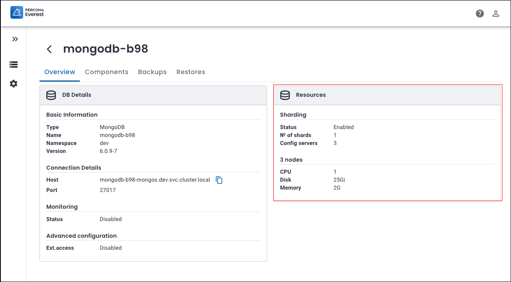

# What's new in Percona Everest 1.2.0

To begin your journey with Percona Everest, check out the [Quickstart Guide for Percona Everest](../quickstart-guide/quick-install.md).


## Release summary

|**Sr. No**|**Release summary**|**Description**|
|---------|---------------------|---------|
| **1.**      |[RBAC](#introducing-rbac-in-percona-everest-ensure-security-and-simplify-database-access-management)|Introducing RBAC in Percona Everest: Ensure security and simplify database access management|
| **2.**|[Breaking API changes](#percona-everest-v120-a-deep-dive-into-breaking-api-changes)|Percona Everest v1.2.0: A deep dive into Breaking API changes|
| **3.**|[MongoDB sharding](#exploring-the-benefits-of-mongodb-sharding-in-percona-everest) |Exploring the Benefits of MongoDB Sharding in Percona Everest|
| **4.**|[Operator upgrades](#improved-mulitple-operator-upgrades)|Improved mulitple operator upgrades|
| **5.**|[New features](#new-features)|Check out the new features introduced in Percona Everest 1.2.0|
| **6.**|[Improvements](#improvements)|Discover all the enhancements featured in Percona Everest 1.2.0|
| **7.**|[Bugs](#bugs)|Find out about all the bugs fixed in Percona Everest 1.2.0|


## Release highlights


### Introducing RBAC in Percona Everest: Ensure security and simplify database access management

Starting with Percona Everest 1.2.0, we’ve enhanced our platform by introducing Role-Based Access Control (RBAC), which regulates resource access for better management and security.

With RBAC, only authorized individuals can access specific resources or perform certain actions based on their assigned roles. This method improves security by minimizing the risk of unauthorized access and helps manage permissions more efficiently across Percona Everest.

Here's a breakdown of the key concepts in RBAC:

- [Roles](https://docs.percona.com/everest/administer/rbac.html#default-role) - Roles are a set of permissions that allow users to access and carry out various tasks within Percona Everest.

- [RBAC resources and privileges](https://docs.percona.com/everest/administer/rbac.html#rbac-resources-and-privileges): Resources are the entities or objects within Percona Everest that require controlled access. Privileges specify the particular actions that a role is able to perform on a resource.

- [Policy definition](https://docs.percona.com/everest/administer/rbac.html#policy-definition-in-rbac): RBAC policies are the rules and guidelines that define how roles, permissions, and users are managed within RBAC.


    The policy definition in Percona Everest is:

    ```sh
    p, <subject>, <resource-type>, <action>, <resource-name>
    ```

- [Role assignment](https://docs.percona.com/everest/administer/rbac.html#assigning-roles-to-users): Assigning specific roles to individual users within Percona Everest is crucial for the roles to be effective.

    The syntax for assigning a role is as follows:

    ```sh
    g, username, rolename
    ```

Explore our comprehensive [documentation](https://docs.percona.com/everest/administer/rbac.html) for everything you need to know about RBAC.


### Percona Everest 1.2.0: A deep dive into Breaking API changes

Beginning with Percona Everest v1.2.0, breaking changes are being introduced to the API for `monitoring-instances` and `backup-storages` resources. These updates include:

- Before the launch of Percona Everest 1.2.0, the resources `monitoring-instances` and `backup-storages` had a global scope. Percona Everest used a `.spec.allowedNamespaces` field to control access to these global resources. This field defined the namespaces where the resources could be accessed, thus providing some degree of access control.

- With the upgrade to Percona Everest version 1.2.0, the transition from global scope to the designated namespaces for these resources is an important change in the way access control is managed. This improves security as the resources are only accessible within their designated namespaces. The database clusters can only use `monitoring-instances` and `backup-storages` located within the same namespace as the cluster.

- When upgrading to 1.2.0 using the CLI command `everestctl upgrade`, all your existing `backup-storages` and `monitoring-instances` will be automatically migrated to the namespaces specified in their `.spec.allowedNamespaces` fields.

    !!! note
        After the upgrade to Percona Everest 1.2.0, you will only be able to access these resources through the new API endpoints.

    Check out our [documentation](docs.percona.com/everest//administer/api_rbac.html#changes-in-the-percona-everest-apis) for in-depth details on the Breaking API changes.


### Exploring the benefits of MongoDB sharding in Percona Everest

[Sharding  :octicons-link-external-16:](https://docs.mongodb.com/manual/reference/glossary/#term-sharding) is used for horizontal database scaling. It distributes a database horizontally across multiple nodes or servers, known as **shards**. Each shard manages a portion of the data, forming a sharded cluster, which enables MongoDB to handle large datasets and high user concurrency effectively.

MongoDB sharding has several key components:

- shard: Each shard has a subset of the data.
- mongos: The query router directs the client queries to the proper shard(s).

    !!! info "Important"
        With the current Percona Everest release, the number of routers (mongos) is, by default, set to the number of nodes in your replica set. However, in our upcoming releases, you can customize the number of routers and set resource limits for them.

- config servers: The configuration servers store the cluster's metadata and configuration settings.

#### Enable sharding in Percona Everest

To enable sharding:
{.power-number}

1. On the **Create Database** wizard, select **MongoDB** database and turn on the **Sharded Cluster** toggle.

    


2. To check if sharding is enabled, go to the database view page and click on the specific database. Then, check the **Resources** panel to see if sharding is enabled.


    


### Improved multiple operator upgrades


Starting with Percona Everest 1.2.0, we have the capability to upgrade all the database operators concurrently with their components across any namespace using our intuitive UI with just a single click.

Before initiating the upgrade process, Everest provides a comprehensive list of tasks that must be completed to ensure a seamless transition of your clusters to the next version of the database operators.


## New features

- [EVEREST-1035](https://perconadev.atlassian.net/browse/EVEREST-1035): We've now included **Retention copies** for PostgreSQL as well when setting up backup schedules.

- [EVEREST-1103](https://perconadev.atlassian.net/browse/EVEREST-1103): Starting with Percona Everest 1.2.0, we've restricted actions based on RBAC roles, ensuring that users are explicitly granted access to the resources required for their specific roles. This enhances security and simplifies access control processes.

- [EVEREST-1142](https://perconadev.atlassian.net/browse/EVEREST-1142): We have now added a [new command](../administer/rbac.md#validate-your-rbac-policy) for validating your RBAC policy to ensure that your RBAC policies are working as expected.

- [EVEREST-1240](https://perconadev.atlassian.net/browse/EVEREST-1240): We have added support for PostgreSQL operator version 2.4.1. 

- [EVEREST-1298](https://perconadev.atlassian.net/browse/EVEREST-1298): We have added support for MySQL operator version 1.15.0.

- [EVEREST-1303](https://perconadev.atlassian.net/browse/EVEREST-1303): Starting with Percona Everest 1.2.0, you can enable sharding for MongoDB when creating a database cluster. By leveraging sharding in Percona Everest, you can enhance the performance and scalability of your database clusters.

- [EVEREST-981](https://perconadev.atlassian.net/browse/EVEREST-981): Configure everest to run behind a proxy


## Improvements

- [EVEREST-1165](https://perconadev.atlassian.net/browse/EVEREST-1165)- We now have the capability to upgrade all database operators simultaneously with their components across any namespace using our user-friendly interface with just a single click.

- [EVEREST-1212](https://perconadev.atlassian.net/browse/EVEREST-1212) - Edit monitoring \(widget\+logic\)

- [EVEREST-1230](https://perconadev.atlassian.net/browse/EVEREST-1230): Resources \(widget\) \+ common card updation

- [EVEREST-1066](https://perconadev.atlassian.net/browse/EVEREST-1066): Backups \(widget\)

- [EVEREST-1369](https://perconadev.atlassian.net/browse/EVEREST-1369): 
We have updated the documentation for the section on turning off telemetry.

## Bugs

- [EVEREST-768](https://perconadev.atlassian.net/browse/EVEREST-768): We've resolved the issue with the PostgreSQL pods not restarting when the database was restarted.

- [EVEREST-1232](https://perconadev.atlassian.net/browse/EVEREST-1232): The backups and restore pages have been updated to show consistent date formats .

- [EVEREST-1253](https://perconadev.atlassian.net/browse/EVEREST-1253): The **Delete** option in the backup menu is properly now disabled if the backup is in the **Deleting** status.

- [EVEREST-1273](https://perconadev.atlassian.net/browse/EVEREST-1273) Backend sends an empty response if the backup storage url is edited to an http address

- [EVEREST-1279](https://perconadev.atlassian.net/browse/EVEREST-1279): The CPU value displayed on the Resources page and the Database Summary panel is now consistent.

- [EVEREST-1286](https://perconadev.atlassian.net/browse/EVEREST-1286): When editing a backup schedule, the option to change the backup name is now disabled.


- [EVEREST-1287](https://perconadev.atlassian.net/browse/EVEREST-1287) No ability to change antiAffinityTopologyKey or other affinity settings

- [EVEREST-1315](https://perconadev.atlassian.net/browse/EVEREST-1315): Despite Percona Everest showing a successful upgrade message, the upgrade actually didn't go as planned. The issue has been resolved now.

- [EVEREST-1323](https://perconadev.atlassian.net/browse/EVEREST-1323):We've resolved the issue that was causing an error to appear on the **Components** page after creating databases, especially when the status was either **initializing** or **up**.

- [EVEREST-1354](https://perconadev.atlassian.net/browse/EVEREST-1354): We've resolved an issue related to the incorrect display of CPU and memory resources in the PXC CRD.


- [EVEREST-1371](https://perconadev.atlassian.net/browse/EVEREST-1371): We've addressed a couple of issues pertaining to the **Monitoring** page, one of them being the monitoring endpoint displaying the **username** instead of the **endpoint** name.


- [EVEREST-1372](https://perconadev.atlassian.net/browse/EVEREST-1372): We've resolved the issue that was preventing us from deleting the monitoring endpoint not currently in use.

- [EVEREST-1375](https://perconadev.atlassian.net/browse/EVEREST-1375): The upgrade to PXC operator 1.15.0 caused a restart of the databases. We have resolved the issue now.