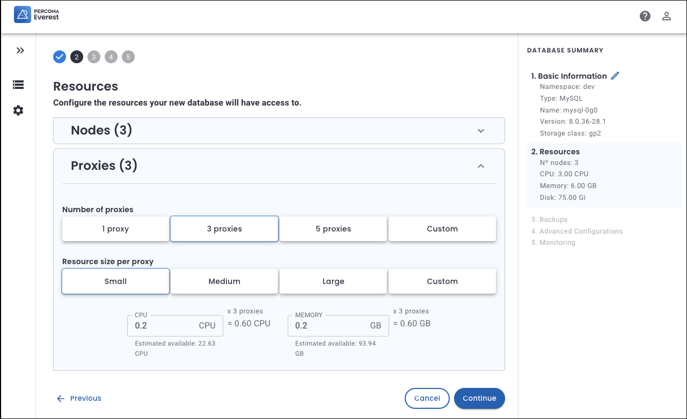
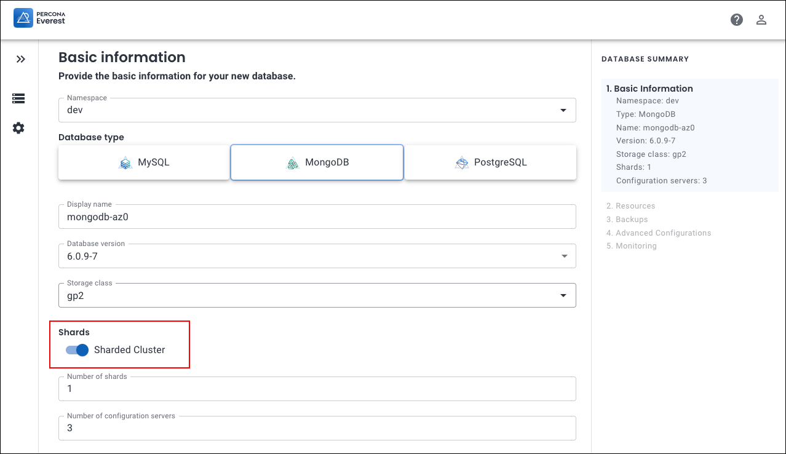
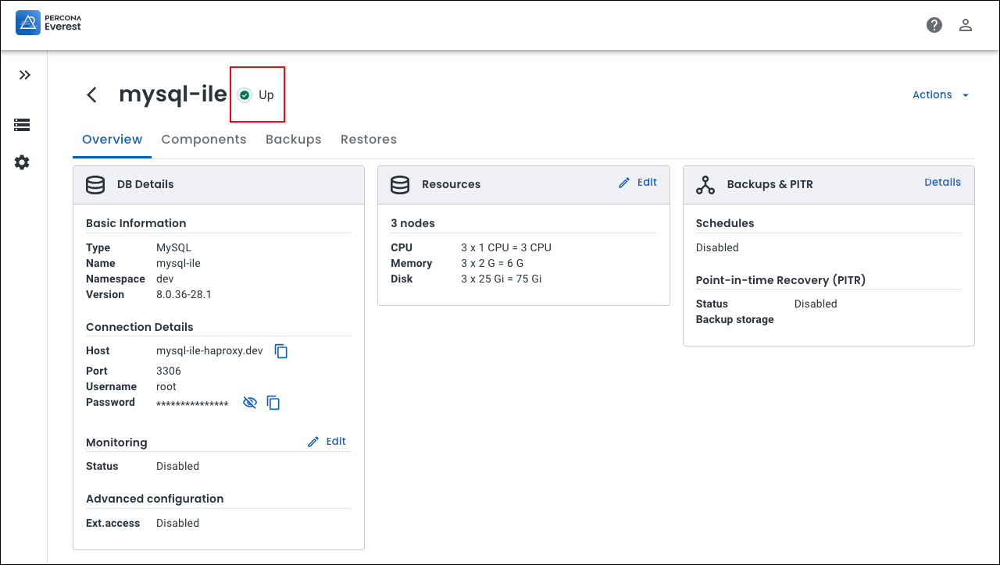

# What's new in Percona Everest 1.3.0

To begin your journey with Percona Everest, check out the [Quickstart Guide for Percona Everest](../quickstart-guide/quick-install.md).


??? info "Release summary at a glance"

    |**Sr. No**|**Release summary**|**Description**|
    |---------|---------------------|---------|
    | **1.**  |[Configure proxy nodes](https://docs.percona.com/everest/release-notes/Percona-Everest-1.3.0-%282024-10-28%29.html#__tabbed_1_1)|Configure proxy nodes and define their resource limits|
    | **2.**  |[MongoDB Sharding](https://docs.percona.com/everest/release-notes/Percona-Everest-1.3.0-%282024-10-28%29.html#__tabbed_1_2)|Introducing **sharding** in Percona Everest: Optimize your MongoDB databases with sharding|
    | **3.**  |[Database status](https://docs.percona.com/everest/release-notes/Percona-Everest-1.3.0-%282024-10-28%29.html#__tabbed_1_3)|Check your database status from the datbas details page|
    | **4.**  |[PSMDB Operator v1.17.0 support](https://docs.percona.com/everest/release-notes/Percona-Everest-1.3.0-%282024-10-28%29.html#__tabbed_1_4)|Support for PSMDB Operator v1.17.0 in Percona Everest|
    | **4.**|[New features](https://docs.percona.com/everest/release-notes/Percona-Everest-1.3.0-%282024-10-28%29.html#new-features)|Check out the new features introduced in Percona Everest 1.3.0|
    | **5.**|[Improvements](https://docs.percona.com/everest/release-notes/Percona-Everest-1.3.0-%282024-10-28%29.html#improvement)|Discover all the enhancements featured in Percona Everest 1.3.0|
    | **6.**|[Deprecated API's](https://docs.percona.com/everest/release-notes/Percona-Everest-1.3.0-%282024-10-28%29.html#the-latest-in-apis-whats-new-and-whats-deprecated)|Discover all the APIs that have been removed from Percona Everest 1.3.0|
    | **7.**|[Bugs](https://docs.percona.com/everest/release-notes/Percona-Everest-1.3.0-%282024-10-28%29.html#bug)|Find out about all the bugs fixed in Percona Everest 1.3.0|
    | **8.**|[Known limitations](https://docs.percona.com/everest/release-notes/Percona-Everest-1.3.0-%282024-10-28%29.html#known-limitations)|Discover all the known limitations in Percona Everest 1.3.0|


## Release highlights


=== "Configure proxies"

    ### Capability to configure proxy nodes and define their resource limits

    Starting with Percona Everest 1.3.0, we have introduced a new feature that permits you to customize the number of proxies and their resources, including the allocation of CPU and RAM for each proxy. This feature mirrors the existing capability to customize the number of database engine replicas and allocate resources to them.

    With this feature, you now have more flexibility to customize the resources allocated to proxies according to your needs, thus providing more control over your Percona Everest deployments.


    

=== "MongoDB sharding"

    ### Optimize MongoDB with sharding in Percona Everest


    We're excited to announce that we've achieved another milestone with the implementation of MongoDB sharding in Percona Everest 1.3.0. You can now harness the benefits of sharding for your MongoDB databases with Percona Everest.

    [Sharding  :octicons-link-external-16:](https://docs.mongodb.com/manual/reference/glossary/#term-sharding) is used for horizontal database scaling. It distributes a database horizontally across multiple nodes or servers, known as **shards**. Each shard manages a portion of the data, forming a sharded cluster, which enables MongoDB to handle large datasets and high user concurrency effectively.

    The key components of MongoDB sharding are:

    - Shard: Each shard has a subset of the data.
    - Mongos: The query router directs the client queries to the proper shard(s).
    - Config servers: The configuration servers store the cluster's metadata and configuration settings.

    Here's how you can enable sharding:

    On the **Create Database** wizard, select **MongoDB** database and turn on the **Sharded Cluster** toggle.

    

    If you're looking to dive deeper into MongoDB sharding, check out the [documentation](https://docs.percona.com/everest/mongo_sharding.html).

=== "Database status"

    ### Database status at a glance


    Starting with Percona Everest version 1.3.0, you can now quickly monitor the status of your databases right from the database details page for your specific database. This feature saves you time by enabling you to keep an eye on your databases without having to switch to the **database view** page.


    


=== "PSMDB operator v1.17.0"

    ### Support for PSMDB Operator v1.17.0

    Starting with Percona Everest 1.3.0, we are thrilled to announce that we have added support for PSMDB Operator v1.17.0.

## New features

- [EVEREST-1303](https://perconadev.atlassian.net/browse/EVEREST-1303): We have introduced MongoDB sharding in Percona Everest 1.3.0. Now, you can leverage sharding for your MongoDB databases with Percona Everest.

- [EVEREST-777](https://perconadev.atlassian.net/browse/EVEREST-777): Previously, you could only customize the database engine replicas and their resources. Now, you have the ability to customize the number of proxy replicas and their resources, including CPU and RAM, during the database creation.


- [EVEREST-1310](https://perconadev.atlassian.net/browse/EVEREST-1310): Previously, you could only customize the database engine replicas and their resources. Now, you have the ability to customize the number of proxy replicas and their resources, including CPU and RAM, while editing the database.


- [EVEREST-1239](https://perconadev.atlassian.net/browse/EVEREST-1239): Starting with Percona Everest, we’ve added support for PSMDB Operator v1.17.0.


## Improvements

- [EVEREST-1006](https://perconadev.atlassian.net/browse/EVEREST-1006) - You can now view your database status right from the database details page.

- [EVEREST-1208](https://perconadev.atlassian.net/browse/EVEREST-1208) - You can upgrade the database version directly from the **Overview** page. However, the **Upgrade** option will only be visible if you have the necessary permissions. When you click **Upgrade**, a pop-up will appear, prompting you to select the version of the database to which you want to upgrade.

- [EVEREST-1211](https://perconadev.atlassian.net/browse/EVEREST-1211) - You can now easily edit your resources directly from the **Overview** page. There’s no longer a need to navigate the entire database wizard, saving you time and simplifying the process.

- [EVEREST-1459](https://perconadev.atlassian.net/browse/EVEREST-1459) \[UI\] Add 'contact Percona support' action to support menu 

- [EVEREST-1460](https://perconadev.atlassian.net/browse/EVEREST-1460) - To make your experience with Percona Everest even smoother, we've added convenient links right on the login page. Discover everything from **Support** and a **Quickstart guide** to our **Forum**, the **K8s Squad program**, and our **GitHub** repository.


- [EVEREST-1470](https://perconadev.atlassian.net/browse/EVEREST-1470) - The `rbac validate` command has been enhanced to accept the `ConfigMap` YAML file. This enables you to validate role-based access control (RBAC) configurations by leveraging the structured data provided in a `ConfigMap` format.

- [EVEREST-1533](https://perconadev.atlassian.net/browse/EVEREST-1533) - Users with read-only permissions for a namespace, including all database engines and database clusters within that namespace, currently cannot access the **Upgrade** option in the user interface. This restriction prevents them from viewing upgrade prerequisites, such as the versions of database clusters that may need to be upgraded.

    However, starting with Percona Everest 1.3.0, the **Upgrade** button is clickable for these users. This enables them to view details about the upgrade plan, including any necessary changes for the database clusters, which can help inform administrators about required preparations. However, within this window, the option to upgrade the operator remains unclickable for users without the upgrade permissions.

## Deprecated API endpoints

This is the list of the API endpoints deprecated in Percona Everest v1.2.0 and removed from v1.3.0:


|**No**|**API endpoints**|**Method**|
|---------|--------------|------------|
|**a.**|`/monitoring-instances`|1.`GET`</br> 2.`POST`|
|**b.**|`/monitoring-instances/{name}`|1.`GET`</br>2. `PATCH`</br>3.`DELETE`|
|**c.**|`/backup-storages`|1.`GET`</br> 2.`POST`|
|**d.**|`/backup-storages/{name}`|1.`GET`</br>2. `PATCH`</br>3.`DELETE`|


## Bugs

- [EVEREST-886](https://perconadev.atlassian.net/browse/EVEREST-886) - The PostgreSQL database can now be restored using PITR. Previously, the restoration using the latest PITR did not complete, and the database remained in the **Restoring** status.


- [EVEREST-1187](https://perconadev.atlassian.net/browse/EVEREST-1187) - When creating a PostgreSQL database, if backup schedules were not created initially but added later after the database was created, Point-in-Time Recovery (PITR) was disabled. We have now resolved the issue, and PITR has now been enabled.


- [EVEREST-1266](https://perconadev.atlassian.net/browse/EVEREST-1266) - On the **Components** page, the Pod icon now shows the correct color: green if the status is `Running` and all containers are ready and yellow if the status is `Running` while some containers are not ready.


- [EVEREST-1384](https://perconadev.atlassian.net/browse/EVEREST-1384) - The **Overview** page now displays resources more clearly for an enhanced UI.

- [EVEREST-1390](https://perconadev.atlassian.net/browse/EVEREST-1390) - We’ve addressed an issue that caused the **Components** page to get stuck in a loop, refreshing endlessly whenever a database was suspended. 

- [EVEREST-1398](https://perconadev.atlassian.net/browse/EVEREST-1398) - The time format is now unified across all backups and restores, ensuring consistency and clarity.

- [EVEREST-1399](https://perconadev.atlassian.net/browse/EVEREST-1399) The Resource per node now correctly shows the value set when creating the database. Before, the value set during and after database creation did not match.


- [EVEREST-1407](https://perconadev.atlassian.net/browse/EVEREST-1407) - We resolved an issue where a user not included in the RBAC configuration (lacking permissions) could access certain information on Percona Everest.


- [EVEREST-1414](https://perconadev.atlassian.net/browse/EVEREST-1414) \[operator\] Do not modify labels not handled by the everest-operator


- [EVEREST-1430](https://perconadev.atlassian.net/browse/EVEREST-1430) - We encountered a problem that prevented us from navigating back to the namespace settings page after upgrading the database operator in the Percona Everest GUI. This issue has now been resolved.

- [EVEREST-1444](https://perconadev.atlassian.net/browse/EVEREST-1444) - The **Create database** wizard now correctly displays an error if the user does not have database-engines permissions. Also, if the user doesn’t have access to at least one database engine, then that namespace doesn't show up on the list.

- [EVEREST-1447](https://perconadev.atlassian.net/browse/EVEREST-1447) - The options to edit and delete backup schedules are now disabled if the user lacks the necessary permissions.


- [EVEREST-1454](https://perconadev.atlassian.net/browse/EVEREST-1454) - Although the user did not have permission for backup storage, they could see the **Add backup storage** option while creating a DB cluster. The issue has been resolved now.


- [EVEREST-1455](https://perconadev.atlassian.net/browse/EVEREST-1455) - Monitoring endpoint information is now consistent when editing a database (DB) cluster. Previously, if you created a DB cluster with monitoring enabled and then removed all permissions related to monitoring before editing the same DB cluster, the endpoint information for monitoring would not be consistent.


- [EVEREST-1457](https://perconadev.atlassian.net/browse/EVEREST-1457) - We have addressed an issue where the **Add monitoring endpoint** option appeared while creating a DB cluster, even though the user lacked the required permissions.


- [EVEREST-1464](https://perconadev.atlassian.net/browse/EVEREST-1464) -  Previously, the **Restores** page would automatically refresh if a user attempted to access it without the necessary restore permissions. The issue has been resolved now.

- [EVEREST-1506](https://perconadev.atlassian.net/browse/EVEREST-1506) - You can now edit the database cluster, provided that you have the necessary permissions to do so.


- [EVEREST-1510](https://perconadev.atlassian.net/browse/EVEREST-1510) - The Add Storage button was displayed for the PostgreSQL database even though backup schedules had already been set up. This issue has been resolved now.


- [EVEREST-1517](https://perconadev.atlassian.net/browse/EVEREST-1517) - 
If users do not have the necessary permissions to perform an action, you can now see the correct error message on the UI.


- [EVEREST-1525](https://perconadev.atlassian.net/browse/EVEREST-1525) - When deleting a monitoring endpoint, the UI no longer freezes and successfully removes the monitoring endpoint.


- [EVEREST-1526](https://perconadev.atlassian.net/browse/EVEREST-1526) - We resolved an issue where users lacking backup storage permissions could create a DB cluster with a backup schedule using a storage location.


- [EVEREST-1532](https://perconadev.atlassian.net/browse/EVEREST-1532) - The option to upgrade an operator is absent on the Percona Everest UI when the database engine name is included in the RBAC policy.


- [EVEREST-1541](https://perconadev.atlassian.net/browse/EVEREST-1541) - We fixed an issue where the custom number of nodes was not functioning during the setup of MySQL databases.

- [EVEREST-1550](https://perconadev.atlassian.net/browse/EVEREST-1550) - The database dashboard menu displayed an empty box for users with read-only permissions on the database cluster. This issue has now been resolved.

- [EVEREST-1551](https://perconadev.atlassian.net/browse/EVEREST-1551) - The **Upgrade** button now only appears when new operator versions are available for upgrade.


## Known limitations

### PSMDB backup failures

There maybe instances when your MongoDB backups may encounter unexpected failures. 

Let's check the reason for these failures by running the following command:

    kubectl get psmdb-backup <BACKUP_NAME> -n <YOUR_NAMESPACE> -o yaml | grep error

Here are some potential errors you could encounter:

```{.bash .no-copy}
starting deadline exceeded
```

```{.bash .no-copy}
'couldn''t get response from all shards: convergeClusterWithTimeout:
```

!!! info "Important"
    We have compiled a list of  a list of [workarounds](https://docs.percona.com/everest/reference/known_limitations.html#workarounds-for-psmdb-backup-failures) to ensure that your backups function properly again.


