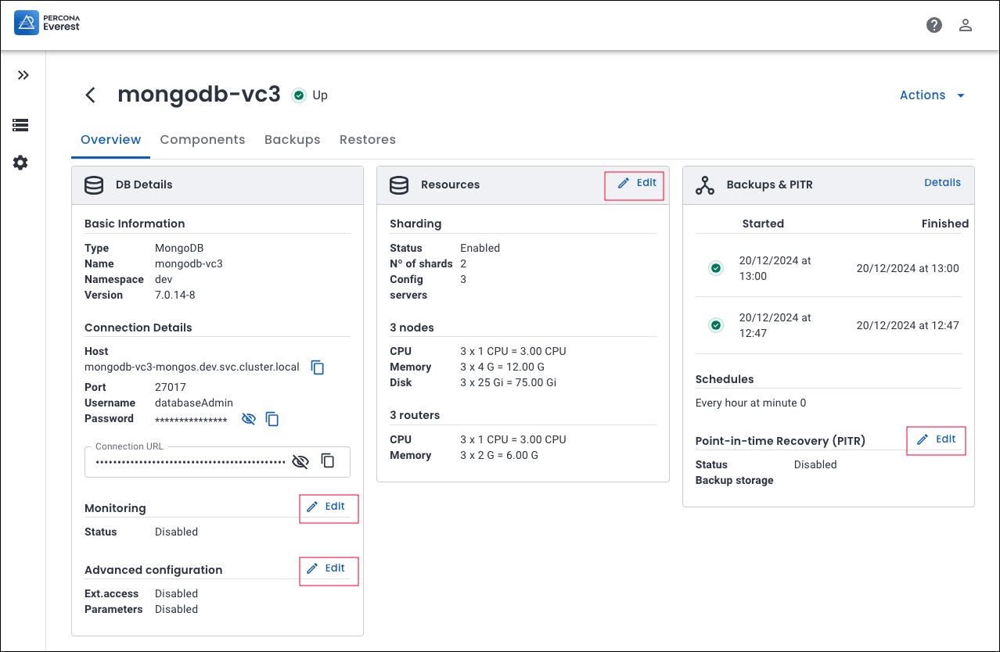
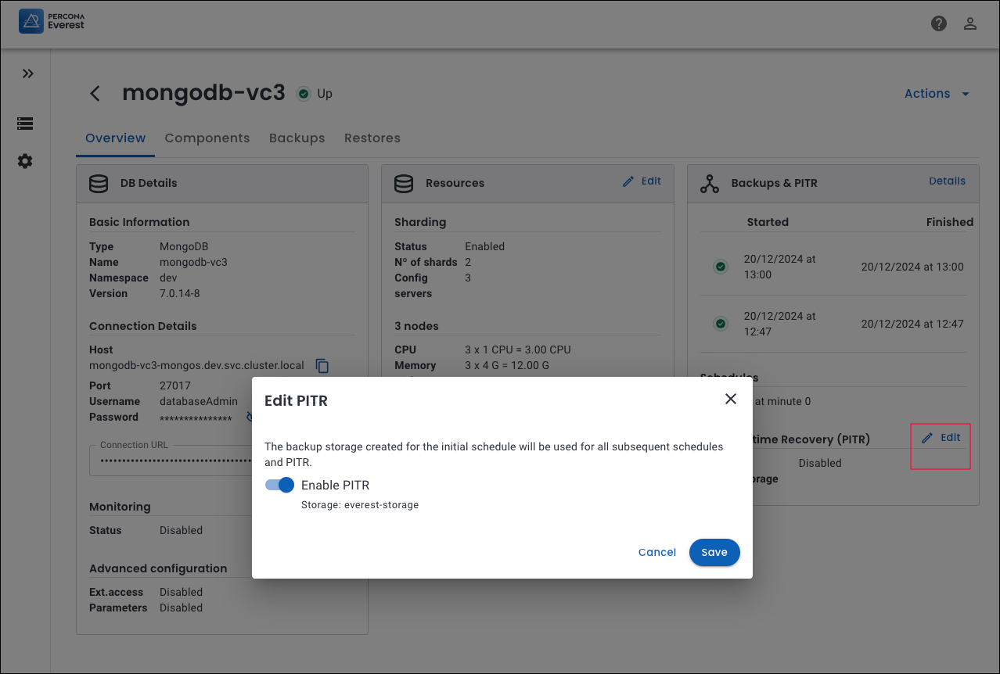

# What's new in Percona Everest 1.4.0

To begin your journey with Percona Everest, check out the [Quickstart Guide for Percona Everest](../quickstart-guide/quick-install.md).


??? info "Release summary at a glance"

    |**Sr. No**|**Release summary**|**Description**|
    |---------|---------------------|---------|
    | **1.**  |[Helm charts]()||
    | **2.**  |[Namespace management]()||
    | **5.**|[New features](https://docs.percona.com/everest/release-notes/Percona-Everest-1.3.0-%282024-11-18%29.html#new-features)|Check out the new features introduced in Percona Everest 1.4.0|
    | **6.**|[Improvements](https://docs.percona.com/everest/release-notes/Percona-Everest-1.3.0-%282024-11-18%29.html#improvements)|Discover all the enhancements featured in Percona Everest 1.4.0|
    | **7.**|[Deprecated APIs](https://docs.percona.com/everest/release-notes/Percona-Everest-1.3.0-%282024-11-18%29.html#deprecated-api-endpoints)|Discover all the Deprecated APIs from Percona Everest 1.4.0|
    | **8.**|[Bugs](https://docs.percona.com/everest/release-notes/Percona-Everest-1.3.0-%282024-11-18%29.html#bugs)|Find out about all the bugs fixed in Percona Everest 1.4.0|
    | **9.**|[Known limitations](https://docs.percona.com/everest/release-notes/Percona-Everest-1.3.0-%282024-11-18%29.html#known-limitations)|Discover all the known limitations in Percona Everest 1.4.0|


## Release highlights

=== "Helm charts"
    ### Simplify your Percona Everest deployments with Helm

    We are excited to announce the launch of Helm charts in Percona Everest 1.4.0. [Helm charts](https://helm.sh/) simplify the deployment process by packaging all necessary resources and configurations, making them ideal for automating and managing installations in Kubernetes environments.

    Percona Helm charts can be found in [percona/percona-helm-charts]( https://github.com/percona/percona-helm-charts/tree/main/charts/everest) repository in Github.

    ??? info "Install Percona Everest with Helm"

        1. Add the Percona Helm repository:

            ```sh
            helm repo add percona https://percona.github.io/percona-helm-charts/
            ```

        2. Install Percona Everest:

            ```sh
            helm install everest-core percona/everest \
            --namespace everest-system \
            --create-namespace
            ```
        
            For a deep dive into using Helm charts for installing Percona Everest, refer to our [documentation](https://docs.percona.com/everest/install/install_everest_helm_charts.html).


    Explore our [Upgrade :material-arrow-right:](https://docs.percona.com/everest/upgrade/upgrade_with_helm.html){.md-button} or [Uninstall :material-arrow-right:](https://docs.percona.com/everest/uninstall/uninstall_everest_helm.html){.md-button} sections to learn how to upgrade or uninstall Percona Everest with Helm.
    
=== "Namespaces management"

    ### Manage your namespaces with new everestctl commands

    Namespace management is essential in Percona Everest for efficiently organizing, securing, and allocating resources, particularly in large and complex Kubernetes environments. By leveraging Kubernetes namespaces, Percona Everest achieves logical isolation, enhanced security, and better resource allocation for databases, backups, and monitoring setups.


    Starting with Percona Everest 1.4.0, we have introduced new `everestctl` commands to manage your namespaces. These commands enable you to:
        
    - [Add new namespaces](https://docs.percona.com/everest/administer/manage_namespaces.html#add-new-namespaces)
    - [Update existing namespaces](https://docs.percona.com/everest/administer/manage_namespaces.html#update-namespaces)
    - [Delete any used namespaces](delete-namespaces)

    For a deep dive into managing namespaces for provisioning DB namespaces in Percona Everest, refer to our [documentation](https://docs.percona.com/everest/administer/manage_namespaces.html).

=== "Improved edit database flow"

    ### Removal of the Edit DB Wizard for an enhanced User Experience

    Starting with Percona Everest 1.4.0, we have removed the **Edit DB** wizard to provide a more streamlined user experience. You can now edit specific fields directly from the **DB Overview** screen using our new editable widgets, eliminating the need to navigate through the entire **Edit DB** wizard.

    

     Let's assume you want to make changes to **Point-in-time-Recovery (PITR)**. First, navigate to the specific database. Then, go to **Overview > Point-in-time-Recovery (PITR)** and click **Edit**. Make the necessary changes and click **Save**.
     
    

## New features

- [EVEREST-908](https://perconadev.atlassian.net/browse/EVEREST-908) Add connection URL to connection details info card

- [EVEREST-1511](https://perconadev.atlassian.net/browse/EVEREST-1511) Install/uninstall with helm

- [EVEREST-1512](https://perconadev.atlassian.net/browse/EVEREST-1512) Upgrade with helm

- [EVEREST-1599](https://perconadev.atlassian.net/browse/EVEREST-1599) Add support for PG operator v2.5.0

- [EVEREST-1624](https://perconadev.atlassian.net/browse/EVEREST-1624) Add support for PSMDB Operator v1.18.0

- [EVEREST-1673](https://perconadev.atlassian.net/browse/EVEREST-1673) \[CLI\] New command for provisioning DB namespaces

## Improvement

- [EVEREST-1065](https://perconadev.atlassian.net/browse/EVEREST-1065) \[UI\] Remove edit button from database list actions

- [EVEREST-1066](https://perconadev.atlassian.net/browse/EVEREST-1066) \[UI\] Backups \(widget\)

- [EVEREST-1210](https://perconadev.atlassian.net/browse/EVEREST-1210) \[UI\] Edit advanced configuration \(widget \+ logic\)

- [EVEREST-1304](https://perconadev.atlassian.net/browse/EVEREST-1304) \[UI\] Select DB type from DB cluster view before opening DB creation wizard

- [EVEREST-1458](https://perconadev.atlassian.net/browse/EVEREST-1458) \[UI\] Refactor empty states - tables 

- [EVEREST-1546](https://perconadev.atlassian.net/browse/EVEREST-1546) \[UI\] Number of proxies/routers/bouncers and their resources should be displayed in dashboard and database overview

- [EVEREST-1683](https://perconadev.atlassian.net/browse/EVEREST-1683) \[UI\] Backups on the database overview page should be sorted in descending order by Started date and time


- [EVEREST-1686](https://perconadev.atlassian.net/browse/EVEREST-1686) Use 24h format

- [EVEREST-1687](https://perconadev.atlassian.net/browse/EVEREST-1687) \[UI\] Update button label - upgrade crd version

- [EVEREST-1688](https://perconadev.atlassian.net/browse/EVEREST-1688) \[UI\] Number fields can change value on scrolling the page

- [EVEREST-1701](https://perconadev.atlassian.net/browse/EVEREST-1701) \[RBAC\] database-cluster-backups resource name matches DB name instead of backup name

- [EVEREST-1702](https://perconadev.atlassian.net/browse/EVEREST-1702) \[RBAC\] database-cluster-restores resource name matches DB name instead of restore name

## Bugs

- [EVEREST-1187](https://perconadev.atlassian.net/browse/EVEREST-1187) \[UI\] PITR is not enabled for postgresql database after creating backup schedules on the Backups page

- [EVEREST-1191](https://perconadev.atlassian.net/browse/EVEREST-1191) \[CLI\] Incorrect handling of OIDC issuer URL response parsing

- [EVEREST-1235](https://perconadev.atlassian.net/browse/EVEREST-1235) \[CLI\] Improve error messages related to k8s connectivity

- [EVEREST-1254](https://perconadev.atlassian.net/browse/EVEREST-1254) \[CLI\] Uninstallation displays a strange code in the end

- [EVEREST-1294](https://perconadev.atlassian.net/browse/EVEREST-1294) everestctl is not providing error if it cannot connect to k8s cluster

- [EVEREST-1301](https://perconadev.atlassian.net/browse/EVEREST-1301) \[UI\] Mongodb backup schedule can't be created if a schedule with a different backup storage is created in db edit

- [EVEREST-1320](https://perconadev.atlassian.net/browse/EVEREST-1320) \[UI\] PITR gap message should come on the Backups page instead of Restores page

- [EVEREST-1352](https://perconadev.atlassian.net/browse/EVEREST-1352) \[UI\] All database actions should be disabled if the database is in Deleting status

- [EVEREST-1399](https://perconadev.atlassian.net/browse/EVEREST-1399) Issue with Resource per Node Selection in Database Creation

- [EVEREST-1407](https://perconadev.atlassian.net/browse/EVEREST-1407) \[RBAC\] A user that is not added in the rbac config \(not having permissions\) can access certain information on Everest

- [EVEREST-1440](https://perconadev.atlassian.net/browse/EVEREST-1440) \[UI\] Time lag and Add storage displayed on the Backups page if the user does not have backup storage permissions

- [EVEREST-1518](https://perconadev.atlassian.net/browse/EVEREST-1518) \[RBAC\] DB clusters visible and editable for users without permissions for the respective db engine\(s\)

- [EVEREST-1534](https://perconadev.atlassian.net/browse/EVEREST-1534) \[RBAC\] '/databases' page does not show any individual dbs from the policy

- [EVEREST-1565](https://perconadev.atlassian.net/browse/EVEREST-1565) \[UI\] Mongodb versions are not sorted and some versions are skipped

- [EVEREST-1593](https://perconadev.atlassian.net/browse/EVEREST-1593) \[UI\] Sometimes the Display name and Database version are not displayed in a fresh cluster

- [EVEREST-1594](https://perconadev.atlassian.net/browse/EVEREST-1594) Scheduled backups start failing after some successful backups for mongodb sharded clusters

- [EVEREST-1604](https://perconadev.atlassian.net/browse/EVEREST-1604) \[RBAC\] Create a database from a backup is successful if the user does not have database-engines permissions

- [EVEREST-1608](https://perconadev.atlassian.net/browse/EVEREST-1608) \[UI\] Error should be displayed on Resources page if the proxies field has no value


- [EVEREST-1613](https://perconadev.atlassian.net/browse/EVEREST-1613) Issue with Topology Settings Reverting to "Custom" in Percona Everest UI

- [EVEREST-1615](https://perconadev.atlassian.net/browse/EVEREST-1615) \[CLI\] Uninstall fails if a mongodb sharded cluster is in Deleting state

- [EVEREST-1630](https://perconadev.atlassian.net/browse/EVEREST-1630) "Config Servers" Reset to Default Value of 1 in GUI After Editing Resources

- [EVEREST-1642](https://perconadev.atlassian.net/browse/EVEREST-1642) \[UI\] Database version can be changed when restoring to a new database

- [EVEREST-1649](https://perconadev.atlassian.net/browse/EVEREST-1649) UI - Backup "Add Storage" Button Inactive After Refresh

- [EVEREST-1650](https://perconadev.atlassian.net/browse/EVEREST-1650) UI - Unable to Create Backup After Adding Storage


- [EVEREST-1694](https://perconadev.atlassian.net/browse/EVEREST-1694) \[RBAC\] Backup storages page is empty if user only has access to a single storage

- [EVEREST-1695](https://perconadev.atlassian.net/browse/EVEREST-1695) \[RBAC\] Monitoring instances page is empty if user only has access to a single instance

- [EVEREST-1700](https://perconadev.atlassian.net/browse/EVEREST-1700) Database clusters restarted on creation when PMM monitoring enabled

- [EVEREST-1703](https://perconadev.atlassian.net/browse/EVEREST-1703) \[UI\] MongoDB sharded cluster is stuck after selecting not enough config serbvers

- [EVEREST-1712](https://perconadev.atlassian.net/browse/EVEREST-1712) \[UI\] Pages become unresponsive after a while


### Epic

- [EVEREST-550](https://perconadev.atlassian.net/browse/EVEREST-550) Helm chart for installation

- [EVEREST-1116](https://perconadev.atlassian.net/browse/EVEREST-1116) Namespace Management \(adding/removing namespaces and operators\)

- [EVEREST-1207](https://perconadev.atlassian.net/browse/EVEREST-1207) Improve Editing DB flows