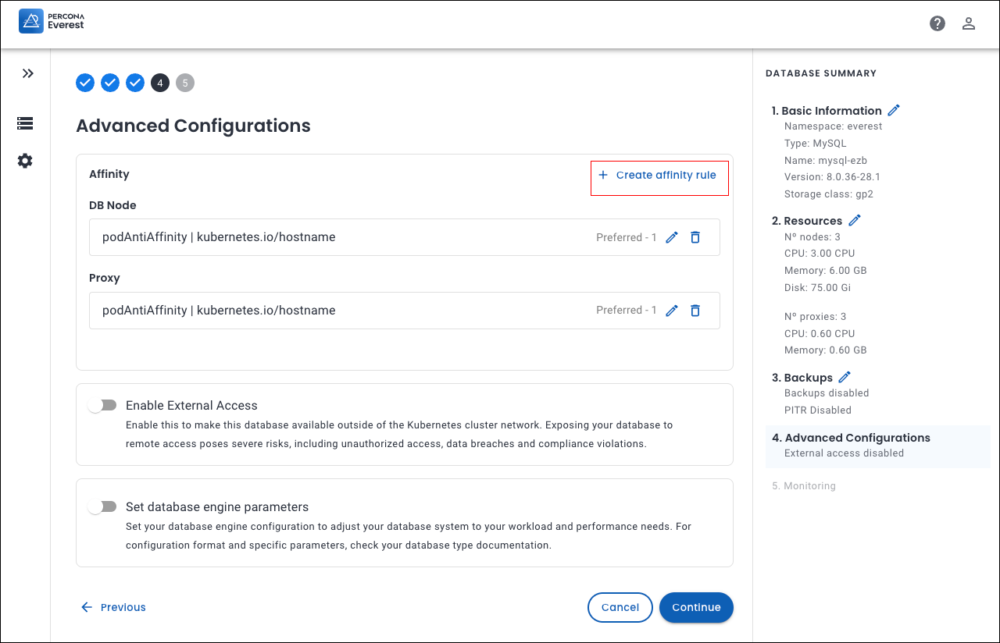

# What's new in Percona Everest 1.5.0

!!! warning
    Google Container Registry (GCR) is scheduled to be deprecated and will officially shut down on March 18, 2025. All versions of Percona Everest prior to 1.4.0 depend on images hosted on GCR, meaning that downloading those images will fail after the shutdown date. We strongly recommend upgrading to Percona Everest version 1.4.0 as soon as possible. If you do not upgrade, Percona Everest will no longer function.

    For more details, refer to the [Container Registry Deprecation documentation](https://cloud.google.com/artifact-registry/docs/transition/prepare-gcr-shutdown){:target="_blank"}.

To begin your journey with Percona Everest, check out the [Quickstart Guide for Percona Everest](../quick-install.md).

??? info "Release summary at a glance"

    |**Sr. No**|**Release summary**|**Description**|
    |---------|---------------------|---------|
    | **1.**|[Affinity](https://docs.percona.com/everest/release-notes/Percona-Everest-1.4.0-%282025-01-07%29.html#__tabbed_1_1)||
    | **2.**|[Operators support](https://docs.percona.com/everest/release-notes/Percona-Everest-1.4.0-%282025-01-07%29.html#__tabbed_1_4)|Support for [Percona Operator for MongoDB v1.18.0](https://docs.percona.com/percona-operator-for-mongodb/RN/Kubernetes-Operator-for-PSMONGODB-RN1.18.0.html){:target="_blank"} (PSMDB) and [Percona Operator for PostgreSQL v2.5.0](https://docs.percona.com/percona-operator-for-postgresql/2.0/ReleaseNotes/Kubernetes-Operator-for-PostgreSQL-RN2.5.0.html){:target="_blank"} (PG)|
    | **5.**|[New features](https://docs.percona.com/everest/release-notes/Percona-Everest-1.3.0-%282024-11-18%29.html#new-features)|Check out the new features introduced in Percona Everest 1.4.0|
    | **6.**|[Improvements](https://docs.percona.com/everest/release-notes/Percona-Everest-1.3.0-%282024-11-18%29.html#improvements)|Discover all the enhancements featured in Percona Everest 1.4.0|
    | **7.**|[Bugs](https://docs.percona.com/everest/release-notes/Percona-Everest-1.3.0-%282024-11-18%29.html#bugs)|Find out about all the bugs fixed in Percona Everest 1.4.0|
    | **8.**|[Known limitations](https://docs.percona.com/everest/release-notes/Percona-Everest-1.3.0-%282024-11-18%29.html#known-limitations)|Discover all the known limitations in Percona Everest 1.4.0|

## Release highlights

### Optimizing workloads with affinity in Percona Everest

We're thrilled to announce the latest enhancement to our offerings—introducing Affinity with Percona Everest 1.5.0.

Affinity provide database administrators with enhanced control over workload distribution in a Kubernetes cluster. By implementing affinity and anti-affinity rules, you can not only optimize performance and enhance system resilience but also ensure that your resources are utilized to their fullest potential.

Kubernetes features three primary types of affinity that play a crucial role in how pods are scheduled and interact within a cluster.

- [Node affinity](https://docs.percona.com/everest/use/affinity.html#node-affinity)
- [Pod affinity](https://docs.percona.com/everest/use/affinity.html#pod-affinity)
- [Pod anti-affinity](https://docs.percona.com/everest/use/affinity.html#pod-anti-affinity)

## Set up affinity rules for your cluster

!!! info "Important"
    All components have a default Pod Anti-Affinity rule set for each of your database engines.

You can set affinity rules in Percona Everest via the **Advanced Configurations** page within the **Affinity** section.

### Secure Access: Validating permissions assignments from Your IDP

Starting with Percona Everest 1.5.0, you can now assign RBAC policies to user groups obtained from the external IDP. This change simplifies permissions management for external users without the need for unique **sub** IDs.

A user will be authorized to perform an operation if either their subject or any of the groups they belong to has the required permission.

### Operators support

We have added support for PXC operator version v1.16.1.

## New features

- [EVEREST-1547](https://perconadev.atlassian.net/browse/EVEREST-1547): After performing an Everest upgrade, you will now receive a notification indicating that the upgrade has been completed. You can then access all the new features by clicking the **Reload** button.

- [EVEREST-1549](https://perconadev.atlassian.net/browse/EVEREST-1549): We have added support for PXC operator v1.16.1.

- [EVEREST-1605](https://perconadev.atlassian.net/browse/EVEREST-1605): Starting with Percona Everest 1.5.0, you have the ability to configure Kubernetes affinity rules for specific database components in the **Advanced Configuration** section of the database creation wizard. This enables you to manage workload distribution across your Kubernetes cluster, optimize resource utilization and boosting the high availability of each component.

- [EVEREST-1606](https://perconadev.atlassian.net/browse/EVEREST-1606): You can now configure Kubernetes affinity rules for specific database components in the **Components** tab of an existing database.

- [EVEREST-1607](https://perconadev.atlassian.net/browse/EVEREST-1607): You can now view the current status of your affinity configuration from the DB Overview tab. From there, you can directly navigate to the Affinity section in the Components tab to modify the rules. This will enable you to monitor and adjust the Kubernetes affinity settings for your database components.

- [EVEREST-1799](https://perconadev.atlassian.net/browse/EVEREST-1799): Starting with Percona Everest 1.5.0, you can now assign RBAC policies to user groups obtained from an external IDP. This change simplifies permissions management for external users without the need for unique **sub** IDs. 

## Improvements

- [EVEREST-970](https://perconadev.atlassian.net/browse/EVEREST-970): Our default schedule has been updated from **Hourly** to **Daily**, starting at 1:00 AM.

- [EVEREST-1066](https://perconadev.atlassian.net/browse/EVEREST-1066) \[UI\] Backups \(widget\)

- [EVEREST-1190](https://perconadev.atlassian.net/browse/EVEREST-1190): You can now easily find out which account you’re using to log into Everest by clicking the Profile button. This button shows the email ID used to log into Percona Everest.

- [EVEREST-1579](https://perconadev.atlassian.net/browse/EVEREST-1579): We have enhanced the shard **Topology** by modifying the label from **Nodes** to **Nodes per shard**. This change provides greater clarity on the distribution of nodes across each shard. Additionally, we now display the total number of nodes within the **Database summary** panel, giving you a more complete and insightful overview of your database.

- [EVEREST-1612](https://perconadev.atlassian.net/browse/EVEREST-1612): 
The `everestctl version` command has been updated to provide  information about the version of the Everest server that is currently installed on your system, if applicable. This enhancement enables you to easily verify the server version in use.

- [EVEREST-1718](https://perconadev.atlassian.net/browse/EVEREST-1718) \[UI\] Add loading bar when operators are being upgraded

- [EVEREST-1788](https://perconadev.atlassian.net/browse/EVEREST-1788),[EVEREST-1790](https://perconadev.atlassian.net/browse/EVEREST-1790): The `everestctl namespaces remove` and `everestctl namespaces update` commands now show a help message that guides you on how to use them.

- [EVEREST-1794](https://perconadev.atlassian.net/browse/EVEREST-1794): We have improved the description of the help text for the `--keep-namespace` flag in the `everestctl namespaces remove` command. Previously, the flag did not clearly explain that it retains the namespace in Kubernetes while only removing `everest-managed` resources, which led to confusion.

- [EVEREST-1795](https://perconadev.atlassian.net/browse/EVEREST-1795): When attempting to update a namespace using `everestctl` that was created with `kubectl` (not managed by Percona Everest), the error message was unclear. It did not provide actionable steps for the user to resolve the issue. We have improved the error message to give more insights into the issue.

## Bugs

- [EVEREST-1261](https://perconadev.atlassian.net/browse/EVEREST-1261) Incorrect error when adding backup storage using same credentials

- [EVEREST-1401](https://perconadev.atlassian.net/browse/EVEREST-1401) \[UI\] Resources not calculated properly for PSMDB sharding cluster

- [EVEREST-1537](https://perconadev.atlassian.net/browse/EVEREST-1537) Everest uninstall fails on trying to delete db clusters due to timeout

- [EVEREST-1581](https://perconadev.atlassian.net/browse/EVEREST-1581) \[UI\] Database remains in Deleting status

- [EVEREST-1588](https://perconadev.atlassian.net/browse/EVEREST-1588) PG stuck initializing after a restore

- [EVEREST-1589](https://perconadev.atlassian.net/browse/EVEREST-1589) MySQL stuck initializing in 1-node cluster

- [EVEREST-1590](https://perconadev.atlassian.net/browse/EVEREST-1590) Installation is stuck

- [EVEREST-1647](https://perconadev.atlassian.net/browse/EVEREST-1647) \[UI\] Monthly schedule creates an invalid configuration for PSMDB

- [EVEREST-1651](https://perconadev.atlassian.net/browse/EVEREST-1651) Creating a new database from backup fails for a mysql database with a long name

- [EVEREST-1674](https://perconadev.atlassian.net/browse/EVEREST-1674) Intermittent "Enforce did not pass" Message for Status 403, and Database Disappearance in UI

- [EVEREST-1677](https://perconadev.atlassian.net/browse/EVEREST-1677) \[UI\] After upgrade from 1.2.0 to 1.3.0-rc5 all resources of proxies and bouncers are displayed as 0

- [EVEREST-1722](https://perconadev.atlassian.net/browse/EVEREST-1722) UI Issues with Config Number Adjustment in DatabaseClusters

- [EVEREST-1724](https://perconadev.atlassian.net/browse/EVEREST-1724) \[UI\] Sharding is reset to default when returning to the previous step of the form

- [EVEREST-1728](https://perconadev.atlassian.net/browse/EVEREST-1728) \[UI\] Database dashboard is not updated automatically

- [EVEREST-1729](https://perconadev.atlassian.net/browse/EVEREST-1729) \[CLI\] Installation fails if 1.3.0 release cli is used to install 1.4.0

- [EVEREST-1735](https://perconadev.atlassian.net/browse/EVEREST-1735) \[UI\] Incorrect info on PITR Edit button is visible when PITR is enabled

- [EVEREST-1758](https://perconadev.atlassian.net/browse/EVEREST-1758) \[UI\] Percona Everest UI buttons to create namespaces not accessible until page is manually refreshed  after adding a namespace with everestctl namespaces add

- [EVEREST-1800](https://perconadev.atlassian.net/browse/EVEREST-1800) \[RBAC\] Unable to create a DB cluster as DB version is not displayed, with specific RBAC policy

- [EVEREST-1801](https://perconadev.atlassian.net/browse/EVEREST-1801) \[RBAC\] Create DB cluster option not visible on the UI if user does not have permission for all the DB engines

- [EVEREST-1802](https://perconadev.atlassian.net/browse/EVEREST-1802) \[RBAC\] Namespace\(s\) not visible on UI if user does not have permission to all db engines of a namespace

- [EVEREST-1803](https://perconadev.atlassian.net/browse/EVEREST-1803) \[RBAC\] Unable to edit/add monitoring to a already created DB cluster, with specific RBAC policy

- [EVEREST-1804](https://perconadev.atlassian.net/browse/EVEREST-1804) \[RBAC\] Operator Upgrade option not visible on the UI if user has access to all DB clusters in a namespace \(RBAC for db clusters set individually\)

- [EVEREST-1805](https://perconadev.atlassian.net/browse/EVEREST-1805) \[UI\] Shard Cluster Activation State Resets After Clicking "Previous"

- [EVEREST-1811](https://perconadev.atlassian.net/browse/EVEREST-1811) everest-operator does not restart when a DB operator is installed for the first time

- [EVEREST-1816](https://perconadev.atlassian.net/browse/EVEREST-1816) Installation under OpenShift is failing

- [EVEREST-1820](https://perconadev.atlassian.net/browse/EVEREST-1820) Database restores are not reconciled correctly for any DB type

### Technical task

- [EVEREST-1654](https://perconadev.atlassian.net/browse/EVEREST-1654) Improve labels handling

## Known limitations

