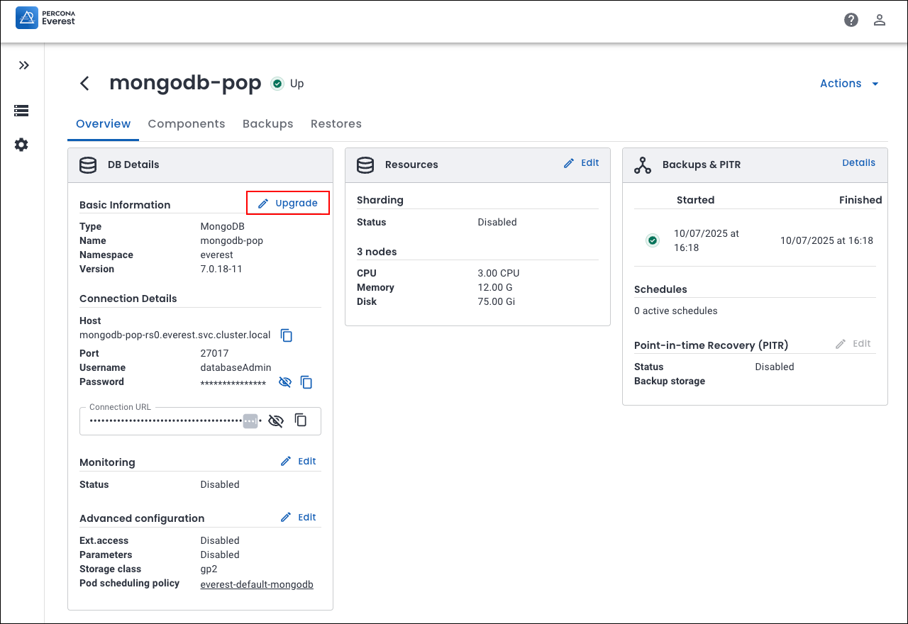
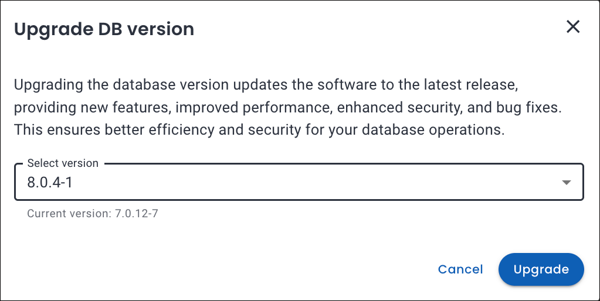

# What's new in Percona Everest 1.6.0

➡️ **New to Percona Everest?** Get started with our [Quickstart Guide](https://docs.percona.com/everest/quick-install.html).

??? info "🔑 Expand to unleash the key updates for **Percona Everest 1.6.0**"

    |**#**|**Release summary**|**Description**|
    |---------|---------------------|---------|
    | **1.**|[Manual storage scaling](https://docs.percona.com/everest/release-notes/Percona-Everest-1.6.0-%282025-03-04%29.html#__tabbed_1_1)|Increase the capacity of your storage through manual storage scaling|
    | **2.**|[MongoDB: Major DB updates](https://docs.percona.com/everest/release-notes/Percona-Everest-1.6.0-%282025-03-04%29.html#__tabbed_1_1)|Support for major version upgrades of MongoDB|
    | **3.**|[Operator Upgrades](https://docs.percona.com/everest/release-notes/Percona-Everest-1.6.0-%282025-03-04%29.html#__tabbed_1_1)|Support for Percona Operator for PostgreSQL 2.6.0|
    | **4.**|[Google Container Registry (GCR) deprecation](https://docs.percona.com/everest/release-notes/Percona-Everest-1.5.0-%282025-03-04%29.html#google-container-registry-gcr)|Deprecation of GCR starting **May 20, 2025**|
    | **5.**|[New features](https://docs.percona.com/everest/release-notes/Percona-Everest-1.5.0-%282025-03-04%29.html#new-features)|Check out the new features introduced in Percona Everest 1.6.0|
    | **6.**|[Improvements](https://docs.percona.com/everest/release-notes/Percona-Everest-1.5.0-%282025-03-04%29.html#improvements)|Discover all the enhancements featured in Percona Everest 1.6.0|
    | **7.**|[Bugs](https://docs.percona.com/everest/release-notes/Percona-Everest-1.5.0-%282025-03-04%29.html#bugs)|Find out about all the bugs fixed in Percona Everest 1.6.0|
    | **8.**|[Known limitations](https://docs.percona.com/everest/release-notes/Percona-Everest-1.5.0-%282025-03-04%29.html#known-limitations)|Discover all the known limitations in Percona Everest 1.6.0|

## 🌟 Release highlights

===  "📈 Manual storage scaling"

    ### Scale your storage with ease with Percona Everest 1.6.0

    Starting with Percona Everest 1.6.0, you can leverage manual storage scaling to increase the capacity of your database, offering greater control over resource allocation as your needs evolve.
    
    **Prerequisites for storage scaling**

    - **PersistentVolumeClaim (PVC) volume expansion** - Ensure that the `StorageClass` used by the database’s PersistentVolumeClaim (PVC) supports volume expansion.  Refer to the [Kubernetes documentation on Persistent Volumes](https://kubernetes.io/docs/concepts/storage/persistent-volumes/){:target="_blank"} for more details.

    - **Resource quota check** - Verify that your resource quotas allow for the requested storage capacity. For more information, see the [Kubernetes documentation on Storage Resource Quota](https://kubernetes.io/docs/concepts/policy/resource-quotas/#storage-resource-quota){:target="_blank"} 

    **How to modify storage capacity**

    To increase the DISK for a database, go to the Percona Everest home page and select your desired database. Then, navigate to **Overview > Resources > Edit** and enter the new value for **DISK** (in Gi).

    

    :mag: If you want to explore this topic in greater depth, check out our detailed [documentation](https://docs.percona.com/everest/use/manual_storage_scaling.html)!

=== "🔄 Major database upgrades"

    ### Seamless major version upgrades for MongoDB

    Percona Everest 1.6.0 introduces support for major version upgrades of MongoDB, enabling you to upgrade your databases with **minimal downtime and disruption**. This enhancement ensures your applications remain secure, performant, and compliant with the latest MongoDB features.

    To upgrade your MongoDB database, navigate to the Percona Everest homepage and select the database you wish to upgrade. On the **Overview** page, locate the **DB Details** panel and click **Edit** next to **Basic Information**. Select the desired version and click **Upgrade** to begin the process.

    
    
    

     :mag: For a deep dive into this topic, refer to our [documentation](https://docs.percona.com/everest/upgrade/mongodb_major_upgrades.html).

=== ":simple-postgresql: PostgreSQL Operator"

    ### Support for PostgreSQL 2.6.0 Operator

    Percona Everest 1.6.0 includes support for Percona Operator for PostgreSQL 2.6.0.

## 🛑 Google Container Registry (GCR)

!!! warning "GCR deprecation"
    GCR is set to be **deprecated**, with its official shutdown scheduled for **May 20, 2025**.

    All Percona Everest versions prior to 1.4.0 depend on images hosted on the Google Container Registry (GCR). These images will become unavailable after the shutdown date: **May 20, 2025**.

### Impact

Percona Everest versions older than 1.4.0 will cease to function after this date.

### Action required

We strongly recommend upgrading to Percona Everest version 1.4.0 or later as soon as possible. If you do not upgrade, Percona Everest will no longer function.
    
For more details, refer to the [Container Registry Deprecation documentation](https://cloud.google.com/artifact-registry/docs/transition/prepare-gcr-shutdown){:target="_blank"}.

## New features

- [EVEREST-1870](https://perconadev.atlassian.net/browse/EVEREST-1870), [EVEREST-1871](https://perconadev.atlassian.net/browse/EVEREST-1871), [EVEREST-1872](https://perconadev.atlassian.net/browse/EVEREST-1872): Starting with Percona Everest 1.6.0, you can leverage manual storage scaling to increase the capacity of your storage for MySQL, MongoDB, and PostgreSQL databases, respectively.

- [EVEREST-1852](https://perconadev.atlassian.net/browse/EVEREST-1852): PMM can now be deployed as a sub-chart by setting `pmm.enabled=true`. As the PMM chart currently lacks support for namespace overrides, it will be deployed in the designated release namespace: `everest-system`.

    Also, PMM can now be fully configured from the Everest chart. This can be done by specifying options under the `pmm` field. This simplifies deployment management, offering greater flexibility and control for **Helm-based workflows**.

- [EVEREST-1841](https://perconadev.atlassian.net/browse/EVEREST-1841): Percona Everest 1.6.0 introduces support for major version upgrades of MongoDB, enabling you to upgrade your databases with **minimal downtime and disruption**.

- [EVEREST-1843](https://perconadev.atlassian.net/browse/EVEREST-1843) : Percona Everest 1.6.0 includes support for Percona Operator for PostgreSQL 2.6.0.

## Improvements

- [EVEREST-1202](https://perconadev.atlassian.net/browse/EVEREST-1202): We’ve refined the table header icons by removing the focus state when users click outside for an enhanced UX.

- [EVEREST-1280](https://perconadev.atlassian.net/browse/EVEREST-1280): We've moved the **Storage class** field to the **Advanced Configurations** page for better organization and usability.

- [EVEREST-1312](https://perconadev.atlassian.net/browse/EVEREST-1312): The installation log now displays the same operator names as selected in the wizard for consistency and clarity.

- [EVEREST-1711](https://perconadev.atlassian.net/browse/EVEREST-1711): We've enhanced the database creation wizard by removing the final confirmation step, which improves user flow and decreases the number of clicks needed to create a database.

- [EVEREST-1921](https://perconadev.atlassian.net/browse/EVEREST-1921): Updated the database version upgrade modal to prevent selection of the current version, ensuring only valid upgrade options are available.

- [EVEREST-1930](https://perconadev.atlassian.net/browse/EVEREST-1930): We have introduced a distinct **Upgrading** state that clearly indicates when a database upgrade is taking place.

- [EVEREST-1912](https://perconadev.atlassian.net/browse/EVEREST-1912): The Storage Class used by a database cluster is now prominently displayed on the database **Overview** page, enhancing visibility and making it easier for users to access configuration details directly within the UI.

## Bugs

- [EVEREST-765](https://perconadev.atlassian.net/browse/EVEREST-765): We have fixed an issue that caused Point-In-Time Recovery (PITR) to be disabled after the database was suspended and then resumed.

- [EVEREST-1350](https://perconadev.atlassian.net/browse/EVEREST-1350): The UI now displays the IP address along with the netmask, ensuring consistency with the backend format.

- [EVEREST-1374](https://perconadev.atlassian.net/browse/EVEREST-1374): We have identified and addressed an inconsistency in the logic governing the naming restrictions for backup storage and monitoring endpoints.

- [EVEREST-1625](https://perconadev.atlassian.net/browse/EVEREST-1625): Point-In-Time Recovery (PITR) options were not visible in the UI when no scheduled backups were in place. This occurred even if the most recent backup was completed successfully and PITR was enabled. This issue has been resolved now.

- [EVEREST-1763](https://perconadev.atlassian.net/browse/EVEREST-1763): When modifying the network topology by reducing the configuration from three nodes to a single node, no error message was displayed. This issue has been resolved, and an error message now appears, indicating that downscaling is not possible.

- [EVEREST-1798](https://perconadev.atlassian.net/browse/EVEREST-1798): Resolved an issue where the PostgreSQL cluster was repeatedly initialized, leading to backup failures in specific scenarios.

- [EVEREST-1911](https://perconadev.atlassian.net/browse/EVEREST-1911): Fixed an issue where an empty state briefly appeared before the first DB cluster was displayed.

- [EVEREST-1920](https://perconadev.atlassian.net/browse/EVEREST-1920): Fixed a UI issue where the custom number of nodes for PostgreSQL was not displaying correctly in the cluster overview.

- [EVEREST-1985](https://perconadev.atlassian.net/browse/EVEREST-1985): Resolved an issue preventing PITR-based recovery when backup schedules were added after the PostgreSQL database was created.

- [EVEREST-1979](https://perconadev.atlassian.net/browse/EVEREST-1979): Addressed an issue where the database engine upgrade unexpectedly modified the backup schedule time.

- [EVEREST-1959](https://perconadev.atlassian.net/browse/EVEREST-1959): The database version was not displayed when creating a new database from a backup. This issue has been resolved now. 

- [EVEREST-1963](https://perconadev.atlassian.net/browse/EVEREST-1963): The `storageclass` field associated with a database cluster is now non-editable to ensure consistency.

- [EVEREST-1978](https://perconadev.atlassian.net/browse/EVEREST-1978): The PITR location was initially set incorrectly during backup restoration but has now been corrected.

- [EVEREST-1986](https://perconadev.atlassian.net/browse/EVEREST-1986): The Helm chart now supports deploying an **Ingress **resource to expose the Percona Everest server externally. This enhancement enables seamless integration with ingress controllers (e.g., NGINX) to manage access to the Percona Everest UI and APIs.

### Known limitation

The PostgreSQL 17.2 image and related database cluster components based on PostgreSQL 17 are currently affected by CVE-2025-1094—a vulnerability in the `libpq` PostgreSQL client library. This issue exposes images used by the Operator to SQL injection risks within the PostgreSQL interactive terminal due to improper neutralization of quotes. While images for earlier PostgreSQL versions have already been patched, the updated images for PostgreSQL 17 are expected to be available soon.

!!! note
    Support for **PostgreSQL 17.4 is now available**, featuring critical security and stability updates, particularly addressing the CVE identified in version 17.2.

    We highly recommend upgrading to PostgreSQL 17.4 for the latest fixes and improved security features.

## :rocket: Upgrade now

Upgrade to **Percona Everest 1.6.0** to access these new features and improvements. Explore our [documentation](https://docs.percona.com/everest/upgrade/upgrade_with_helm.html) for the upgrade steps.