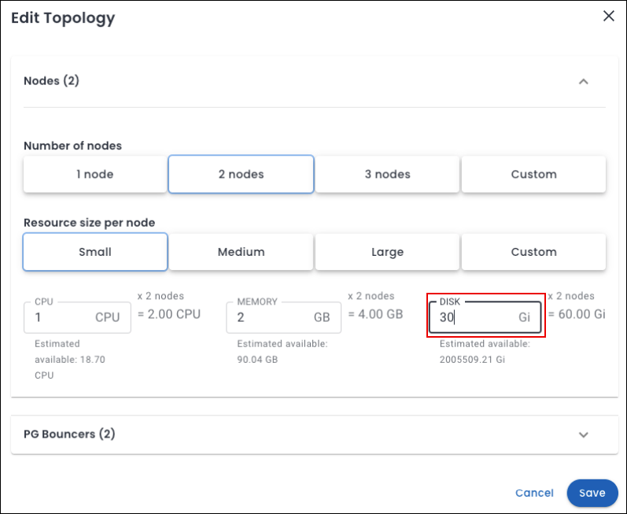

# What's new in Percona Everest 1.7.0

➡️ **New to Percona Everest?** Get started with our [Quickstart Guide](https://docs.percona.com/everest/quick-install.html).

??? info "🔑 Expand to unleash the key updates"

    |**#**|**Release summary**|**Description**|
    |---------|---------------------|---------|
    | **1.**|[Manual storage scaling](https://docs.percona.com/everest/release-notes/Percona-Everest-1.6.0-%282025-04-16%29.html#__tabbed_1_1)|Increase the capacity of your storage through manual storage scaling|
    | **2.**|[MongoDB: Major DB updates](https://docs.percona.com/everest/release-notes/Percona-Everest-1.6.0-%282025-04-16%29.html#__tabbed_1_2)|Support for major version upgrades of MongoDB|
    | **3.**|[Operator Upgrades](https://docs.percona.com/everest/release-notes/Percona-Everest-1.6.0-%282025-04-16%29.html#__tabbed_1_3)|Support for Percona Operator for PostgreSQL 2.6.0 and PostgreSQL 17|
    | **4.**|[Removed support for PostgreSQL 12](https://docs.percona.com/everest/release-notes/Percona-Everest-1.6.0-%282025-04-16%29.html#removed-support-for-postgresql-12)|Percona Everest 1.6.0 discontinues support for PostgreSQL 12|
    | **5.**|[Google Container Registry (GCR) deprecation](https://docs.percona.com/everest/release-notes/Percona-Everest-1.6.0-%282025-04-16%29.html#google-container-registry-gcr)|Deprecation of GCR starting **May 20, 2025**|
    | **6.**|[New features](Percona-Everest-1.6.0-%282025-04-16%29.html#new-features)|Check out the new features introduced in Percona Everest 1.6.0|
    | **7.**|[Improvements](Percona-Everest-1.6.0-%282025-04-16%29.html#improvements)|Discover all the enhancements featured in Percona Everest 1.6.0|
    | **8.**|[Bugs](Percona-Everest-1.6.0-%282025-04-16%29.html#bugs)|Find out about all the bugs fixed in Percona Everest 1.6.0|
    | **9.**|[Known limitation](https://docs.percona.com/everest/release-notes/Percona-Everest-1.6.0-%282025-04-16%29.html#known-limitation)|Discover all the known limitations in Percona Everest 1.6.0|

## 🌟 Release highlights

===  "📈 Storage scaling"

    ### Scale your storage with ease with Percona Everest 1.6.0

    Starting with Percona Everest 1.6.0, you can leverage manual storage scaling to increase the capacity of your database, offering greater control over resource allocation as your needs evolve.
    
    **Prerequisites for storage scaling**

    - **PersistentVolumeClaim (PVC) volume expansion** - Ensure that the `StorageClass` used by the database’s PersistentVolumeClaim (PVC) supports volume expansion.  Refer to the [Kubernetes documentation on Persistent Volumes](https://kubernetes.io/docs/concepts/storage/persistent-volumes/){:target="_blank"} for more details.

    - **Resource quota check** - Verify that your resource quotas allow for the requested storage capacity. For more information, see the [Kubernetes documentation on Storage Resource Quota](https://kubernetes.io/docs/concepts/policy/resource-quotas/#storage-resource-quota){:target="_blank"} 

    **How to modify storage capacity**

    To increase the DISK for a database, go to the Percona Everest home page and select your desired database. Then, navigate to **Overview > Resources > Edit** and enter the new value for **DISK** (in Gi).

    

    :mag: If you want to explore this topic in depth, check out our detailed [documentation](https://docs.percona.com/everest/use/manual_storage_scaling.html)!

=== "🔄 Major database upgrades"

    ### Seamless major version upgrades for MongoDB

    Percona Everest 1.6.0 introduces support for major version upgrades of MongoDB, enabling you to upgrade your databases with **minimal downtime and disruption**. This enhancement ensures your applications remain secure, performant, and compliant with the latest MongoDB features.

    To upgrade your MongoDB database, navigate to the Percona Everest homepage and select the database you wish to upgrade. On the **Overview** page, locate the **DB Details** panel and click **Edit** next to **Basic Information**. Select the desired version and click **Upgrade** to begin the process.

    
    
    

     :mag: For a deep dive into this topic, refer to our [documentation](https://docs.percona.com/everest/upgrade/mongodb_major_upgrades.html).

=== ":simple-postgresql: Expanded PostgreSQL support"

    ### Support for PostgreSQL Operator 2.6.0 and PostgreSQL 17

    Percona Everest 1.6.0 now includes support for Percona Operator for PostgreSQL 2.6.0 and PostgreSQL 17.

## 🛑 Google Container Registry (GCR)

!!! warning "GCR deprecation"
    GCR is set to be **deprecated**, with its official shutdown scheduled for **May 20, 2025**.

    All Percona Everest versions prior to 1.4.0 depend on images hosted on the Google Container Registry (GCR). These images will become unavailable after the shutdown date: **May 20, 2025**.

### Impact

Percona Everest versions older than 1.4.0 will cease to function after this date.

### Action required

We strongly recommend upgrading to Percona Everest version 1.4.0 or later as soon as possible. If you do not upgrade, Percona Everest will no longer function.
    
For more details, refer to the [Container Registry Deprecation documentation](https://cloud.google.com/artifact-registry/docs/transition/prepare-gcr-shutdown){:target="_blank"}.

## New Feature

- [EVEREST-1605](https://perconadev.atlassian.net/browse/EVEREST-1605) Select Pod Scheduling Policy in DB creation wizard

- [EVEREST-1606](https://perconadev.atlassian.net/browse/EVEREST-1606) Select Pod Scheduling Policy in DB overview tab

- [EVEREST-1607](https://perconadev.atlassian.net/browse/EVEREST-1607) Navigate to Pod Scheduling Policy from the DB overview tab

- [EVEREST-1862](https://perconadev.atlassian.net/browse/EVEREST-1862) \[UI\] Topology diagram view

- [EVEREST-1987](https://perconadev.atlassian.net/browse/EVEREST-1987) Add support for PXC operator v1.17.0

- [EVEREST-1998](https://perconadev.atlassian.net/browse/EVEREST-1998) Manage Pod Scheduling Policies

## Improvements

- [EVEREST-990](https://perconadev.atlassian.net/browse/EVEREST-990) Everest GUI needs to use HTTPS

- [EVEREST-1106](https://perconadev.atlassian.net/browse/EVEREST-1106) Check for user existence on every incoming request

- [EVEREST-1180](https://perconadev.atlassian.net/browse/EVEREST-1180) TLS support for Everest server

- [EVEREST-1806](https://perconadev.atlassian.net/browse/EVEREST-1806) \[UI\] Improve Visibility of Proxy Validation Message for MySQL Database Creation 

- [EVEREST-1923](https://perconadev.atlassian.net/browse/EVEREST-1923) Invalidate session for logged out users

- [EVEREST-1931](https://perconadev.atlassian.net/browse/EVEREST-1931) \[UI\] Improve Diagram View: Default Zoom & Search Functionality for DB Cluster Components

- [EVEREST-1946](https://perconadev.atlassian.net/browse/EVEREST-1946) Add confirmation dialog before performing disk size update

## Bugs

- [EVEREST-741](https://perconadev.atlassian.net/browse/EVEREST-741) Enabling PITR sometimes displays the database as down

- [EVEREST-1012](https://perconadev.atlassian.net/browse/EVEREST-1012) Creating a new postgresql database using backup has no restore information

- [EVEREST-1540](https://perconadev.atlassian.net/browse/EVEREST-1540) \[CLI\] Authorization token for a deleted user should be invalidated

- [EVEREST-1623](https://perconadev.atlassian.net/browse/EVEREST-1623) Haproxy restarts continuously in 5 node mysql database

- [EVEREST-1651](https://perconadev.atlassian.net/browse/EVEREST-1651) Creating a new database from backup fails for a mysql database with a long name

- [EVEREST-1700](https://perconadev.atlassian.net/browse/EVEREST-1700) Database clusters restarted on creation when PMM monitoring enabled

- [EVEREST-1754](https://perconadev.atlassian.net/browse/EVEREST-1754) \[UI\] storage is \(re\)initializing error message displayed

- [EVEREST-1785](https://perconadev.atlassian.net/browse/EVEREST-1785) \[BE\] PITR pod gets restarted many times

- [EVEREST-1838](https://perconadev.atlassian.net/browse/EVEREST-1838) The 'Edit' option for PITR is disabled for MySQL and MongoDB clusters, even when PITR is enabled.

- [EVEREST-1865](https://perconadev.atlassian.net/browse/EVEREST-1865) \[UI\] PITR edit info not available for PG db cluster

- [EVEREST-1890](https://perconadev.atlassian.net/browse/EVEREST-1890) \[UI\] Number of Proxies changes from 'X' to '1' while creating a mysql db cluster

- [EVEREST-1895](https://perconadev.atlassian.net/browse/EVEREST-1895) \[UI\] PITR time can't be changed from the last successful backup

- [EVEREST-1948](https://perconadev.atlassian.net/browse/EVEREST-1948) \[UI\] Component Age isn't displayed properly

- [EVEREST-1961](https://perconadev.atlassian.net/browse/EVEREST-1961) \[BE\] Edit monitoring instance does not work

- [EVEREST-2011](https://perconadev.atlassian.net/browse/EVEREST-2011) Restore to a mysql database is not working in pxc v1.17.0

- [EVEREST-2018](https://perconadev.atlassian.net/browse/EVEREST-2018) Incorrect Everest installation instructions when TLS is enabled

## :rocket: Upgrade now

Upgrade to **Percona Everest 1.6.0** to access these new features and improvements. 

:mag: Explore our [documentation](https://docs.percona.com/everest/upgrade/upgrade_with_helm.html) for the upgrade steps.