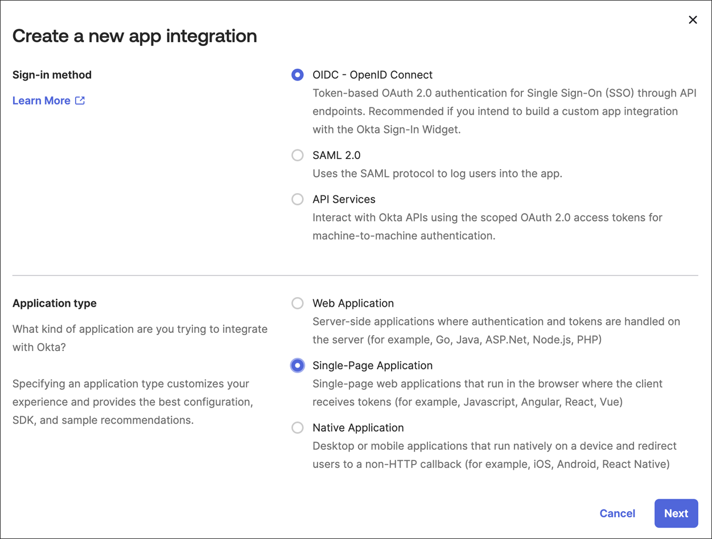
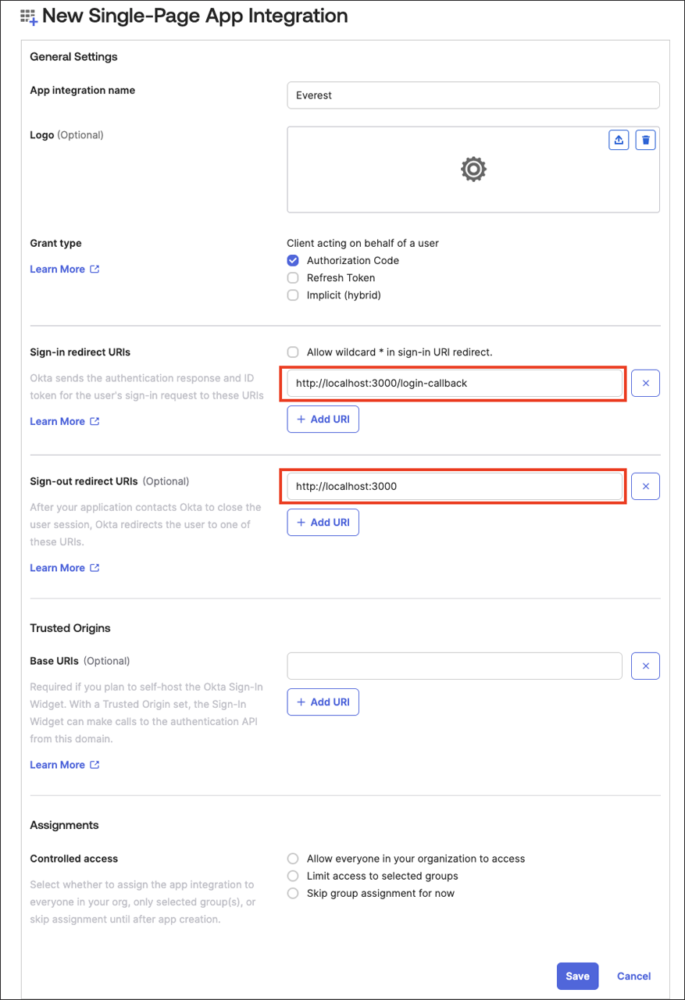

# Percona Everest IdP integration

[Identity Provider (IdP)](https://www.okta.com/identity-101/why-your-company-needs-an-identity-provider/) integration connects applications and services with an external identity provider for your organization. This enables centralized authentication and authorization management, improving security and simplifying user access. By leveraging IdP integration, you can ensure that users are securely authenticated and authorized to access various applications and services across your organization.

Percona Everest uses [OpenID Connect](https://auth0.com/docs/authenticate/protocols/openid-connect-protocol) (OIDC) Protocol to integrate with external Identity Providers (IdP).


## Configure OIDC on the providers's side

- **PKCE**: When setting up the Provider side, it's important to configure an application specifically for [PKCE](https://auth0.com/docs/get-started/authentication-and-authorization-flow#authorization-code-flow-with-proof-key-for-code-exchange-pkce-) (Proof Key for Code Exchange) authorization.

- **Redirect URIs**: 

    - Sign-in redirect URIs should point to `<EVEREST_URL>/login-callback`
    - Sign-out redirect URIs should point to `<EVEREST_URL>`
 
- **https based**: IdP providers often require a secure connection (https). Therefore, the provider might require your `<EVEREST_URL>` to be based on https.


    ??? example "Example: OKTA"

        1. Sign in to your Okta organization as a user with administrative privileges.
        
        2. In the **Admin** Console, go to **Applications → Applications** and click **Create App Integration**.

        3. On the **Create a new app integration page**, set the following:
        
            - Sign-in method - **OIDC - OpenID Connect**
            - **Application type** - **Signle-Page Application**, and click **Next**.

            

        4. Set the following fields:

            a. App integration name - any value

            b. Sign-in redirect URIs - `<EVEREST_URL>/login-callback`

            c. Sign-out redirect URIs - `<EVEREST_URL>`

            d. Click **Save**.

            e. Copy the `clientID` of the created app.

            f. Navigate to **Security → API → Authorization Servers** and copy the `issuerURL` you’d like to use for the Everest authorization. 

            !!! note "Note"
                Okta allows the use of HTTP for development purposes and in cases where the Admin explicitly permits it.

            


## Configure OIDC on Percona Everest side

You can configure OIDC on the Percona side using the flag or the wizard.

Configuring OIDC using the flag:

    everestctl settings oidc configure --issuer-url=http://url.com --client-id=<your-app-client-id

??? example "Output"

    ```{.text .no-copy}
    2024-06-18T11:06:18Z    info    oidc/configure.go:110   OIDC provider configured, restarting Everest..
    2024-06-18T11:06:33Z    info    oidc/configure.go:117   OIDC has been configured successfully
    ```

Configuring OIDC via wizard:

??? example "Output"

    ```{.text .no-copy}
    $ everestctl settings oidc configure
    ? Enter issuer URL <your-provider-url>
    ? Enter client ID <your-app-client-id>
    2024-06-18T11:05:15Z    info    oidc/configure.go:110   OIDC provider   configured, restarting Everest..    
    2024-06-18T11:05:30Z    info    oidc/configure.go:117   OIDC has been configured successfully
    ```

??? info "What's happening under the hood?"

    This command stores the updated configuration in k8s and restarts the Everest deployment.

    1. **Store Configuration**

        The OIDC settings are stored in the `everest-settings` ConfigMap in the `everest-system` namespace, along with other settings, in the following format:

        ```sh
        apiVersion: v1
        kind: ConfigMap
        metadata:
            name: everest-settings
            namespace: everest-system
        data:
            data:
            oidc.config: |
                issuerUrl: <your OIDC provider URL>
                clientId: <your OIDC provider client ID>
        ```
    
        The Everest user should not directly interact with the `everest-settings` ConfigMap. Use the CLI command to set up the OIDC config.

    2. **Restart Percona Everest**

        OIDC configuration must be in place for Percona Everest to start the API Server, allowing the server to utilize the OIDC provider's validation. This means that after setting up the OIDC configuration, the Percona Everest API Server needs to be restarted.

        The CLI command typically takes approximately 15 seconds to execute. It waits for the Everest Deployment to be up again before exiting successfully.

    
        !!! info "Important"

            - The restart only impacts the Everest UI and API. Database clusters are not affected.

            - The restart results in the loss of the port-forwarding connection. If you had port-forwarding enabled on your machine to access Percona Everest UI and API, you will need to set it up again.


## Testing IdP integration

After setting up your OIDC configuration, you can verify the functionality by visiting the Percona Everest login page and attempting to log in using Single Sign-On (SSO).


