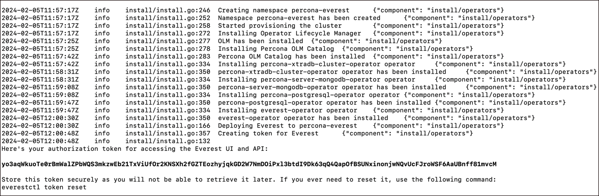

# User authentication

Percona Everest provides user authentication to ensure that only authorized users can access the databases hosted on Percona Everest. Securing access to these databases is crucial to safeguard sensitive data and restrict database access to authorized users only. 

To access Percona Everest:
{.power-number}

1. Copy the authorization token that is displayed on the terminal while [installing Percona Everest](../install/installEverest.md).

    

2. Navigate to the Everest UI.

3. Enter the authorization token that you copied in step 1.

    


4. Click **Log in**.


## Reset password

If you forget to copy the authorization token while installing Everest or misplace it, you can reset the token by executing the following command:

```sh
go run cmd/everest/main.go password reset
```

??? example "Expected output"

    ```
    Here's your authorization token for accessing the Everest UI and API:

    74xm9CdEAD7iVtsqolBsSMNXvJHrMpJekUpPmZhXCAbGsMMFJVrGe7MyCvSV2qhSAgLMiTVRUKn363QTzVJNFL6a8cY4MPTwbb3rO87joikqvAHnQeyrDLZLSsglHmCP

    Store this token securely as you will not be able to retrieve it later. If you ever need to reset it, use the following command:

    everestctl token reset
    ```


