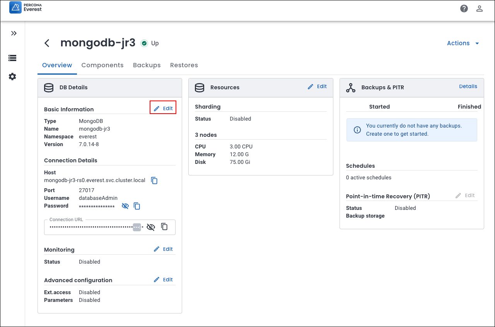

# Database engine upgrades

!!! warning
    If you encounter an issue while upgrading your database engine, there is **no option to roll back**. In this case, you must **manually diagnose and resolve** the problem.

## MongoDB: Major version upgrades

Starting with Percona Everest 1.6.0, you can upgrade your MongoDB database major versions, allowing upgrades with minimal downtime and disruption.

!!! info "Important"
    PostgreSQL and MySQL support only **minor** engine upgrades.

## Before you upgrade

The prerequisites for performing a major version upgrade of MongoDB in Percona Everest are:

- **Version compatibility:** Verify that your current MongoDB version is eligible for an upgrade.

## Upgrade

To upgrade database versions via the Percona Everest UI:
{.power-number}

1. Log in to the Percona Everest UI. Navigate to the home page, and select the database that you wish to upgrade. 

2. On the **Overview** page, access the **DB Details** panel and select **Edit** next to the **Basic Information** field.

 

    

3. Select the desired database version, and then click **Upgrade**.

    

