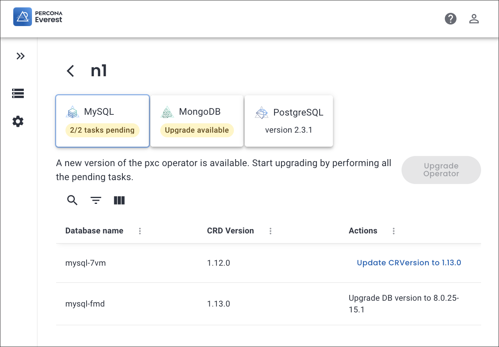
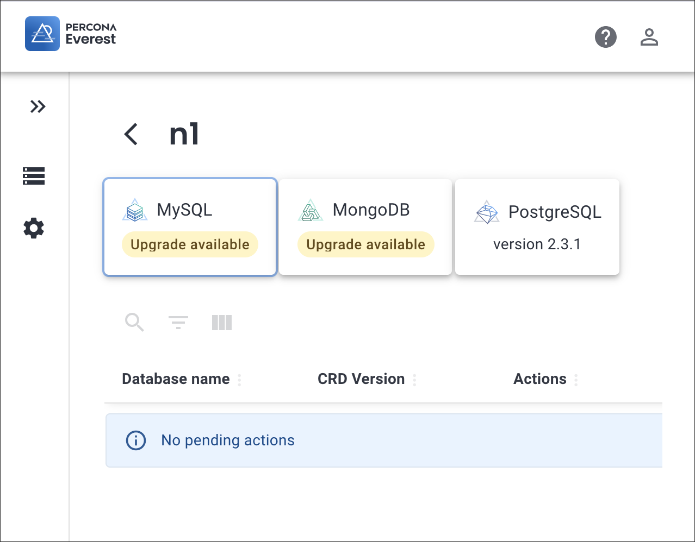

# Upgrade database operators

Starting with Percona Everest 1.0.0, the intuitive UI allows you to upgrade database operators and all their components in any namespace with a single click.

## Before you upgrade

Before upgrading a database operator, Everest presents a list of tasks that need to be completed to smoothly transition your clusters to the next version of the database operators. These tasks may include:

- Upgrading your database engine version from an unsupported or end-of-life (EOL) version.

- Ensuring your clusters are using a supported [Custom Resource](https://ibm.github.io/kubernetes-operators/lab1/#:~:text=A%20CRD%20defines%20Custom%20Resources,store%20and%20retrieve%20structured%20data.){:target="_blank"} (CR) version.

- Backing up your databases.

## Upgrade

To upgrade database operators via the Percona Everest UI:
{.power-number}

1. Log in to the Percona Everest UI and navigate to <i class="uil uil-cog"></i> **Settings > Namespaces**.

2. Click on the namespace where you want to upgrade the database operator. You will see all the database operators installed in that namespace.

3. Once a database operator upgrade becomes available, you can upgrade each operator individually.

4. Review the pending actions to complete before upgrading an operator:

      a. Upgrade the database version.

      b. Restart the database.

      c. Wait until the database is in the ready state.
      

    

5. After resolving all pending actions, proceed with upgrading the operator.

    !!! note "Note"

        During the operator upgrade, you won't be able to perform actions that create or modify a database.

    

