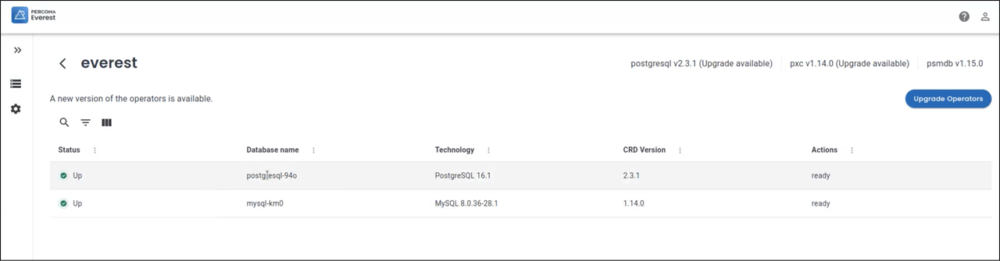
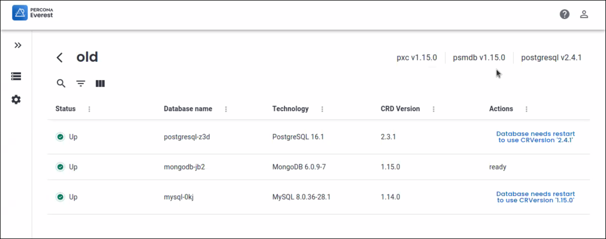
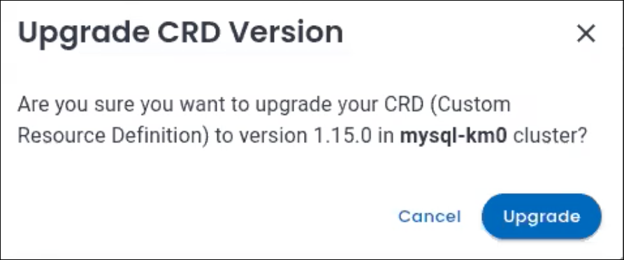
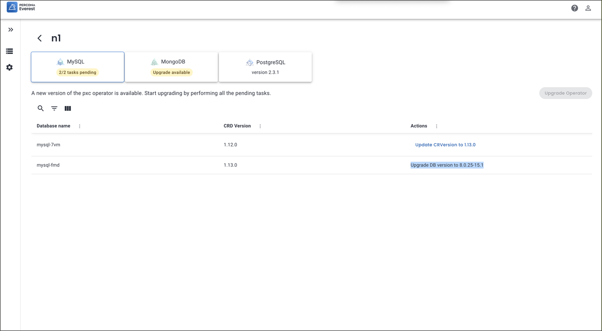
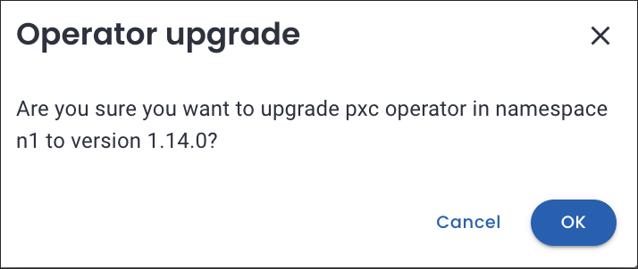
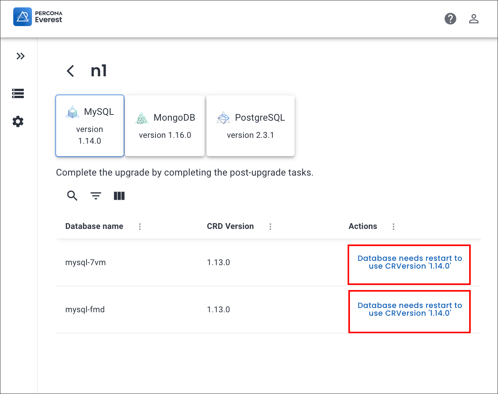

# Upgrade database operators

Starting with Percona Everest 1.2.0, the intuitive UI allows you to upgrade all the database operators and their components in any namespace with a single-click.

## Before you upgrade

!!! note " Note"
    We recommend that you to take a backup of your databases before starting the upgrade process.

Before upgrading a database operator, Everest presents a list of tasks that need to be completed to smoothly transition your clusters to the next version of the database operators. These tasks may include:

- Upgrading your database engine version from an unsupported or end-of-life (EOL) version.

- Ensuring your clusters are using a supported [Custom Resource](https://ibm.github.io/kubernetes-operators/lab1/#:~:text=A%20CRD%20defines%20Custom%20Resources,store%20and%20retrieve%20structured%20data.){:target="_blank"} (CR) version.

## Upgrade

To upgrade database operators via the Percona Everest UI:
{.power-number}

1. Log in to the Percona Everest UI and navigate to <i class="uil uil-cog"></i> **Settings > Namespaces**.

2. Click on the namespace where you want to upgrade the database operators. You will see all the database operators installed in that namespace.

    

3.  Once the upgrade for the database operators becomes available, you can initiate the upgrade process by clicking on **Upgrade**.

    

4. A page is displayed showcasing the upgrades available for the different operators.

    

5. Click on **Upgrade Operators**. A confirmation pop-up will appear, asking if you want to proceed with the upgrade.

     
    

      
6. After clicking on **Upgrade**, you will see a page displaying pending actions. The pending actions indicate that you need to restart the database in order to utilize the updated CR version.

    

7. Click on the pending **Actions**. A confirmation pop-up will appear, asking if you want to **Upgrade CRD version**:

    

5. After resolving all pending actions, proceed with upgrading the operator.

??? example "Example"

    In the upcoming scenario, we are going to upgrade the PXC operator to version 1.14.0.
    {.power-number}

    1. On the **Namespaces** tab, click on the namespace `n1` and check for any pending **Actions**.

        

    2. Click **Update CRVersion to 1.13.0.** A confirmation pop-up will appear. Click **Upgrade** to proceed.

        

        

    3. Go to **Databases** view page and click on the ellipsis (…) menu next to the database `mysql-fmd`.

    4. Click **Edit**.

    5. On the **Basic information** page, select the database version as **8.0.25.15-1**. Click **Continue** until the last page of the editing wizard and then click **Edit database**.

    6. Once the operator is ready to upgrade, the status of **Actions** will be set to **ready**.

        

    7. Click **Upgrade Operator**. A confirmation pop-up for **Operator upgrade** will be displayed.

        

    8. Click **Ok**.

    9. Complete the post upgrade tasks by clicking on the items under **Actions**.

        

    10. Your PXC operator will now be upgraded to version 1.14.0.

a. Upgrade the database version.

      b. Restart the database.

      c. Wait until the database is in the ready state.

    !!! note "Note"

        During the operator upgrade, you won't be able to perform actions that create or modify a database.

    

