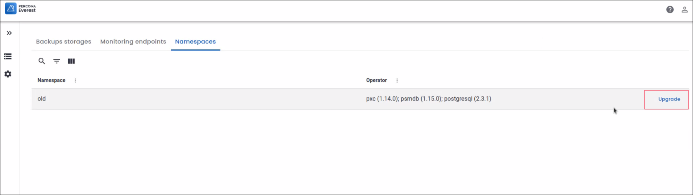
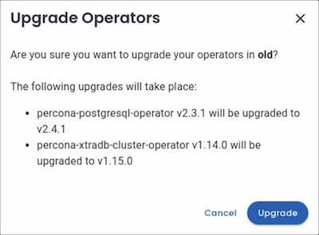
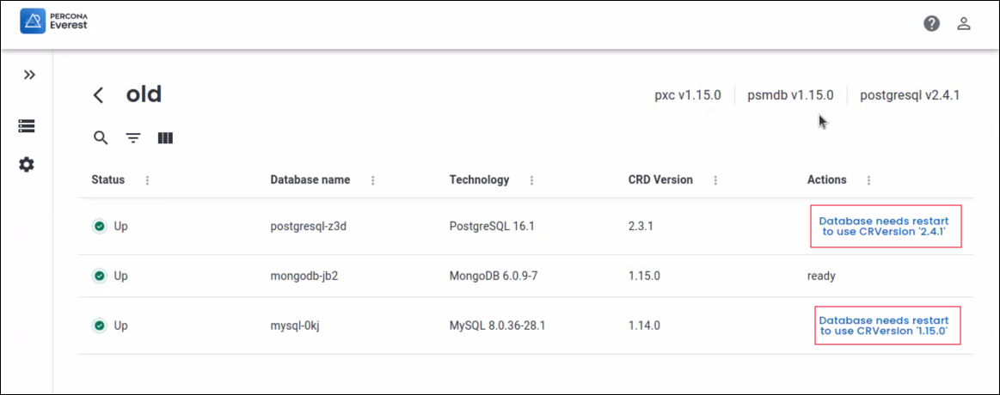
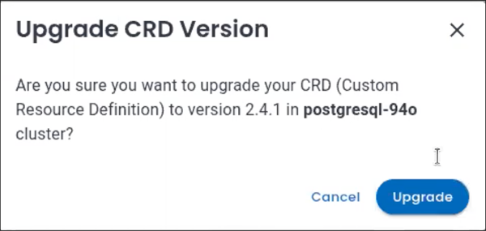

# Upgrade database operators

Starting with Percona Everest 1.2.0, the intuitive UI allows you to upgrade all the database operators and their components in any namespace with a single-click.

## Before you upgrade

!!! note " Note"
    We recommend that you to take a backup of your databases before starting the upgrade process.

Before upgrading a database operator, Everest presents a list of tasks that need to be completed to smoothly transition your clusters to the next version of the database operators. These tasks may include:

- Upgrading your database engine version from an unsupported or end-of-life (EOL) version.

- Ensuring your clusters are using a supported [Custom Resource](https://ibm.github.io/kubernetes-operators/lab1/#:~:text=A%20CRD%20defines%20Custom%20Resources,store%20and%20retrieve%20structured%20data.){:target="_blank"} (CR) version.

## Upgrade

To upgrade database operators via the Percona Everest UI:
{.power-number}

1. Log in to the Percona Everest UI and navigate to <i class="uil uil-cog"></i> **Settings > Namespaces**. You will see all the database operators installed in that namespace.

3. Once the upgrade for the database operators becomes available, you can initiate the upgrade process by clicking on **Upgrade**.

    

4. A page is displayed showcasing the upgrades available for the various operators.

    

5. Click **Upgrade Operators**. A confirmation pop-up will appear, asking if you want to proceed with the upgrade.

     
    

      
6. After clicking on **Upgrade**, you will see a page displaying pending actions. The pending actions indicate that you need to restart the database in order to utilize the updated CR version.

    

7. Click on the pending **Actions**. A confirmation pop-up will appear, asking if you want to **Upgrade CRD version**:

    

8. Click on **Upgrade** to upgrade the operators.

