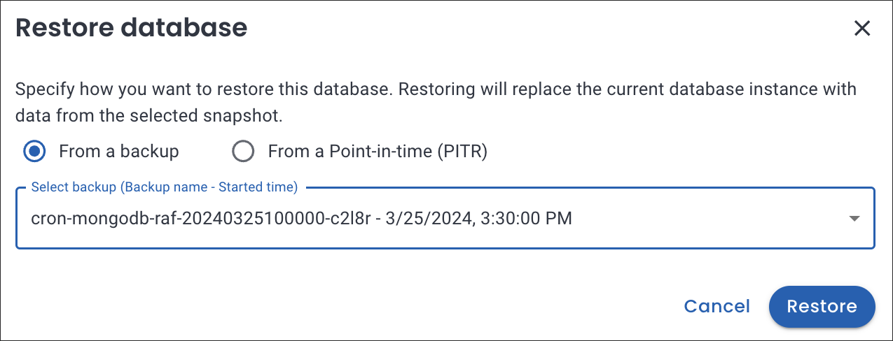

# Restore the database from a previously saved backup

Database backups and data replication are complementary components of an effective disaster recovery strategy.

Everest enables you to use backups to either create a new database or restore the backup data to the original database. Choosing between these two options often depends on the specific scenario, the urgency of recovery, the impact on ongoing operations, the need for data isolation, and the purpose of the restoration (such as testing, recovery from corruption, or analysis).

## Restore database from backup

Restoring to the same cluster is useful in the following scenarios:

- **For faster recovery**: It's typically quicker to restore data to an existing database as it eliminates the need for creating a new database deployment.
- **Database consistency:** Maintains the same database ID, configurations, and dependencies, ensuring consistency within the existing environment.

To restore a database from a backup:
{.power-number}

1. In the <i class="uil uil-database"></i> **Databases** view, select the database you want to restore.
2. Click the <i class="uil uil-ellipsis-h"></i> Actions menu next to the backup you want to restore from, then click **Restore from a backup**.
3. On the **Restore database** dialogue box select  **From a backup**.

    

4. Select **Restore** to restore the backup of your database.

### Post-Restore step for MongoDB

PITR restores alter the timeline of MongoDB oplog events. As a result, MongoDB oplog slices created after the restore timestamp and before the last backup become invalid.

To seamlessly resume PITR after a restore, make sure to run a new full backup. This new backup will serve as the starting point for oplog updates, ensuring the continuity and integrity of your data.

## Restore to a point-in-time recovery

!!! warning
    For PostgreSQL, point-in-time recovery (PITR) can get stuck in a **Restoring** state when you attempt to recover the database after the last transaction. See the [Limitation for PostgreSQL](../createBackups/EnablePITR.md#limitation) section for a workaround.

To restore to a point-in-time recovery:
{.power-number}

1. In the <i class="uil uil-database"></i> **Databases** view, select the database you want to replicate.
2. Click the <i class="uil uil-ellipsis-h"></i> Actions menu next to the backup you want to replicate from, then click **Restore from a backup**. The **Restore database** dialogue box opens.
3. On the **Restore database** dialogue box, select **From a Point-in-time (PITR)**. Click on the calendar icon, choose the specific time to which you would like to restore the database.

    

4. Click **Restore**.