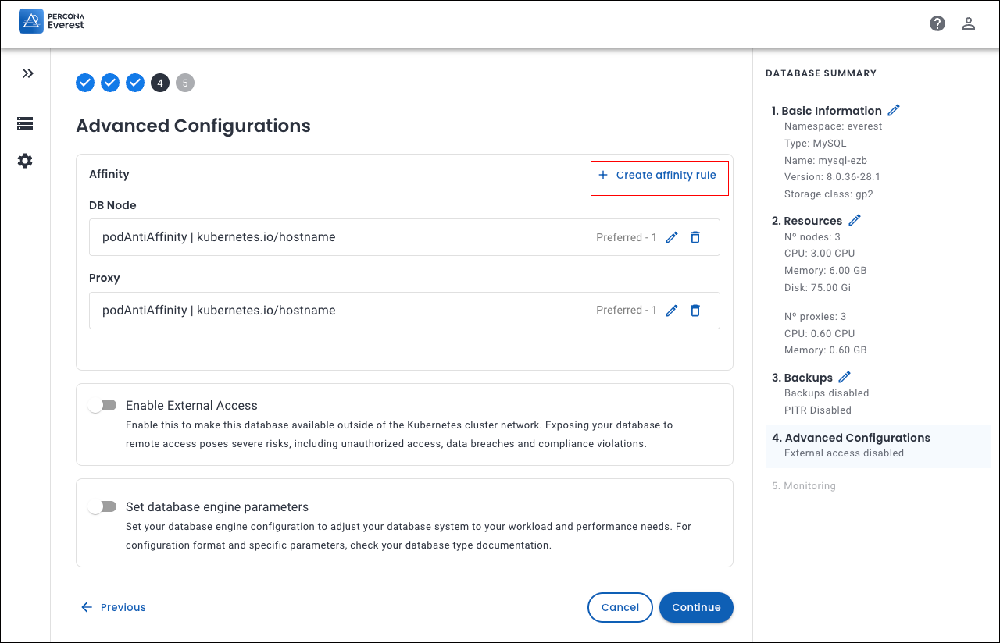

#  Leveraging Affinity in Percona Everest

!!! warning
    We rely on the Kubernetes scheduler for pod placement and resource management.

Affinity refers to rules that attempt to schedule Pods together or on nodes that meet specific criteria. It promotes the co-location of Pods or assigns Pods to preferred nodes.

Affinity rules provide database administrators with enhanced control over workload distribution in a Kubernetes cluster. By implementing affinity and anti-affinity rules, you can not only optimize performance and enhance system resilience but also ensure that your resources are utilized to their fullest potential.


## Types of affinity

Kubernetes features three primary types of affinity that play a crucial role in how pods are scheduled and interact within a cluster.

### Node affinity

Node affinity determines which nodes a pod can be scheduled on. Based on the labels assigned to nodes, you can define rules about where a pod should or should not be deployed. 

Nodes in a Kubernetes cluster have labels that consist of **key-value** pairs.

If you're looking to dive deep into node affinity, check out the Kubernetes [documentation](https://kubernetes.io/docs/concepts/scheduling-eviction/assign-pod-node/#node-affinity).

### Pod affinity

Pod affinity enables you to control the placement of pods based on the location of other pods. By using affinity rules, you can ensure that pods are scheduled together (co-located) on the same node, in the same zone, or within any other topological boundary.

Kubernetes uses labels, which are key-value pairs, to identify and categorize pods.

If you're looking to dive deep into pod affinity, check out the Kubernetes [documentation](https://kubernetes.io/docs/concepts/scheduling-eviction/assign-pod-node/#inter-pod-affinity-and-anti-affinity).

### Pod anti-affinity

Pod anti-affinity empowers you to take control of pod placement in your Kubernetes environment. With pod anti-affinity you can prevent certain pods from being scheduled on the same node or within the same topology, such as a zone or region.

Like pod affinity, Pod anti-affinity also uses pod labels to identify and match pods that should not be co-located.

If you're looking to dive deep into pod anti-affinity, check out the Kubernetes [documentation](https://kubernetes.io/docs/concepts/scheduling-eviction/assign-pod-node/#inter-pod-affinity-and-anti-affinity).


### Set up affinity rules for your cluster

You can set affinity rules in Percona Everest via the **Advanced Configurations** page within the **Affinity** section. 
{.power-number}

1. From the Percona Everest home page, navigate through the **Create Database** wizard until you reach the **Advanced Configurations** page.

2. From the **Advanced Configurations** page, click **Create affinity rule**. The **Add rule** screen will be displayed.

    

    
3. Enter the information on the **Add Rule** screen. Click **Add rule**. You can view the affinity rule on the components page of the corresponding database.


    [!image](../images/add_rule_affinity.png)

The following table provides details about the different attributes involved in setting up affinity rules for your databases.

|**Attributes**    |**Description**  |**Note**  |
|----------------|-----------------|--------------|
|**Components**|<ul><li>Config Server</li><li>DB Node</li><li>Router</br></br></li><li>DB Node</br><br></li><li>DB Node</li><li>Proxy</li></ul>|Applicable for **MongoDB sharded cluster**.<br/></br></br></br></br>Applicable for **MongoDB non sharded cluster**.</br></br>Applicable for **MySQL** and **PostgreSQL** databases.|
|**Priority**|Each type of Affinity can implement two distinct levels of rule enforcement:</br><ul><li>Preffered</br></br></br></br></br></li><li>Required</li></ul>|</br></br>Defines the preferences for Pod scheduling instead of strict requirements. Kubernetes will try to place the Pod according to these preferences, but if they cannot be fulfilled, the Pod will still be scheduled.</br></br>A strict requirement that must be met for a Pod to be scheduled. If the conditions in this field are not met, the Pod will remain unscheduled.|
|**Weight (1-100)**|It prioritizes preferred scheduling rules using a numerical value that indicates how strongly Kubernetes should favor specific placement preferences when scheduling Pods. Higher weights signify stronger preferences, meaning Kubernetes will prioritize fulfilling rules with higher weights over those with lower weights.|Weight is only used when the priority is **Preferred**.|
|**Topology key**|TopologyKey is label key on nodes that defines the grouping or topology scope (e.g., zone, hostname) where the rules are enforced.| Node affinity rules do not include a topology key. </br></br>Here are some examples of **topologyKey**:</br><ul><li>kubernetes.io/hostname</li><li>topology.kubernetes.io/zone	</li><li>topology.kubernetes.io/region</li><li>custom node labels (e.g., rack)</li></ul>|
|**key**|A key in pod affinity is the label assigned to pods, used to define scheduling rules. This label helps the Kubernetes scheduler identify pods and place new pods in relation to them based on affinity or anti-affinity rules.|The key that you set will be a label present in other existing pods within the cluster, affecting whether your pods will be scheduled on the same nodes as those pods.</br></br>Here are some examples of **key**:</br><ul><li>app</li><li>security</li><li>environment</li><li>custom labels (e.g., security, web-store)</li></ul>|
|**Operator**|The operator field specifies how a label's values match a resource, such as a Pod or node. It establishes the logical condition to determine if a resource satisfies the affinity or anti-affinity rule.</br></br>The following are all logical operators you can use in the operator field:</br><ul><li>**In**: Matches label values in a list</li><li>**NotIn**: Matches label values not in a list.</li><li>**Exists**: Matches when a label key exists, regardless of its value.</li><li>**DoesNotExist**: Matches when a label key does not exist.</li></ul>|When using the **In** and **NotIn** operators, you have to provide the values for the key as well.|
|**Values**|The values are the specific label values that must match the key for the affinity rule to apply.|Here are some examples for **values**:</br><ul><li>s2</li><li>database</li><li>production</li><li>custom values</li></ul>|

## Use cases for affinity

Here are several detailed use cases for affinity that highlight its diverse applications and the numerous benefits it offers across various contexts.


=== "Node affinity"
    ### Regional scheduling

    Let's consider a use case in which workloads are distributed based on performance requirements, fault tolerance, and regional specifications across designated zones or areas.

    You need to run a workload in the `us-west2 region` for latency optimaztion and to meet specific compliance requirements.

    ```sh
    affinity:
      nodeAffinity:
        requiredDuringSchedulingIgnoredDuringExecution:
        nodeSelectorTerms:
        - matchExpressions:
            - key: topology.kubernetes.io/region
            operator: In
            values:
            - "us-west2"
    ```
    ??? info "What happens under the hood"
        - It ensures that the pod is scheduled only on nodes located in the us-west-2 region, as defined by the `topology.kubernetes.io/region` node label.

        - For the rule to be applicable, it is essential that the node possesses a label such as `topology.kubernetes.io/region: us-west-2`. If no nodes correspond to the specified label, the pod will remain in an unscheduled state.


=== "Pods affinity"
    ### Pods scheduled together

    Let's consider a use case in which you want to to ensure that HAProxy pods should be scheduled to run on the same Kubernetes node.
    
        affinity:
          podAffinity:
            requiredDuringSchedulingIgnoredDuringExecution:
            - labelSelector:
            matchExpressions:
                - key: app
                operator: In
                values:
                - haProxy
        topologyKey: "kubernetes.io/hostname"

    ??? info "What happens under the hood"
        - The pod will be scheduled only on nodes that already contain pods labeled with `app=haproxy`.

        - If no nodes match, the pod will not be scheduled until a suitable node becomes available.


=== "Pod anti-affinity"
    ### Pods scheduled apart

    Let's consider a use case in which you want to ensure that no HAProxy pods should be scheduled to run on the same Kubernetes node.


        affinity:
          podAntiAffinity:
            requiredDuringSchedulingIgnoredDuringExecution:
            - labelSelector:
            matchExpressions:
                - key: app
                operator: NotIn
                values:
                - haproxy
        topologyKey: "kubernetes.io/hostname"

    ??? info "What happens under the hood"
        - The pod will not be scheduled on nodes that contain pods labeled with `app=haproxy`.

        - If no nodes match, the pod will not be scheduled until a suitable node becomes available.


 


