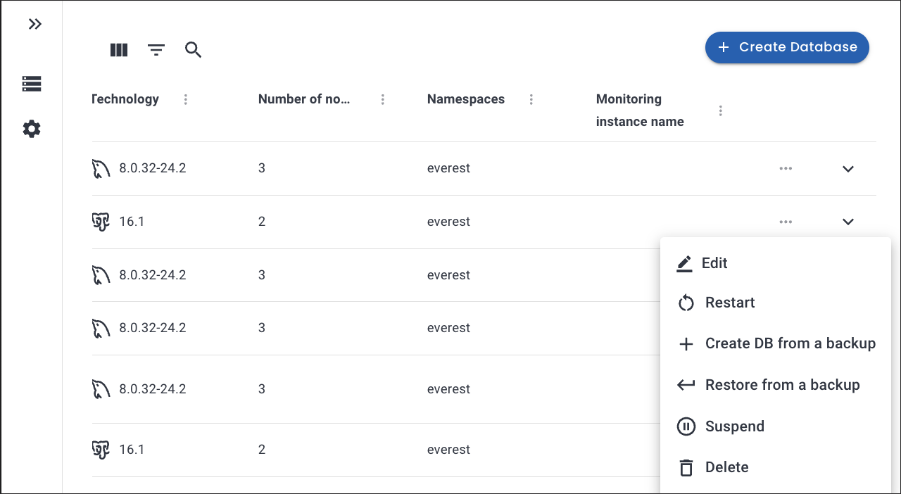
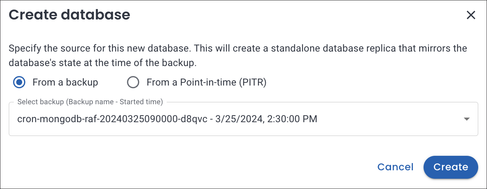

# Create a new database from backup or PITR

To create a new database, you can restore from a previously taken backup or perform a point-in-time recovery.

## Creating a new batabase from backup

When you need to recreate a database from a known state, such as when recovering from data loss or corruption, or when setting up a new environment, this method is useful.

To create a new database from backup:
{.power-number}

1. In the <i class="uil uil-database"></i> **Databases** view, select the database you want to replicate.
2. Click on the <i class="uil uil-ellipsis-h"></i> menu next to the database you want to replicate from, then click **Create DB from a backup**. The **Create database** dialogue box opens.

    

3. On the **Create database** dialogue box select **From a backup**.

4. From the dropdown select the backup.

    

5. Click **Create**.

6. On the **Basic information** window, change the default backup name if required, then select one of the classes created by your Kubernetes administrator.
Storage classes define what storage configuration and features will be used for storing your database data. Different classes map to different quality-of-service levels, backup policies, persistent volumes, or to arbitrary policies determined by your cluster administrator. For more information, see [Storage Classes](https://kubernetes.io/docs/concepts/storage/storage-classes/){:target="_blank"} in the Kubernetes documentation. 
7. On the **Resources** page, select the number of nodes and set the resources. For more information see, [Provision a database](../use/db_provision.md).
8. [Optional] Enable scheduled backups on the **Scheduled Backups** page. Provide a name, select a schedule interval, and choose a backup storage from the dropdown.
9. On the **Point-in-time Recovery (PITR)** page, you may enable **PITR** with the toggle, provided you have previously enabled scheduled backups. Select the **Backup storage** from the dropdown.

10. On the **Advanced Configurations** page, enable external access and database engine parameters by turning the toggle button on. For more information on configuring specific database parameters, see the [MySQL](https://dev.mysql.com/doc/refman/8.0/en/option-files.html){:target="_blank"}, [MongoDB](https://www.mongodb.com/docs/manual/reference/configuration-options){:target="_blank"}, and [PostgreSQL](https://www.postgresql.org/docs/current/config-setting.html#CONFIG-SETTING-CONFIGURATION-FILE){:target="_blank"} configuration documentation.

11. If you've added a monitoring endpoint this option will show as active on the **Monitoring** page and you can disable it if required.
12. Click **Create database**.

