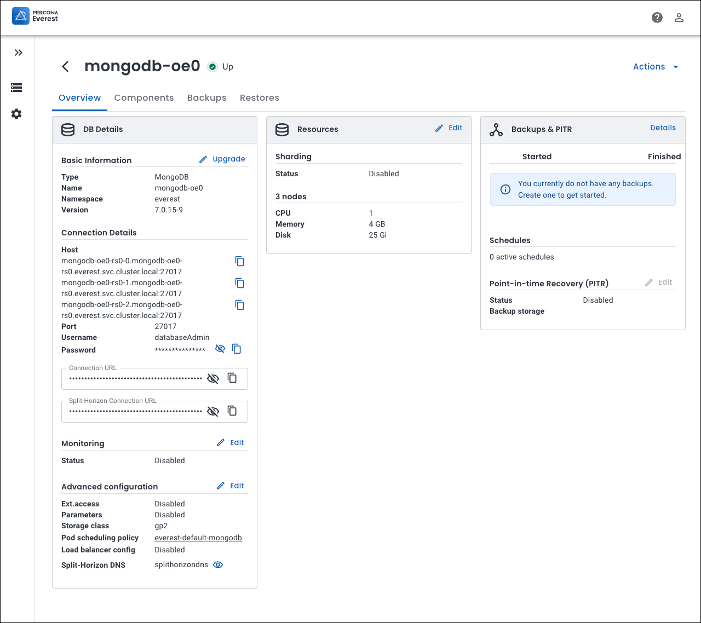
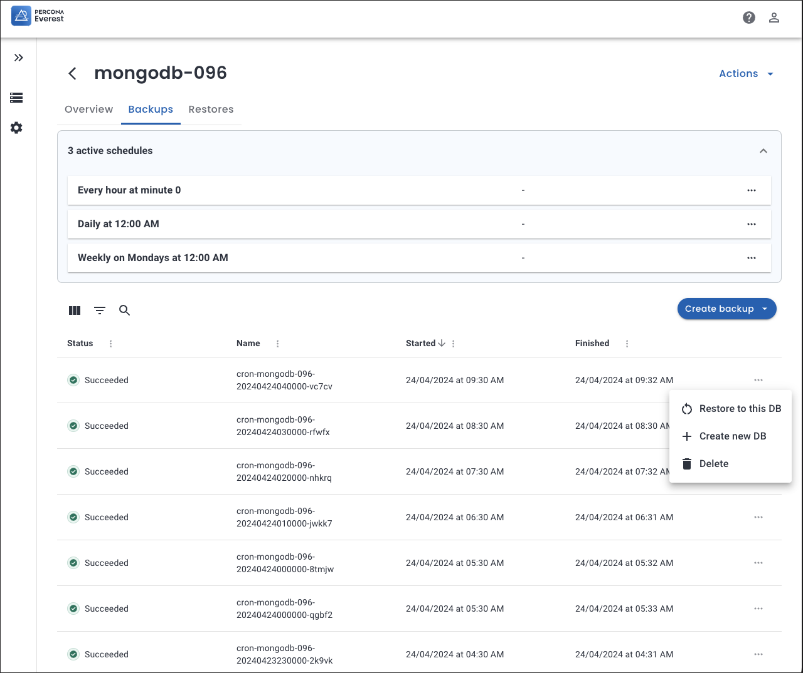
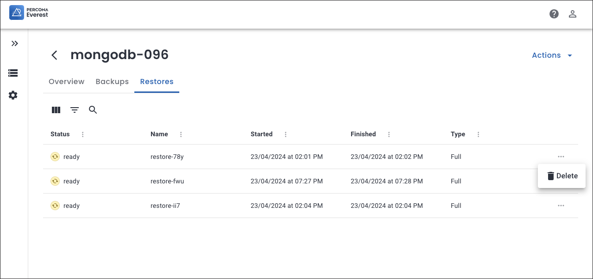

# Database view

The database view in Percona Everest provides an interface to view and provision your databases. With the database view, you can keep a close eye on all your databases and their status and perform tasks such as backup and restore.

   

By clicking on the individual database, you will be able to perform various actions such as:

   

 - **Edit the database**
    
    To edit any parameters for your database, click the ellipsis (...) menu next to the database you want to edit, then click **Edit**. Make the required changes on the screens that follow and then click **Edit database**.

 -  **Restart the database**

     Restarting your database can improve the performance of your database and enable you to apply recent configuration changes. 
    
     To restart your database, click the ellipsis (...) menu next to the database you want to restart, then click **Restart**. 

 - **Create database from a backup**

    With Percona Everest, you have the ability to create a database by using a backup. 
    
    To create a backup, click the ellipsis (…) menu next to the database, then click **Create database from a backup**. For more in-depth instructions on how to create a database from a backup, refer to the [create a database from a backup ](createBackups/create_new_database.md).

 - **Restore database from a backup**

     With Percona Everest, you have the ability to restore your database using a backup. 
    
     To restore your database, click the ellipsis (...) menu next to the database, then click **Restore database from a backup**. For more in-depth instructions on how to restore a database, refer to the [restore a database from a backup](createBackups/RestoreBackup.md) section.

 - **Suspend the database**

     Suspending your database can save resources when it's not being used. Pausing it can also conserve CPU and memory. 
    
     To suspend your database, click the ellipsis (...) menu next to the database you want to suspend, then click **Suspend**. To resume your database click **Resume**. You database will be immediately resumed.

 - **Delete the database**

     When you no longer need your database, you can delete it. 
    
     To delete your database, click the ellipsis (...) menu next to the database you want to suspend, then click **Delete**.

## Detailed database view

You can view a comprehensive overview of any specific database by clicking on the respective database. Once you do that, you will see the **Overview**, **Backups**, and **Restores** tabs.

## Overview

The Overview tab provides a comprehensive view of all the essential database details, such as:

- Basic information about the database
- Backups information
- Point-in-time Recovery status
- Resources used by the database
- External access and monitoring status
- Information about host, port, and credentials

## Backups

The **Backups** tab lists all the backups created for the database. This includes the exact date and time when each backup was taken, providing you with a clear overview of the backup history for the database.

Click the ellipsis (...) menu next to the database and you can:

- [Restore the backup to database](../use/RestoreBackup.md#RestoreBackup). 

- [Create a new database from backup](createBackups/create_new_database.md#create_new_database). 

    

The **Backups** tab also displays all active schedules for the database. You can edit or delete schedules by clicking the ellipsis (...) menu next to the database and selecting **Edit** or **Delete** respectively.

## Restores

The **Restores** tab displays a list of the database restores along with their respective dates and timestamps. This way, you can easily track and manage the history of all the restores that have been performed on the database.

To remove this restored database, click the ellipsis (...) menu next to the database and click **Delete**.

